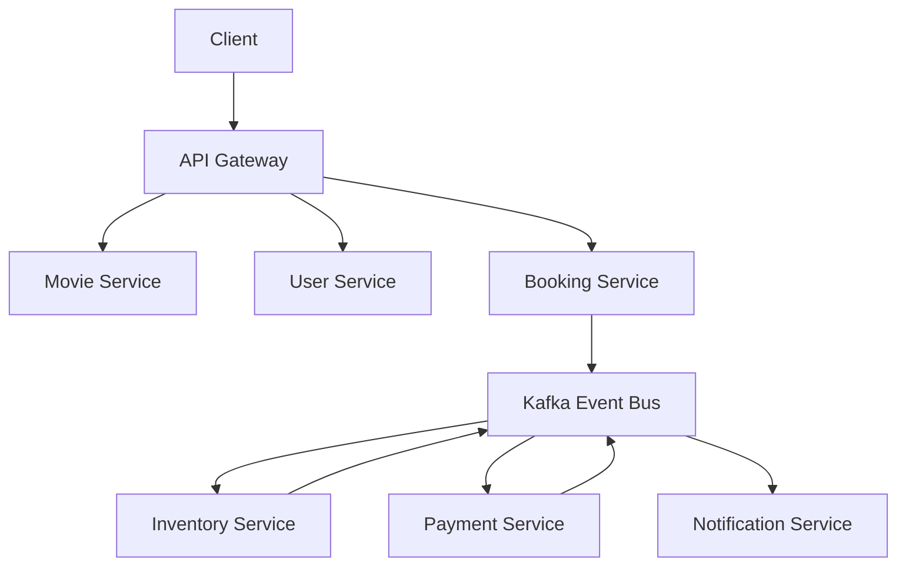
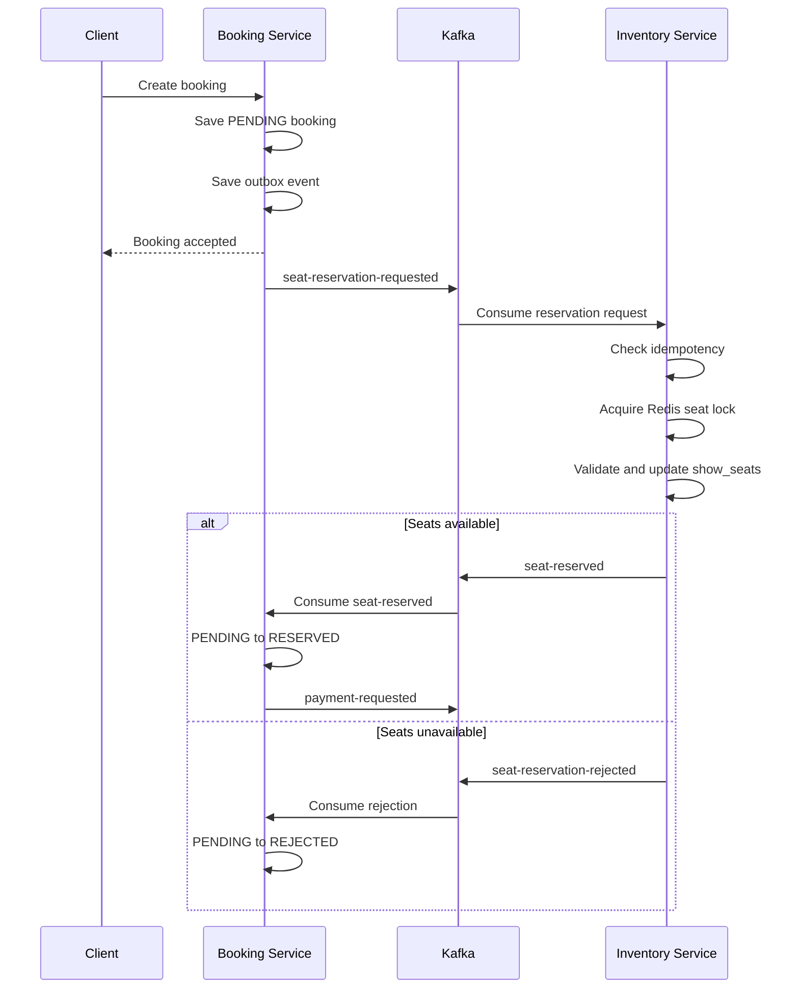

<div align="center">

# 🎬 Cinema Booking System

**Production-Grade Event-Driven Cinema Booking Platform**

Built with **Java 21**, **Spring Boot**, **Microservices**, **Kafka**,
**Saga Pattern**, and **Transactional Outbox**


</div>

---

# Table of Contents

- [Overview](#overview)
- [Features](#features)
- [Architecture](#architecture)
- [Service Ownership](#service-ownership)
- [Technology Stack](#technology-stack)
- [Project Structure](#project-structure)
- [Booking Flow](#booking-flow)
- [Current Progress](#current-progress)
- [Documentation](#documentation)
- [Getting Started](#getting-started)
- [Roadmap](#roadmap)
- [Architecture Decisions](#architecture-decisions)

---

# Overview

Cinema Booking System is an enterprise-grade backend application that
simulates a real-world online movie ticket booking platform similar to
CGV, Galaxy Cinema, Cinestar, or Lotte Cinema.

The project focuses on building a scalable, fault-tolerant, and
maintainable distributed system using modern backend architecture
patterns.

Core objectives:

- High-concurrency seat reservation
- Event-Driven Architecture
- Distributed transactions using Saga Pattern
- Reliable messaging using Transactional Outbox
- Idempotent event consumption
- Database per service
- Modular Maven architecture
- Production-ready coding standards
- Comprehensive technical documentation

---

# Features

Current and planned platform capabilities:

- Movie and genre management
- Showtime management
- Seat inventory management
- Distributed seat locking using Redis and Redisson
- Booking lifecycle management
- Payment integration using Saga Choreography
- Notification processing
- JWT authentication and authorization
- Kafka event processing
- Transactional Outbox
- Idempotent Consumer
- Global exception handling
- Standard API responses
- Bean Validation
- OpenAPI and Swagger
- Testcontainers integration testing
- Docker Compose

Feature availability depends on the current roadmap milestone.

---

# Architecture



The system follows:

- Microservices Architecture
- Event-Driven Architecture
- Saga Pattern using Choreography
- Transactional Outbox Pattern
- Idempotent Consumer Pattern
- Database per Service
- Eventual consistency between services

No service directly reads or modifies another service's database.

---

# Service Ownership

Each service exclusively owns its domain data.

| Service              | Owned data                                     |
| -------------------- | ---------------------------------------------- |
| Movie Service        | Movies, genres, movie metadata                 |
| User Service         | Users, roles, permissions, refresh tokens      |
| Inventory Service    | Show-seat availability and reservation state   |
| Booking Service      | Booking lifecycle and requested seat snapshots |
| Payment Service      | Payments and payment transactions              |
| Notification Service | Notifications and delivery history             |

Important seat ownership rules:

- `show_seats` belongs exclusively to Inventory Service.
- Redis locks for seats belong exclusively to Inventory Service.
- Booking Service must not query or update `show_seats`.
- Booking Service must not connect to the Inventory Service database.
- Booking and Inventory coordinate through Kafka events.
- Cross-database foreign keys are not allowed.

---

# Technology Stack

| Category          | Technology                           |
| ----------------- | ------------------------------------ |
| Language          | Java 21                              |
| Framework         | Spring Boot 3.5.4                    |
| Build             | Maven Multi Module                   |
| Cloud             | Spring Cloud                         |
| Database          | MySQL 8                              |
| ORM               | Spring Data JPA / Hibernate          |
| Migration         | Flyway                               |
| Cache             | Redis                                |
| Distributed Lock  | Redisson                             |
| Messaging         | Apache Kafka                         |
| Mapping           | MapStruct                            |
| JSON              | Jackson                              |
| Security          | Spring Security and JWT              |
| API Documentation | OpenAPI and Swagger                  |
| Testing           | JUnit 5, Mockito, Testcontainers     |
| Container         | Docker Compose                       |
| Search            | Elasticsearch                        |
| Storage           | MinIO                                |
| Tracing           | Micrometer Tracing and OpenTelemetry |

---

# Project Structure

```text
cinema-system
├── common
│   ├── common-api
│   ├── common-core
│   ├── common-exception
│   ├── common-jackson
│   ├── common-jpa
│   ├── common-kafka
│   ├── common-lock
│   ├── common-logging
│   ├── common-mapper
│   ├── common-openapi
│   ├── common-outbox
│   ├── common-response
│   ├── common-search
│   ├── common-security
│   ├── common-storage
│   ├── common-test
│   ├── common-tracing
│   └── common-validation
├── infrastructure
│   ├── config-service
│   ├── discovery-service
│   └── gateway-service
├── services
│   ├── movie-service
│   ├── user-service
│   ├── inventory-service
│   ├── booking-service
│   ├── payment-service
│   └── notification-service
├── docs
├── docker
└── pom.xml
```

Detailed module descriptions are documented in:

```text
docs/04_MODULES.md
```

---

# Booking Flow

Seat reservation is coordinated asynchronously between Booking Service
and Inventory Service.



Booking Service transaction:

1. Create a booking with status `PENDING`.
2. Store the requested seat snapshot.
3. Create a `SEAT_RESERVATION_REQUESTED` outbox event.
4. Commit the local transaction.

Inventory Service transaction:

1. Validate event idempotency.
2. Acquire Redis distributed locks.
3. Query Inventory-owned `show_seats`.
4. Verify all requested seats are available.
5. Change the seats to `RESERVED`.
6. Create the result outbox event.
7. Commit the local transaction.
8. Release the Redis locks.

When a booking expires, is cancelled, or payment fails:

```text
Booking Service
    ↓
seat-release-requested
    ↓
Inventory Service
    ↓
show_seats: RESERVED → AVAILABLE
    ↓
seat-released
```

Inventory Service remains the only service allowed to change
`show_seats`.

---

# Current Progress

## Completed

- [x] R1 — Parent Project
- [x] R2 — common-core
- [x] R3 — common-jpa
- [x] R4 — common-exception
- [x] R5 — common-response
- [x] R6 — common-api
- [x] R7 — common-validation
- [x] R8 — common-jackson
- [x] R9 — common-logging
- [x] R10 — common-mapper
- [x] R11 — common-security
- [x] R12 — common-lock
- [x] R13 — common-kafka
- [x] R14 — common-outbox
- [x] R15 — common-search
- [x] R16 — common-openapi
- [x] R17 — common-test
- [x] R18 — common-tracing
- [x] R19 — common-storage
- [x] R20 — Config Server
- [x] R21 — Discovery Server
- [x] R22 — API Gateway

## In progress

- [ ] R23 — Movie Service stabilization

Movie Service functional implementation includes:

- Movie CRUD
- Genre CRUD
- Movie–Genre relationship
- Flyway migrations
- Config Server integration
- Eureka registration
- OpenAPI integration

Remaining R23 stabilization work:

- Remove hard-coded credentials
- Complete service unit tests
- Complete mapper and utility tests
- Complete controller tests
- Add MySQL Testcontainers integration tests
- Run the full Maven verification
- Pass security scanning
- Synchronize documentation

## Not started

- [ ] R24 — User Service
- [ ] R25 — Inventory Service
- [ ] R26 — Booking Service
- [ ] R27 — Payment Service
- [ ] R28 — Notification Service

Current milestone:

> **R23 — Movie Service Stabilization**

Next milestone after R23 verification:

> **R24 — User Service**

---

# Documentation

| Document                   | Description                           |
| -------------------------- | ------------------------------------- |
| `00_PROJECT_CONTEXT.md`    | Project overview and current progress |
| `01_AI_CONTEXT.md`         | Context for continuing development    |
| `02_ARCHITECTURE.md`       | System architecture                   |
| `03_TECHNOLOGY_STACK.md`   | Technology stack                      |
| `04_MODULES.md`            | Module overview                       |
| `05_CODING_CONVENTIONS.md` | Coding standards                      |
| `06_DATABASE_DESIGN.md`    | Database ownership and design         |
| `07_EVENT_CATALOG.md`      | Kafka event catalog                   |
| `08_SECURITY.md`           | Security architecture                 |
| `09_OUTBOX.md`             | Transactional Outbox                  |
| `10_ROADMAP.md`            | Development roadmap                   |
| `11_CHANGELOG.md`          | Project changelog                     |
| `12_DEPENDENCY_RULES.md`   | Module dependency rules               |
| `13_SEQUENCE_DIAGRAMS.md`  | System sequence diagrams              |
| `14_DEPLOYMENT.md`         | Deployment guide                      |
| `decisions/`               | Architecture Decision Records         |

The `docs` directory is the project's source of truth.

---

# Getting Started

## Clone

```bash
git clone https://github.com/HuyKunNe/cinema-system.git

cd cinema-system
```

## Configure environment variables

Database credentials must be provided through environment variables.

Example:

```dotenv
MYSQL_ROOT_PASSWORD=change-me
MOVIE_DB_USERNAME=cinema_movie
MOVIE_DB_PASSWORD=change-me
```

Never commit the real `.env` file or real credentials.

## Start infrastructure

```bash
docker compose up -d
```

## Build

```bash
mvn clean verify
```

## Start services

Start infrastructure services in this order:

```text
Config Server
    ↓
Discovery Server
    ↓
Gateway Service
    ↓
Business Services
```

---

# Roadmap

## Completed

- Foundation common modules
- Infrastructure common modules
- Config Server
- Discovery Server
- API Gateway
- Movie Service functional implementation

## In progress

- Movie Service stabilization and test completion

## Next

- User Service
- Inventory Service
- Booking Service
- Payment Service
- Notification Service

## Future

- CI/CD
- Kubernetes
- Monitoring
- Metrics
- Prometheus
- Grafana
- Performance testing
- Chaos testing

---

# Architecture Decisions

The project follows Architecture Decision Records.

Important decisions include:

- Java 21
- Spring Boot 3.5.4
- UUID Version 7
- Event-Driven Architecture
- Saga Pattern using Choreography
- Transactional Outbox Pattern
- Idempotent Consumer Pattern
- Database per Service
- No cross-database foreign keys
- Inventory Service owns `show_seats`
- Inventory Service owns seat distributed locks
- No Lombok in common modules
- MapStruct
- Unified `ApiResponse`
- Environment-based credentials

See:

```text
docs/decisions/
```

---

# License

MIT License

---
