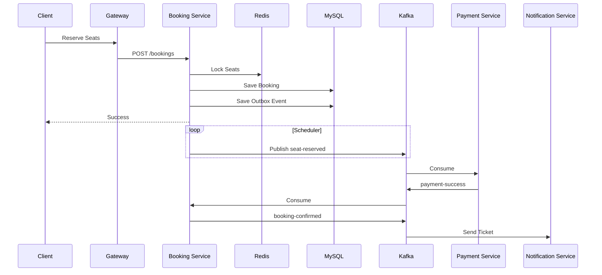

<div align="center">

# 🎬 Cinema Booking System

**Production-Grade Event-Driven Cinema Booking Platform**

Built with **Java 21**, **Spring Boot**, **Microservices**, **Kafka**, **Saga Pattern**, and **Transactional Outbox**


</div>

---

# Table of Contents

- [Overview](#overview)
- [Features](#features)
- [Architecture](#architecture)
- [Technology Stack](#technology-stack)
- [Project Structure](#project-structure)
- [Booking Flow](#booking-flow)
- [Current Progress](#current-progress)
- [Documentation](#documentation)
- [Getting Started](#getting-started)
- [Roadmap](#roadmap)
- [Architecture Decisions](#architecture-decisions)

---

# Overview

Cinema Booking System is an enterprise-grade backend application that simulates a real-world online movie ticket booking platform similar to **CGV**, **Galaxy Cinema**, or **Cinestar**.

The project focuses on building a scalable, fault-tolerant and maintainable distributed system using modern backend architecture patterns.

Core objectives:

- High-concurrency seat reservation
- Event-Driven Architecture
- Distributed transactions using Saga Pattern
- Reliable messaging with Transactional Outbox
- Modular Maven architecture
- Production-ready coding standards
- Comprehensive technical documentation

---

# Features

- ✅ Movie Management
- ✅ Showtime Management
- ✅ Seat Reservation
- ✅ Distributed Seat Lock (Redis + Redisson)
- ✅ Booking Management
- ✅ Payment Integration (Saga)
- ✅ Notification Service
- ✅ JWT Authentication
- ✅ Kafka Event Processing
- ✅ Transactional Outbox
- ✅ Idempotent Consumer
- ✅ Global Exception Handling
- ✅ Standard API Response
- ✅ Bean Validation
- ✅ OpenAPI / Swagger
- ✅ Docker Compose

---

# Architecture

```text
                           +------------------+
                           |      Client      |
                           +--------+---------+
                                    |
                                    v
                           +------------------+
                           | API Gateway      |
                           +--------+---------+
                                    |
            -------------------------------------------------
            |                 |              |              |
            v                 v              v              v
   +---------------+ +---------------+ +--------------+ +--------------+
   | Booking       | | Movie         | | User         | | Notification |
   | Service       | | Service       | | Service      | | Service      |
   +-------+-------+ +---------------+ +--------------+ +--------------+
           |
           |
           v
     +-----------+
     |  Kafka    |
     +-----------+
       |       |
       |       |
       v       v
+---------------+      +---------------+
| Inventory     |      | Payment       |
| Service       |      | Service       |
+---------------+      +---------------+

```

---

# Technology Stack

| Category | Technology |
|------------|------------|
| Language | Java 21 |
| Framework | Spring Boot 3.5.4 |
| Build | Maven Multi Module |
| Database | MySQL 8 |
| ORM | Spring Data JPA / Hibernate |
| Migration | Flyway |
| Cache | Redis |
| Distributed Lock | Redisson |
| Messaging | Apache Kafka |
| Mapping | MapStruct |
| JSON | Jackson |
| Security | Spring Security + JWT |
| API Docs | OpenAPI / Swagger |
| Testing | JUnit 5, Mockito, Testcontainers |
| Container | Docker Compose |

---

# Project Structure

```text
cinema-booking-system
│
├── common/
│
├── infrastructure/
│
├── services/
│
├── docs/
│
└── docker/
```

Detailed module descriptions:

➡ **docs/04_MODULES.md**

---

# Booking Flow



---

# Current Progress

## Foundation

- [x] Parent Project
- [x] common-core
- [x] common-jpa
- [x] common-exception
- [x] common-response
- [x] common-api
- [x] common-validation
- [x] common-jackson
- [x] common-logging
- [x] common-mapper

## Infrastructure

- [x] common-security
- [x] common-lock
- [x] common-kafka
- [x] common-outbox

## Remaining

- [ ] common-search
- [ ] common-storage
- [ ] common-tracing
- [ ] common-openapi
- [ ] common-test

Current milestone:

> **R14**

---

# Documentation

| Document | Description |
|------------|------------|
| 00_PROJECT_CONTEXT | Project Overview |
| 01_AI_CONTEXT | AI Context |
| 02_ARCHITECTURE | Architecture |
| 03_TECHNOLOGY_STACK | Technology Stack |
| 04_MODULES | Module Overview |
| 05_CODING_CONVENTIONS | Coding Standards |
| 06_DATABASE_DESIGN | Database Design |
| 07_EVENT_CATALOG | Kafka Events |
| 08_SECURITY | Security |
| 09_OUTBOX | Transactional Outbox |
| 10_ROADMAP | Development Roadmap |
| 11_CHANGELOG | Changelog |
| 12_DEPENDENCY_RULES | Dependency Rules |
| 13_SEQUENCE_DIAGRAMS | Sequence Diagrams |
| 14_DEPLOYMENT | Deployment Guide |
| decisions/ | Architecture Decision Records |

---

# Getting Started

## Clone

```bash
git clone https://github.com/<your-account>/cinema-booking-system.git

cd cinema-booking-system
```

---

## Start Infrastructure

```bash
docker compose up -d
```

---

## Build

```bash
mvn clean install
```

---

## Start Services

Start in the following order:

```
Config Server

↓

Discovery Server

↓

Gateway

↓

Business Services
```

---

# Roadmap

## Completed

- Foundation Modules
- Infrastructure Common Modules

## In Progress

- Business Services

## Future

- Elasticsearch
- MinIO
- Distributed Tracing
- Monitoring
- Prometheus
- Grafana
- Kubernetes
- CI/CD
- Performance Testing

---

# Architecture Decisions

The project follows Architecture Decision Records (ADR).

Important decisions include:

- Java 21
- Spring Boot 3.5.4
- UUID Version 7
- Event-Driven Architecture
- Saga Pattern (Choreography)
- Transactional Outbox Pattern
- Database per Service
- No Lombok in Common Modules
- MapStruct
- Unified ApiResponse

See:

```
docs/decisions/
```

---

# License

MIT License

---

<div align="center">

Built with ❤️ using Java, Spring Boot and Event-Driven Microservices.

</div>
