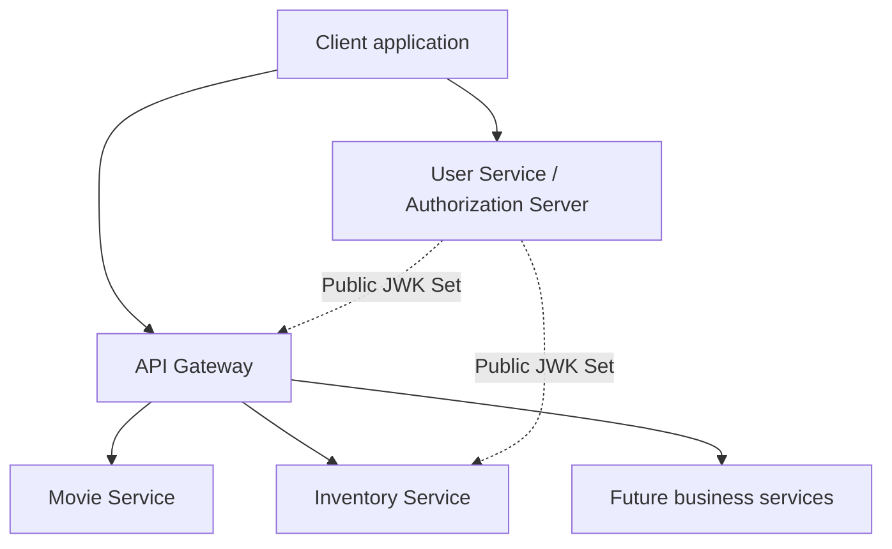
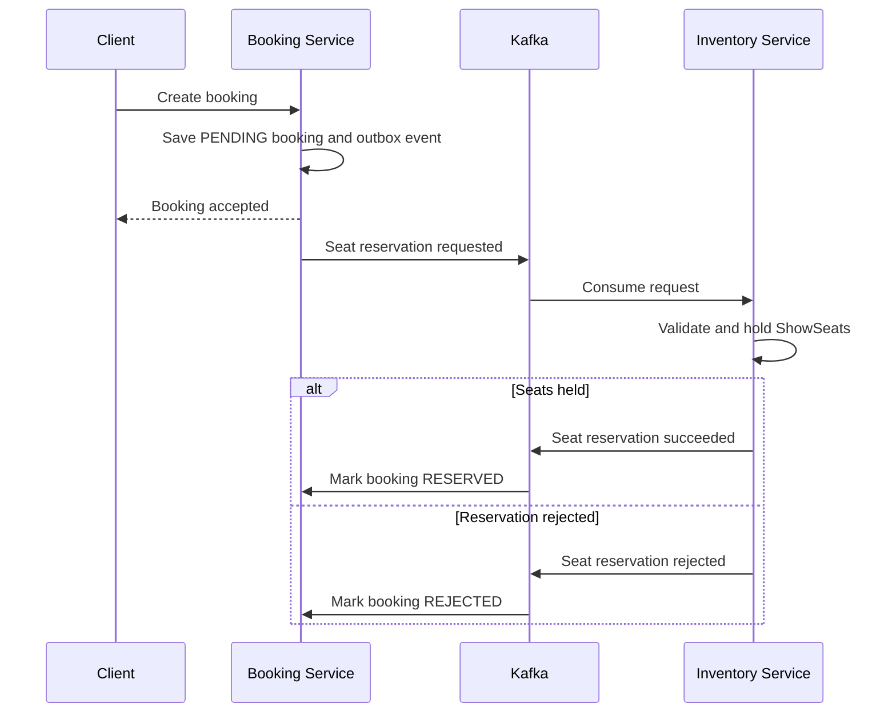

<div align="center">

# 🎬 Cinema Booking System

**Event-driven cinema booking platform built as a Java microservice system**


</div>

---

# Overview

Cinema Booking System is a learning and production-oriented backend project for
an online cinema platform. It incrementally implements domain ownership,
high-concurrency seat management, event-driven workflows, reliable messaging,
and an OAuth2/OpenID Connect identity platform.

The project prioritizes:

- Database per service
- Explicit business ownership
- Atomic seat-state transitions
- Event-driven communication
- Saga choreography
- Transactional Outbox
- Idempotent event consumers
- Reusable technical modules without shared business persistence
- Testable security boundaries
- Root Maven reactor verification
- Documentation-driven roadmap execution

The repository is developed checkpoint by checkpoint. A module directory or
documented target does not mean the corresponding runtime capability is already
implemented.

---

# Current Status

| Scope                                                  | Status      |
| ------------------------------------------------------ | ----------- |
| R1-R24                                                 | Completed   |
| R25.1 — `common-security` hardening                    | Completed   |
| R25.2 — Architecture and documentation synchronization | In progress |
| R25.3+ — User Service and identity runtime             | Planned     |
| R26 — Booking Service                                  | Planned     |
| R27 — Payment Service                                  | Planned     |
| R28 — Notification Service                             | Planned     |

Latest completed runtime service:

> **R24 — Inventory Service**

Active checkpoint:

> **R25.2 — Architecture and documentation synchronization**

Next implementation checkpoint:

> **R25.3 — User Service foundation**

See `docs/10_ROADMAP.md` for authoritative checkpoint scope and exit criteria.

---

# Implemented Capabilities

## Shared platform modules

- Common core utilities and UUIDv7 strategy
- JPA entity, repository, and auditing foundations
- Shared error-code and exception contracts
- Standard API responses and global exception handling
- Bean Validation foundations
- Shared Jackson configuration
- Correlation-aware logging and tracing foundations
- MapStruct foundations
- OAuth2 Resource Server mechanics in `common-security`
- Redisson distributed-lock abstraction
- Kafka producer, consumer, serialization, retry, and error-handling support
- Transactional Outbox infrastructure
- Elasticsearch search abstraction
- MinIO storage abstraction
- OpenAPI configuration
- JUnit and Testcontainers foundations

## Infrastructure

- Config Server
- Eureka Discovery Server
- Spring Cloud Gateway routing

Gateway OAuth2 Resource Server integration remains R25 work. Token forwarding
must not be mistaken for token validation.

## Movie Service

- Movie and genre management
- MySQL persistence and Flyway migrations
- Validation, mapping, API response, OpenAPI, and test integration

## Inventory Service

- Cinema management
- Room management
- Fixed physical seat layouts
- Showtime management and overlap validation
- ShowSeat generation
- Atomic ShowSeat state transitions
- Hold ownership and expiration enforcement
- Administrative availability transitions
- MySQL concurrency verification
- Shared Resource Server integration
- Public, management, and service-only endpoint authorization
- Standard JSON `401` and `403` responses
- Flyway and Hibernate schema verification

Normal ShowSeat lifecycle:

```text
AVAILABLE -> HELD -> BOOKED
```

Release lifecycle:

```text
HELD -> AVAILABLE
```

Administrative availability includes controlled transitions to and from
`UNAVAILABLE`.

---

# Architecture


```mermaid
flowchart TD
    Client[Client application] --> Gateway[API Gateway]
    Client --> Identity[User Service / Authorization Server]
    Gateway --> Movie[Movie Service]
    Gateway --> Inventory[Inventory Service]
    Gateway --> Future[Future business services]
    Identity -.->|Public JWK Set| Gateway
    Identity -.->|Public JWK Set| Inventory
```

The system follows:

- Microservices architecture
- Database per service
- API Gateway
- Centralized configuration
- Service discovery
- Event-driven integration
- Saga choreography for distributed workflows
- Transactional Outbox for reliable database-to-Kafka publication
- Idempotent consumers
- OAuth2 Authorization Server and Resource Server separation
- OpenID Connect for identity interoperability

No service may directly read or modify another service's database.

---

# Service Ownership

| Service              | Authoritative ownership                                                                        |
| -------------------- | ---------------------------------------------------------------------------------------------- |
| Movie Service        | Movies, genres, and movie lifecycle                                                            |
| Inventory Service    | Cinemas, rooms, physical seats, showtimes, ShowSeats, seat state, and seat concurrency         |
| User Service         | Users, profiles, roles, permissions, OAuth2 clients, grants, consent, tokens, and signing keys |
| Booking Service      | Bookings and booking-seat references                                                           |
| Payment Service      | Payments and payment-provider state                                                            |
| Notification Service | Notification templates, delivery policy, and delivery state                                    |

Important Inventory boundary:

- `show_seats` belongs exclusively to Inventory Service.
- Inventory Service owns every authoritative seat-state transition.
- Current mutable ShowSeat loads use database transactions and
  `PESSIMISTIC_WRITE` where required.
- Redis coordination is added only where the accepted workflow requires it.
- Booking Service must not query or update `show_seats`.
- Cross-database foreign keys are prohibited.
- Cross-service coordination uses approved APIs and versioned Kafka events.

---

# Security Architecture

ADR-013 defines the R25 identity topology:

- User Service integrates Spring Authorization Server.
- User Service is the authoritative OAuth2/OpenID Connect issuer.
- Gateway and protected business services are OAuth2 Resource Servers.
- `common-security` provides Resource Server mechanics only.
- Access tokens are JWTs signed with RS256.
- Resource Servers validate signature, issuer, timestamps, and the required
  `cinema-api` audience.
- Access tokens expire after 15 minutes.
- Refresh tokens are opaque, rotated, revocable, and expire within 30 days.

Approved grants:

- Authorization Code with PKCE
- Refresh Token
- Controlled Client Credentials

Resource Owner Password Credentials must not be implemented.

`common-security` does not issue tokens, store refresh tokens, own OAuth2
clients, or contain signing private keys.

R25.1 hardened this shared boundary. The User Service Authorization Server
runtime remains planned for R25.3 and later checkpoints.

---

# Technology Stack

| Category               | Technology                                                                       |
| ---------------------- | -------------------------------------------------------------------------------- |
| Language               | Java 21                                                                          |
| Framework              | Spring Boot 3.5.16                                                               |
| Cloud                  | Spring Cloud 2025.0.2                                                            |
| Build                  | Apache Maven multi-module reactor                                                |
| Database               | MySQL 8                                                                          |
| Persistence            | Spring Data JPA and Hibernate                                                    |
| Migration              | Flyway 12.0.0                                                                    |
| Messaging              | Apache Kafka and Spring for Apache Kafka                                         |
| Cache and coordination | Redis and Redisson 3.50.0                                                        |
| Mapping                | MapStruct 1.6.3                                                                  |
| JSON                   | Jackson                                                                          |
| Security               | Spring Security, OAuth2 Resource Server, and planned Spring Authorization Server |
| API documentation      | OpenAPI 3 and Swagger UI                                                         |
| Search                 | Elasticsearch 8.18.1                                                             |
| Storage                | MinIO SDK 8.5.17                                                                 |
| Observability          | Actuator, Micrometer, and OpenTelemetry                                          |
| Testing                | JUnit Jupiter, Mockito, Spring Test, and Testcontainers 1.21.3                   |

Docker and Docker Compose are approved deployment technologies, but the
repository does not yet contain a verified root Compose topology.

---

# Project Structure

```text
cinema-system/
├── common/
│   ├── common-api/
│   ├── common-core/
│   ├── common-exception/
│   ├── common-jackson/
│   ├── common-jpa/
│   ├── common-kafka/
│   ├── common-lock/
│   ├── common-logging/
│   ├── common-mapper/
│   ├── common-openapi/
│   ├── common-outbox/
│   ├── common-response/
│   ├── common-search/
│   ├── common-security/
│   ├── common-storage/
│   ├── common-test/
│   ├── common-tracing/
│   ├── common-util/
│   └── common-validation/
├── infrastructure/
│   ├── config-service/
│   ├── discovery-service/
│   └── gateway-service/
├── services/
│   ├── booking-service/
│   ├── inventory-service/
│   ├── movie-service/
│   ├── notification-service/
│   ├── payment-service/
│   └── user-service/
├── docs/
└── pom.xml
```

The root `pom.xml` is the authoritative Maven module registry. Placeholder
service modules remain non-deployable until their roadmap rounds are complete.

---

# Target Booking Flow

The booking Saga is an approved future workflow. Booking, Payment, and
Notification services are not yet implemented.


```mermaid
sequenceDiagram
    participant Client
    participant Booking as Booking Service
    participant Kafka
    participant Inventory as Inventory Service

    Client->>Booking: Create booking
    Booking->>Booking: Save PENDING booking and outbox event
    Booking-->>Client: Booking accepted
    Booking->>Kafka: Seat reservation requested
    Kafka->>Inventory: Consume request
    Inventory->>Inventory: Validate and hold ShowSeats

    alt Seats held
        Inventory->>Kafka: Seat reservation succeeded
        Kafka->>Booking: Mark booking RESERVED
    else Reservation rejected
        Inventory->>Kafka: Seat reservation rejected
        Kafka->>Booking: Mark booking REJECTED
    end
```

Target rules:

- Booking Service stores its local booking and Outbox event atomically.
- Inventory Service performs the authoritative ShowSeat transition.
- State-changing consumers are idempotent.
- Booking Service never imports Inventory entities or repositories.
- Payment and notification workflows join through versioned events in their
  approved rounds.

Detailed contracts remain authoritative in the roadmap, event catalog, and
sequence-diagram documents.

---

# Build and Test

## Prerequisites

- JDK 21
- Maven 3.9+
- MySQL 8 for local service runtime
- Git
- Redis and Kafka when testing functionality that requires them

## Clone

```bash
git clone https://github.com/HuyKunNe/cinema-system.git
cd cinema-system
```

## Verify the complete reactor

```bash
mvn clean verify
```

This is the final project-level verification command.

## Test one service with dependencies

```bash
mvn -pl services/inventory-service -am clean test
```

Focused success does not replace root `mvn clean verify`.

## Run infrastructure applications

```bash
mvn -pl infrastructure/config-service -am spring-boot:run
```

```bash
mvn -pl infrastructure/discovery-service -am spring-boot:run
```

```bash
mvn -pl infrastructure/gateway-service -am spring-boot:run
```

## Run implemented business services

```bash
mvn -pl services/movie-service -am spring-boot:run
```

```bash
mvn -pl services/inventory-service -am spring-boot:run
```

Movie and Inventory services require their documented database credentials.
Protected Inventory runtime also requires `CINEMA_AUTH_ISSUER` and
`CINEMA_AUTH_JWK_SET_URI`.

The repository does not currently support starting the whole platform with a
root `docker compose up` command. See `docs/14_DEPLOYMENT.md` for the current
startup model and required environment variables.

---

# Documentation

| Document                        | Purpose                                            |
| ------------------------------- | -------------------------------------------------- |
| `docs/00_PROJECT_CONTEXT.md`    | Project state and current checkpoint               |
| `docs/01_AI_CONTEXT.md`         | Continuation context and implementation guardrails |
| `docs/02_ARCHITECTURE.md`       | System architecture and ownership                  |
| `docs/03_TECHNOLOGY_STACK.md`   | Versioned technology baseline                      |
| `docs/04_MODULES.md`            | Module responsibilities                            |
| `docs/05_CODING_CONVENTIONS.md` | Coding conventions                                 |
| `docs/06_DATABASE_DESIGN.md`    | Database ownership and design                      |
| `docs/07_EVENT_CATALOG.md`      | Event contracts and evolution                      |
| `docs/08_SECURITY.md`           | Security architecture and rules                    |
| `docs/09_OUTBOX.md`             | Transactional Outbox rules                         |
| `docs/10_ROADMAP.md`            | Authoritative implementation sequence              |
| `docs/11_CHANGELOG.md`          | Completed historical changes                       |
| `docs/12_DEPENDENCY_RULES.md`   | Compile-time and runtime boundaries                |
| `docs/13_SEQUENCE_DIAGRAMS.md`  | Approved interaction flows                         |
| `docs/14_DEPLOYMENT.md`         | Local and deployment guidance                      |
| `docs/decisions/`               | Architecture Decision Records                      |

The roadmap defines completion. The changelog records history. Accepted ADRs
resolve durable architectural decisions.

---

# Roadmap Summary

## Completed

- R1-R19 common platform modules
- R20 Config Server
- R21 Discovery Server
- R22 API Gateway
- R23 Movie Service
- R24 Inventory Service
- R25.1 `common-security` hardening

## Active

- R25.2 architecture and documentation synchronization

## Next

- R25.3 User Service foundation
- Remaining User Service identity and Authorization Server checkpoints

## Planned

- R26 Booking Service
- R27 Payment Service
- R28 Notification Service
- Complete container and production deployment
- CI/CD, metrics, alerting, performance, and resilience verification

---

# Architecture Decisions

Important accepted decisions include:

- Java 21
- Spring Boot 3.5.x baseline
- UUIDv7 identifiers
- Database per service
- No cross-database foreign keys
- Event-driven architecture
- Saga choreography
- Transactional Outbox
- Idempotent event consumers
- Inventory Service owns `show_seats`
- MapStruct compile-time mapping
- Unified API response and exception contracts
- User Service hosts Spring Authorization Server under ADR-013
- `common-security` contains Resource Server mechanics only
- Environment-based credentials and externalized secrets

See `docs/decisions/` for the complete decision record.

---

# Contribution Rules

Before closing a checkpoint:

1. Preserve service and database ownership.
2. Use `common-exception` for expected domain/API failures instead of
   `IllegalArgumentException`.
3. Add Flyway migrations instead of editing applied migrations.
4. Add or update relevant tests.
5. Run `mvn clean verify` from the repository root.
6. Synchronize roadmap, changelog, architecture, and affected documentation.

---

# License

No repository license file is currently committed. Add an approved `LICENSE`
before describing the project as distributed under a specific license.
