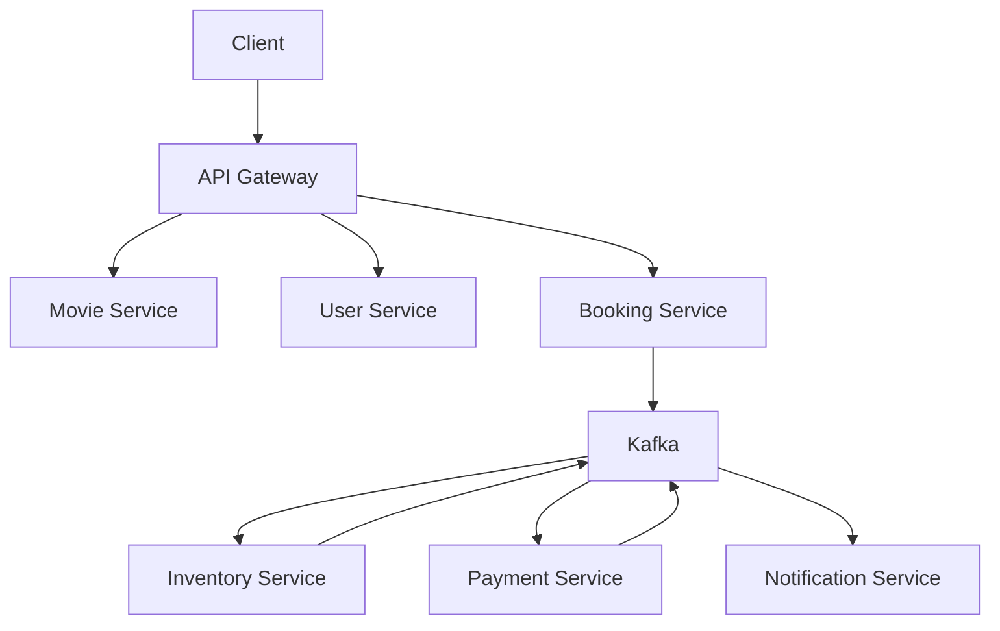
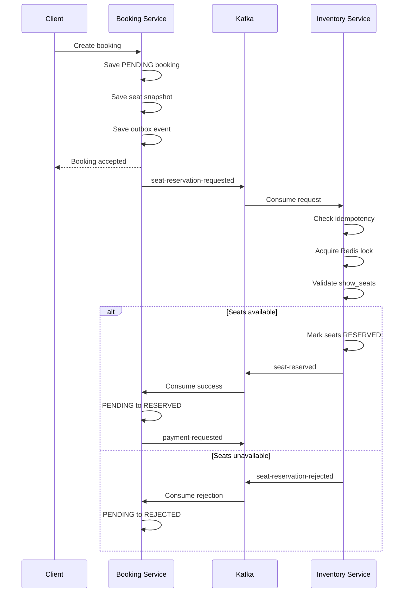

# Cinema Booking System

Version: 0.2 (R24 Inventory Service Implementation)

---

# Project Overview

Cinema Booking System là hệ thống đặt vé xem phim theo kiến trúc
Microservices hướng Enterprise.

Mục tiêu:

- High Availability
- High Scalability
- Event-Driven
- Cloud Ready
- Production Ready
- DDD Friendly
- Easy Horizontal Scaling

Hệ thống được thiết kế để mô phỏng nền tảng của các chuỗi rạp như:

- CGV
- Galaxy Cinema
- Cinestar
- Lotte Cinema

---

# Current Progress

## Completed

- ✅ R1 — Parent Project
- ✅ R2 — common-core
- ✅ R3 — common-jpa
- ✅ R4 — common-exception
- ✅ R5 — common-response
- ✅ R6 — common-api
- ✅ R7 — common-validation
- ✅ R8 — common-jackson
- ✅ R9 — common-logging
- ✅ R10 — common-mapper
- ✅ R11 — common-security
- ✅ R12 — common-lock
- ✅ R13 — common-kafka
- ✅ R14 — common-outbox
- ✅ R15 — common-search
- ✅ R16 — common-openapi
- ✅ R17 — common-test
- ✅ R18 — common-tracing
- ✅ R19 — common-storage
- ✅ R20 — Config Server
- ✅ R21 — Discovery Server
- ✅ R22 — API Gateway
- ✅ R23 — Movie Service

## In Progress

- 🚧 R24 — Inventory Service Implementation

Inventory Service owns:

- Cinemas
- Rooms
- Fixed physical seats
- Room seat layouts
- Showtimes
- `show_seats`
- Seat availability and reservation state
- Redis seat locks
- Inventory Outbox records
- Inventory consumer-processing records

R24 implementation scope:

- Bootstrap the Spring Boot application
- Create the Inventory database and Flyway migrations
- Implement Cinema management
- Implement Room management
- Implement fixed Seat layouts
- Implement Showtime management and overlap validation
- Generate ShowSeat records for each Showtime
- Implement atomic ShowSeat state transitions
- Integrate shared exception, response, validation and mapping modules
- Add unit, integration and concurrency tests
- Complete security and documentation verification

## Not Started

- R25 — User Service
- R26 — Booking Service
- R27 — Payment Service
- R28 — Notification Service

---

# Current Target

Current milestone:

> **R24 — Inventory Service Implementation**

R24 is complete only when:

- Inventory Service owns all approved inventory-domain data
- Flyway migrations pass
- Cinema, Room, Seat, Showtime and ShowSeat behavior is implemented
- Showtime overlap validation is covered
- ShowSeat generation is verified
- Seat-state transitions are atomic
- Duplicate event processing is idempotent
- Unit and integration tests pass
- Concurrency tests pass
- Security requirements pass
- `mvn clean verify` passes from the repository root
- Documentation is synchronized

After R24 has been verified, continue with:

> **R25 — User Service**

Do not start R25 before R24 passes its exit criteria.

---

# Project Goals

The project focuses on:

- Clean Architecture
- Domain-Driven Design
- Event-Driven Architecture
- Saga Pattern using Choreography
- Transactional Outbox
- Idempotent Consumer
- Distributed Lock
- Database per Service
- Eventual Consistency
- Observability
- Production-Ready Deployment

---

# Architecture Style



The system follows:

- Microservices Architecture
- Spring Cloud infrastructure
- Event-Driven Architecture
- Kafka asynchronous communication
- Saga Pattern using Choreography
- Transactional Outbox Pattern
- Idempotent Consumer Pattern
- Database per Service
- Eventual consistency between services

---

# Service Database Ownership

Every microservice exclusively owns its database and domain data.

A service must not:

- Connect to another service's database
- Query another service's tables
- Update another service's tables
- Reuse another service's repository
- Create physical foreign keys across service databases

Cross-service coordination must use:

- Synchronous APIs when an immediate response is required
- Kafka events for asynchronous workflows
- Transactional Outbox for reliable event publication
- Idempotent Consumer for safe event processing

Ownership summary:

| Service | Owned data |
|---|---|
| Movie Service | Movies, genres and movie metadata |
| User Service | Users, roles, permissions and refresh tokens |
| Inventory Service | Show-seat availability and reservation state |
| Booking Service | Booking lifecycle and requested seat snapshots |
| Payment Service | Payments and payment transactions |
| Notification Service | Notification and delivery history |

---

# Seat Inventory Ownership

The `show_seats` table belongs exclusively to Inventory Service.

Inventory Service is responsible for:

- Creating show-seat inventory
- Reading current seat availability
- Reserving seats
- Releasing seats
- Marking seats as sold
- Managing Redis seat locks
- Publishing seat reservation result events

Booking Service must not:

- Query `show_seats`
- Update `show_seats`
- Use a `ShowSeatRepository`
- Connect to the Inventory Service database
- Acquire Redis locks for seats
- Create a cross-database foreign key to `show_seats`

Booking Service may store a seat snapshot containing fields such as:

- `inventorySeatId`
- `showtimeId`
- `seatNumber`
- `seatType`
- `price`

`inventorySeatId` is an external reference only. It is not a physical
foreign key to the Inventory Service database.

---

# Seat Reservation Flow

The previous design in which Booking Service directly locked and updated
`show_seats` is no longer valid.

The standardized flow is:



## Booking Service Local Transaction

Booking Service performs only the following operations when creating a
booking:

1. Create a booking with status `PENDING`.
2. Store the requested seat snapshot.
3. Store a `SEAT_RESERVATION_REQUESTED` outbox event.
4. Commit the local database transaction.

Booking Service then publishes:

```text
seat-reservation-requested
```

## Inventory Service Local Transaction

Inventory Service processes the reservation request:

1. Check event idempotency using `eventId`.
2. Acquire Redis distributed locks for the requested seats.
3. Query Inventory-owned `show_seats`.
4. Verify all requested seats are `AVAILABLE`.
5. Change available seats to `RESERVED`.
6. Store the result in the Inventory outbox table.
7. Commit the local database transaction.
8. Release the Redis locks.

Inventory Service publishes one of:

```text
seat-reserved
seat-reservation-rejected
```

## Booking Service Result Handling

When Booking Service receives `seat-reserved`:

```text
PENDING → RESERVED
```

Booking Service then creates:

```text
payment-requested
```

When Booking Service receives `seat-reservation-rejected`:

```text
PENDING → REJECTED
```

No payment request is created.

## Seat Release

When a booking expires, is cancelled, or its payment fails:

```text
Booking Service
    ↓
seat-release-requested
    ↓
Inventory Service
    ↓
show_seats: RESERVED → AVAILABLE
    ↓
seat-released
```

Inventory Service remains the only service allowed to update
`show_seats`.

---

# Security and Configuration Rules

Credentials must not be committed to Git.

Database credentials must use environment variables:

```yaml
spring:
  datasource:
    username: ${MOVIE_DB_USERNAME}
    password: ${MOVIE_DB_PASSWORD}
```

Rules:

- Do not hard-code passwords in YAML or properties files.
- Do not commit real `.env` files.
- Do not provide default values for passwords.
- Use Testcontainers-generated credentials in integration tests.
- Keep `.env.example` limited to placeholder values.
- Rotate any credential previously committed to Git history.

Example placeholders:

```dotenv
MYSQL_ROOT_PASSWORD=change-me
MOVIE_DB_USERNAME=cinema_movie
MOVIE_DB_PASSWORD=change-me
```

---

# Architecture Principles

The project follows:

- SOLID
- DRY
- KISS
- Clean Code
- Domain-Driven Design
- Hexagonal-Friendly Design
- Event-Driven Architecture
- Database per Service
- Loose Coupling
- High Cohesion
- Eventual Consistency
- Idempotent Processing

---

# Locked Technical Decisions

The following decisions are fixed unless the user explicitly requests a
change:

- Java 21
- Spring Boot 3.5.16
- Maven Multi Module
- MySQL 8
- Flyway
- Redis and Redisson
- Apache Kafka
- UUID Version 7
- Saga Pattern using Choreography
- Transactional Outbox Pattern
- Idempotent Consumer Pattern
- Database per Service
- MapStruct
- Jackson ISO-8601
- Standard `ApiResponse`
- `BusinessException` hierarchy
- No Lombok in common modules
- JUnit 5
- Testcontainers
- Docker Compose

Do not extend or replace these technologies without an explicit request.

---

# Project Structure

```text
cinema-system
├── common
│   ├── common-api
│   ├── common-core
│   ├── common-exception
│   ├── common-jackson
│   ├── common-jpa
│   ├── common-kafka
│   ├── common-lock
│   ├── common-logging
│   ├── common-mapper
│   ├── common-openapi
│   ├── common-outbox
│   ├── common-response
│   ├── common-search
│   ├── common-security
│   ├── common-storage
│   ├── common-test
│   ├── common-tracing
│   └── common-validation
├── infrastructure
│   ├── config-service
│   ├── discovery-service
│   └── gateway-service
├── services
│   ├── movie-service
│   ├── user-service
│   ├── inventory-service
│   ├── booking-service
│   ├── payment-service
│   └── notification-service
├── docs
├── docker
└── pom.xml
```

---

# Development Strategy

The project is developed incrementally through numbered rounds.

```text
R1 → R2 → ... → R22 → R23 → R24 → ...
```

Each round must pass:

- Unit tests
- Controller tests where applicable
- Integration tests where applicable
- Flyway validation
- Maven build
- Security checks
- Documentation synchronization

A round must not be marked complete solely because its functional
implementation has been merged.

---

# Documentation

The `docs` directory is the single source of truth.

Chat history must never be treated as project documentation.

When implementation and documentation conflict:

1. Inspect the current implementation.
2. Inspect the relevant architecture decision.
3. Correct the outdated documentation or implementation.
4. Keep database ownership boundaries intact.
5. Record material architecture changes in the changelog.

Relevant documents:

- `00_PROJECT_CONTEXT.md`
- `01_AI_CONTEXT.md`
- `02_ARCHITECTURE.md`
- `06_DATABASE_DESIGN.md`
- `07_EVENT_CATALOG.md`
- `10_ROADMAP.md`
- `11_CHANGELOG.md`
