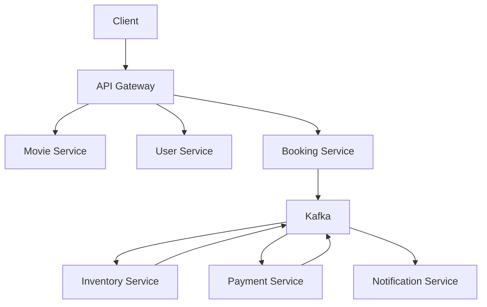
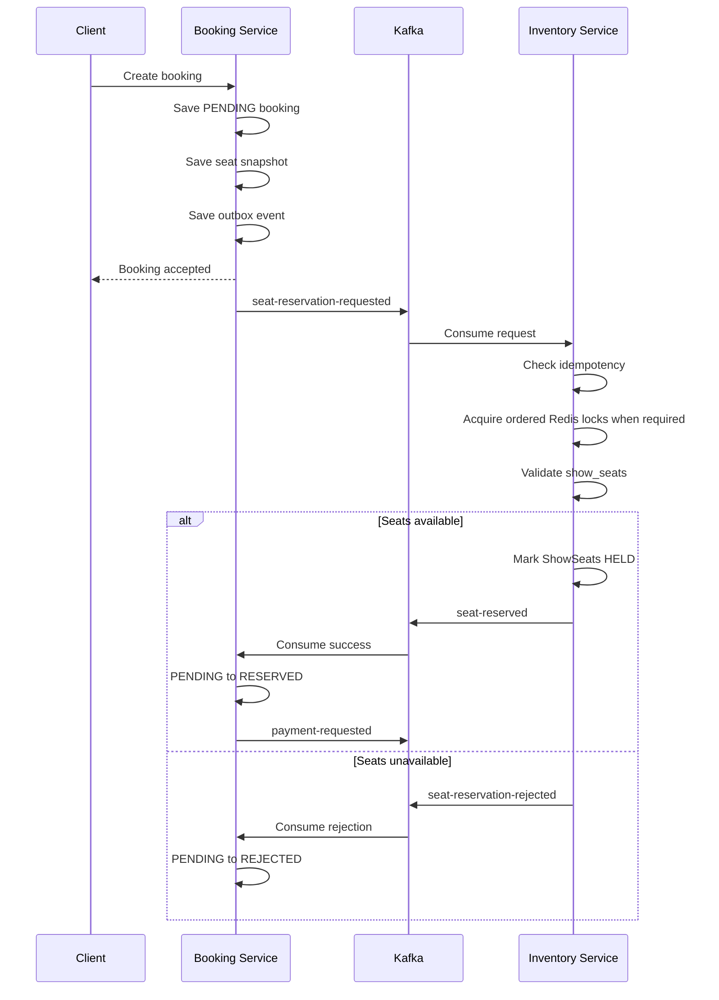

# Cinema Booking System

Version: 0.6 (R25 User Service Completed; R26 Booking Service Active)

---

# Project Overview

Cinema Booking System là hệ thống đặt vé xem phim theo kiến trúc
Microservices hướng Enterprise.

Mục tiêu:

- High Availability
- High Scalability
- Event-Driven
- Cloud Ready
- Production Ready
- DDD Friendly
- Easy Horizontal Scaling

Hệ thống được thiết kế để mô phỏng nền tảng của các chuỗi rạp như:

- CGV
- Galaxy Cinema
- Cinestar
- Lotte Cinema

---

# Current Progress

## Completed

- ✅ R1 — Parent Project
- ✅ R2 — common-core
- ✅ R3 — common-jpa
- ✅ R4 — common-exception
- ✅ R5 — common-response
- ✅ R6 — common-api
- ✅ R7 — common-validation
- ✅ R8 — common-jackson
- ✅ R9 — common-logging
- ✅ R10 — common-mapper
- ✅ R11 — common-security
- ✅ R12 — common-lock
- ✅ R13 — common-kafka
- ✅ R14 — common-outbox
- ✅ R15 — common-search
- ✅ R16 — common-openapi
- ✅ R17 — common-test
- ✅ R18 — common-tracing
- ✅ R19 — common-storage
- ✅ R20 — Config Server
- ✅ R21 — Discovery Server
- ✅ R22 — API Gateway
- ✅ R23 — Movie Service
- ✅ R24 — Inventory Service

Inventory Service owns:

- Cinemas
- Rooms
- Fixed physical seats
- Room seat layouts
- Showtimes
- `show_seats`
- Seat availability and reservation state
- Database-backed ShowSeat concurrency control
- Redis coordination where explicitly required by a later operation
- Inventory Outbox records
- Inventory consumer-processing records

Completed R24 scope:

- Bootstrapped the Spring Boot application
- Created the Inventory database and Flyway migrations
- Implemented Cinema management
- Implemented Room management
- Implemented fixed Seat layouts
- Implemented Showtime management and overlap validation
- Implemented ShowSeat generation for each Showtime
- Implemented atomic ShowSeat state transitions
- Integrated shared exception, response, validation and mapping modules
- Added unit, integration, security and concurrency tests
- Completed stabilization, exit-criteria and documentation verification

## In Progress

- 🚧 R25 — User Service

Completed R25 checkpoints:

```text
R25.1 — common-security hardening — DONE
R25.2 — authentication architecture and roadmap — DONE
R25.3 — User Service bootstrap — DONE
R25.4 — user domain and database schema — DONE
R25.5 — roles and permissions — DONE
R25.6 — password authentication foundation — DONE
R25.7 — account lifecycle and email verification — DONE
R25.8 — Spring Authorization Server foundation — DONE
R25.9 — OAuth2 clients and grant types — DONE
R25.10 — JWT claims and JWK signing — DONE
R25.11.1–R25.11.11 — refresh security, auditing, concurrency and closure — DONE
R25.12 — profile and account lifecycle APIs — DONE
R25.13 — Gateway and Resource Server integration — DONE
R25.14 — security and protocol verification — DONE
R25.15 — stabilization and closure — DONE
R25 — User Service — DONE
```

R25 is complete.

Active implementation round:

- R26 Booking Service — NEXT

  R25.14 verifies JWT trust and temporal validation, UUID v7 subjects, roles and
  permissions, Authorization Code with PKCE, controlled Client Credentials,
  refresh-token rotation and reuse handling, locked and disabled account token
  rejection, and MySQL Testcontainers execution.
  Accepted authentication decision:

- User Service integrates Spring Authorization Server.
- User Service is the single authoritative OAuth2 and OpenID Connect issuer.
- `common-security` validates tokens but does not issue them.
- Access tokens use RS256, UUID v7 subjects and the `cinema-api` audience.
- Authorization Code with PKCE, Refresh Token and Client Credentials are approved.
- Resource Owner Password Credentials is prohibited.
- Refresh tokens are opaque, rotated and revocable.
- Rotated refresh-token reuse invalidates the affected authorization family.
- Explicit token revocation is available through `/oauth2/revoke`.
- OIDC RP-Initiated Logout is available through `/connect/logout` and validates the
  ID-token hint, registered redirect URI and hashed session `sid`.
- Successful OIDC logout invalidates the applicable session and authorization tokens
  and revokes refresh-token history.
- Production privileged access requires MFA or an approved external control.
- Account lock and disable operations revoke applicable authorization sessions.
- Password change and password reset revoke applicable authorization sessions.
- OAuth2 client deactivation and client-secret rotation revoke applicable client
  authorizations.
- Authorized administrators can explicitly revoke user or client authorizations.
- Sensitive-change revocation records durable audit events with resolved actors,
  safe targets, explicit reason codes and the number of authorizations invalidated.
- Audit persistence participates in the same transaction as the sensitive change
  and authorization revocation.
- General security activity is persisted in the append-oriented
  `security_audit_events` table.
- Implemented durable event triggers cover form-authentication success and failure,
  refresh-token reuse detection, user-role changes, role-permission changes, OAuth2
  client registration, client deactivation and client-secret rotation.
- Security-audit actors resolve as `SYSTEM`, `USER` or `CLIENT`; request correlation
  uses the MDC correlation identifier and then the trace identifier.
- Audit records use safe target references, bounded reason codes and approved metadata.
  They never contain raw passwords, password hashes, refresh tokens, token hashes,
  client secrets, authentication credentials or unrestricted request bodies.
- Audit persistence failure rolls back audited role, permission, OAuth2 client and
  refresh-token mutations.
- General security audit records remain internal User Service persistence and are not
  Kafka business events.
- Concurrent refresh requests for the same active token produce at most one committed
  successor.
- Refresh-token history state is checked again after acquiring its pessimistic lock.
- A request that loses the rotation race returns OAuth2 `invalid_grant`; internal
  `ConflictException` details are not exposed through the token endpoint.
- No concurrent outcome may leave more than one active successor.
- Concurrent reuse of a rotated token changes the predecessor to `REUSED`, revokes the
  active successor, invalidates the authorization family and writes exactly one durable
  reuse audit event.
- Raw predecessor and successor token values remain absent from history, audit records
  and error responses.

Architecture decision:

```text
docs/decisions/ADR-013-spring-authorization-server.md
```

## Not Started

- R26 — Booking Service
- R27 — Payment Service
- R28 — Notification Service

---

# Current Target

Latest completed round:

> **R24 — Inventory Service**

Completed stabilization checkpoint:

```text
R24.5.1–R24.5.9 — DONE
R24.5             — DONE
R24               — DONE
```

Completed ShowSeat transitions:

```text
AVAILABLE   → HELD
HELD        → BOOKED
HELD        → AVAILABLE
AVAILABLE   → UNAVAILABLE
HELD        → UNAVAILABLE
UNAVAILABLE → AVAILABLE
```

Verified concurrency model:

- every transition executes inside a database transaction;
- current ShowSeat state is loaded using `PESSIMISTIC_WRITE`;
- concurrent holds for one ShowSeat allow at most one success;
- Redis locking is not duplicated for current single-row transitions.

Verified security policy:

- ShowSeat queries follow the approved public-access policy;
- generation and availability administration require `inventory:manage`;
- hold, book and release require `inventory:write`;
- authorization behavior is covered by applicable `401`, `403` and
  successful-access tests;
- JWT role and permission claims are mapped to granted authorities;
- blank and duplicate authorities are removed.
- Gateway validates bearer tokens through a reactive Resource Server chain.
- Movie and Inventory services independently validate bearer tokens.
- Gateway removes client-supplied identity headers before routing.
- Service clients receive permissions from authorized Client Credentials scopes.
- `inventory:write` authorizes hold, book and release operations.
- `inventory:manage` does not implicitly replace `inventory:write`.

R24 completion evidence:

- Inventory Service owns all approved inventory-domain data.
- Flyway migrations and Hibernate schema validation pass.
- Cinema, Room, Seat, Showtime and ShowSeat behavior is implemented.
- Showtime overlap validation is covered.
- ShowSeat generation is transactional and idempotent.
- Seat-state transitions are atomic.
- Hold ownership and expiration rules are enforced.
- Database locking prevents competing requests from successfully holding the
  same ShowSeat.
- Duplicate event processing is idempotent.
- Unit, controller, repository and integration tests pass.
- Concurrency tests pass.
- Security and authorization requirements pass.
- Maven verification passes.
- Documentation is synchronized.

Latest completed round:

> **R25 — User Service**

Active round:

> **R26 — Booking Service**

ADR-013 selects User Service with Spring Authorization Server as the authoritative
issuer. The issuer, audience, RS256/JWK ownership, approved grant types, access-token
lifetime, refresh-token lifecycle, service identity and privileged-account boundary
are confirmed.

User Service persistence, password authentication, account lifecycle, email
verification, controlled OAuth2 client registration, approved grant flows, RS256
signing, JWK publication and JWT claims are implemented. OAuth2 authorization and
consent state is stored through JDBC. Confidential BFF refresh tokens rotate after
use, and hashed history records issuance, rotation, reuse and revocation.

Rotated-token reuse invalidates the affected authorization family. Explicit OAuth2
token revocation and OIDC RP-Initiated Logout are implemented and verified. Successful
OIDC logout validates the ID-token hint, registered redirect URI and hashed session
`sid`, invalidates the HTTP session and applicable authorization tokens, and revokes
refresh-token history.

R25.11 refresh security, revocation, durable auditing, concurrency verification and
documentation closure are complete. R25.12 profile and account lifecycle APIs,
ownership enforcement and privileged-operation auditing are complete. R25.13 Gateway
and Resource Server integration is complete. R25.14 security and protocol verification and R25.15 stabilization and closure are complete. R25 User Service is closed, and R26 Booking Service is active.

---

# Project Goals

The project focuses on:

- Clean Architecture
- Domain-Driven Design
- Event-Driven Architecture
- Saga Pattern using Choreography
- Transactional Outbox
- Idempotent Consumer
- Distributed Lock
- Database per Service
- Eventual Consistency
- Observability
- Production-Ready Deployment

---

# Architecture Style


```mermaid
flowchart TD
    Client[Client] --> Gateway[API Gateway]

    Gateway --> Movie[Movie Service]
    Gateway --> User[User Service]
    Gateway --> Booking[Booking Service]

    Booking --> Kafka[Kafka]
    Kafka --> Inventory[Inventory Service]
    Kafka --> Payment[Payment Service]
    Kafka --> Notification[Notification Service]

    Inventory --> Kafka
    Payment --> Kafka
```

The system follows:

- Microservices Architecture
- Spring Cloud infrastructure
- Event-Driven Architecture
- Kafka asynchronous communication
- Saga Pattern using Choreography
- Transactional Outbox Pattern
- Idempotent Consumer Pattern
- Database per Service
- Eventual consistency between services

---

# Service Database Ownership

Every microservice exclusively owns its database and domain data.

A service must not:

- Connect to another service's database
- Query another service's tables
- Update another service's tables
- Reuse another service's repository
- Create physical foreign keys across service databases

Cross-service coordination must use:

- Synchronous APIs when an immediate response is required
- Kafka events for asynchronous workflows
- Transactional Outbox for reliable event publication
- Idempotent Consumer for safe event processing

Ownership summary:

| Service              | Owned data                                     |
| -------------------- | ---------------------------------------------- |
| Movie Service        | Movies, genres and movie metadata              |
| User Service         | Users, roles, permissions and refresh tokens   |
| Inventory Service    | Show-seat availability and reservation state   |
| Booking Service      | Booking lifecycle and requested seat snapshots |
| Payment Service      | Payments and payment transactions              |
| Notification Service | Notification and delivery history              |

---

# Seat Inventory Ownership

The `show_seats` table belongs exclusively to Inventory Service.

Inventory Service is responsible for:

- Creating show-seat inventory
- Reading current seat availability
- Reserving seats
- Releasing seats
- Marking seats as sold
- Managing Redis seat locks
- Publishing seat reservation result events

Booking Service must not:

- Query `show_seats`
- Update `show_seats`
- Use a `ShowSeatRepository`
- Connect to the Inventory Service database
- Acquire Redis locks for seats
- Create a cross-database foreign key to `show_seats`

Booking Service may store a seat snapshot containing fields such as:

- `inventorySeatId`
- `showtimeId`
- `seatNumber`
- `seatType`
- `price`

`inventorySeatId` is an external reference only. It is not a physical
foreign key to the Inventory Service database.

---

# Target Seat Reservation Flow

The previous design in which Booking Service directly locked and updated
`show_seats` is no longer valid.

This is the approved R26+ Booking Saga target. Booking Service is not yet
implemented. Inventory's direct ShowSeat `HELD`, `BOOKED`, `AVAILABLE`, and
`UNAVAILABLE` transitions were completed in R24.

The standardized flow is:


```mermaid
sequenceDiagram
    participant Client
    participant Booking as Booking Service
    participant Kafka
    participant Inventory as Inventory Service

    Client->>Booking: Create booking
    Booking->>Booking: Save PENDING booking
    Booking->>Booking: Save seat snapshot
    Booking->>Booking: Save outbox event
    Booking-->>Client: Booking accepted

    Booking->>Kafka: seat-reservation-requested
    Kafka->>Inventory: Consume request

    Inventory->>Inventory: Check idempotency
    Inventory->>Inventory: Acquire ordered Redis locks when required
    Inventory->>Inventory: Validate show_seats

    alt Seats available
        Inventory->>Inventory: Mark ShowSeats HELD
        Inventory->>Kafka: seat-reserved
        Kafka->>Booking: Consume success
        Booking->>Booking: PENDING to RESERVED
        Booking->>Kafka: payment-requested
    else Seats unavailable
        Inventory->>Kafka: seat-reservation-rejected
        Kafka->>Booking: Consume rejection
        Booking->>Booking: PENDING to REJECTED
    end
```

## Booking Service Local Transaction

Booking Service performs only the following operations when creating a
booking:

1. Create a booking with status `PENDING`.
2. Store the requested seat snapshot.
3. Store a `SEAT_RESERVATION_REQUESTED` outbox event.
4. Commit the local database transaction.

Booking Service then publishes:

```text
seat-reservation-requested
```

## Inventory Service Local Transaction

Inventory Service processes the reservation request:

1. Check event idempotency using `eventId`.
2. Acquire ordered Redis distributed locks when the approved multi-seat
   workflow requires them.
3. Query Inventory-owned `show_seats`.
4. Verify all requested seats are `AVAILABLE`.
5. Change available ShowSeats to `HELD` and store hold owner/expiry.
6. Store the result in the Inventory outbox table.
7. Commit the local database transaction.
8. Release the Redis locks.

Inventory Service publishes one of:

```text
seat-reserved
seat-reservation-rejected
```

## Booking Service Result Handling

When Booking Service receives `seat-reserved`:

```text
PENDING → RESERVED
```

Booking Service then creates:

```text
payment-requested
```

When Booking Service receives `seat-reservation-rejected`:

```text
PENDING → REJECTED
```

No payment request is created.

## Seat Release

When a booking expires, is cancelled, or its payment fails:

```text
Booking Service
    ↓
seat-release-requested
    ↓
Inventory Service
    ↓
show_seats: HELD → AVAILABLE
    ↓
seat-released
```

Inventory Service remains the only service allowed to update
`show_seats`.

---

# Security and Configuration Rules

Credentials must not be committed to Git.

Database credentials must use environment variables:

```yaml
spring:
  datasource:
    username: ${MOVIE_DB_USERNAME}
    password: ${MOVIE_DB_PASSWORD}
```

Rules:

- Do not hard-code passwords in YAML or properties files.
- Do not commit real `.env` files.
- Do not provide default values for passwords.
- Use Testcontainers-generated credentials in integration tests.
- Keep `.env.example` limited to placeholder values.
- Rotate any credential previously committed to Git history.

Example placeholders:

```dotenv
MYSQL_ROOT_PASSWORD=change-me
MOVIE_DB_USERNAME=cinema_movie
MOVIE_DB_PASSWORD=change-me
```

---

# Architecture Principles

The project follows:

- SOLID
- DRY
- KISS
- Clean Code
- Domain-Driven Design
- Hexagonal-Friendly Design
- Event-Driven Architecture
- Database per Service
- Loose Coupling
- High Cohesion
- Eventual Consistency
- Idempotent Processing

---

# Locked Technical Decisions

The following decisions are fixed unless the user explicitly requests a
change:

- Java 21
- Spring Boot 3.5.16
- Maven Multi Module
- MySQL 8
- Flyway
- Redis and Redisson
- Apache Kafka
- UUID Version 7
- Saga Pattern using Choreography
- Transactional Outbox Pattern
- Idempotent Consumer Pattern
- Database per Service
- MapStruct
- Jackson ISO-8601
- Standard `ApiResponse`
- `BusinessException` hierarchy
- No Lombok in common modules
- JUnit 5
- Testcontainers
- Docker Compose

Do not extend or replace these technologies without an explicit request.

---

# Project Structure

```text
cinema-system
├── common
│   ├── common-api
│   ├── common-core
│   ├── common-exception
│   ├── common-jackson
│   ├── common-jpa
│   ├── common-kafka
│   ├── common-lock
│   ├── common-logging
│   ├── common-mapper
│   ├── common-openapi
│   ├── common-outbox
│   ├── common-response
│   ├── common-search
│   ├── common-security
│   ├── common-storage
│   ├── common-test
│   ├── common-tracing
│   ├── common-util
│   └── common-validation
├── infrastructure
│   ├── config-service
│   ├── discovery-service
│   └── gateway-service
├── services
│   ├── movie-service
│   ├── user-service
│   ├── inventory-service
│   ├── booking-service
│   ├── payment-service
│   └── notification-service
├── docs
└── pom.xml
```

---

# Development Strategy

The project is developed incrementally through numbered rounds.

```text
R1 → R2 → ... → R22 → R23 → R24 → R25 → ...
```

Each round must pass:

- Unit tests
- Controller tests where applicable
- Integration tests where applicable
- Flyway validation
- Maven build
- Security checks
- Documentation synchronization

A round must not be marked complete solely because its functional
implementation has been merged.

---

# Documentation

The `docs` directory is the single source of truth.

Chat history must never be treated as project documentation.

When implementation and documentation conflict:

1. Inspect the current implementation.
2. Inspect the relevant architecture decision.
3. Correct the outdated documentation or implementation.
4. Keep database ownership boundaries intact.
5. Record material architecture changes in the changelog.

Relevant documents:

- `00_PROJECT_CONTEXT.md`
- `01_AI_CONTEXT.md`
- `02_ARCHITECTURE.md`
- `08_SECURITY.md`
- `10_ROADMAP.md`
- `decisions/ADR-013-spring-authorization-server.md`
- `06_DATABASE_DESIGN.md`
- `07_EVENT_CATALOG.md`
- `10_ROADMAP.md`
- `11_CHANGELOG.md`
