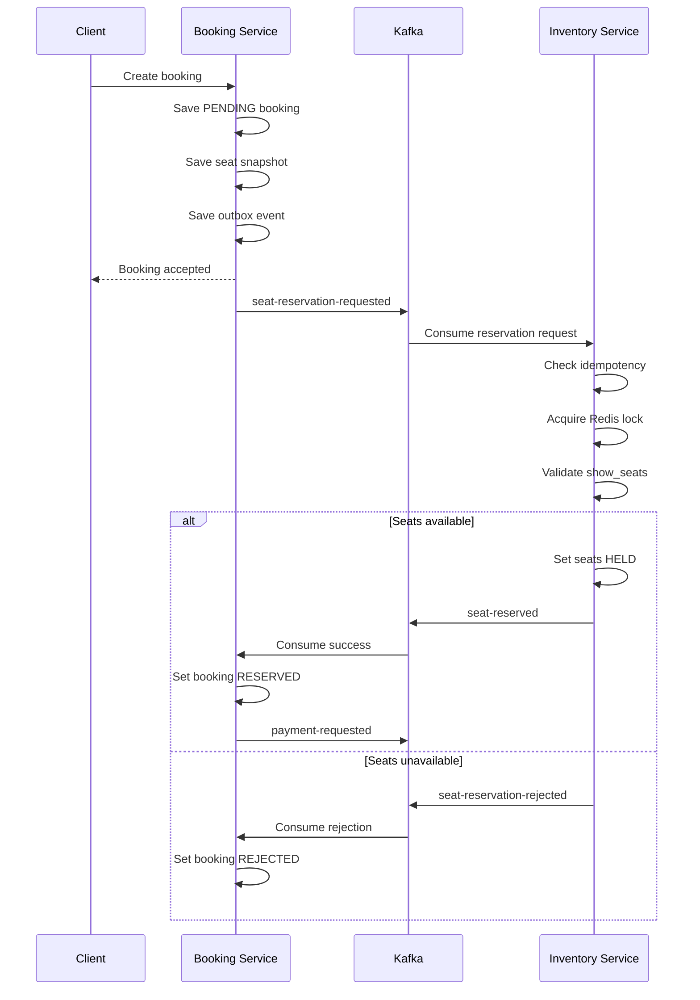

# AI Context

This file provides the minimum authoritative context required for an AI
assistant to continue development of Cinema Booking System without relying
on previous chat history.

The `docs` directory is the project's source of truth.

---

# Current Progress

## Completed

- R1–R19 — Common modules
- R20 — Config Server
- R21 — Discovery Server
- R22 — API Gateway
- R23 — Movie Service

## Current Round

> **R24 — Inventory Service Implementation**

Inventory Service is the active business-service round.

Approved domain model:

```text
Cinema
    ↓
Room
    ↓
Seat

Room + external Movie ID
    ↓
Showtime
    ↓
ShowSeat
```

Inventory Service owns:

- Cinemas
- Rooms
- Fixed physical seats
- Room seat layouts
- Showtimes
- `show_seats`
- Seat availability and reservation state
- Redis seat locks
- Inventory Outbox records
- Inventory consumer-processing records

Required implementation order:

1. Bootstrap Inventory Service.
2. Implement Cinema.
3. Implement Room.
4. Implement fixed Seat layouts.
5. Implement Showtime and overlap validation.
6. Generate ShowSeat records.
7. Implement atomic ShowSeat state transitions.
8. Add idempotent event processing.
9. Add unit, integration and concurrency tests.
10. Complete security, Maven and documentation verification.

## Next Round

> **R25 — User Service**

Do not start R25 before R24 passes all exit criteria defined in
`docs/10_ROADMAP.md`.

---

# Locked Architecture

Do not modify the following unless the user explicitly requests it:

- Module structure
- Technology stack
- Package naming
- Database ownership
- Event contracts
- Architecture patterns
- Coding conventions
- Dependency rules
- Round scope

Do not introduce new technologies, patterns, modules, or infrastructure
without explicit approval.

---

# Technology Stack

- Java 21
- Spring Boot 3.5.4
- Maven Multi Module
- Spring Data JPA
- Hibernate 6
- MySQL 8
- Flyway
- Redis
- Redisson
- Apache Kafka
- MapStruct
- Jackson
- Spring Security
- JWT and OAuth2
- OpenAPI and Swagger
- JUnit 5
- Mockito
- Testcontainers
- Docker Compose
- Spring Cloud Config
- Eureka Discovery
- Spring Cloud Gateway
- Micrometer Tracing
- OpenTelemetry
- Elasticsearch
- MinIO

Do not change technology versions or replace technologies unless
explicitly requested.

---

# Architecture Decisions

The project uses:

- Microservices Architecture
- Event-Driven Architecture
- Saga Pattern using Choreography
- Transactional Outbox Pattern
- Idempotent Consumer Pattern
- Database per Service
- Eventual Consistency
- Distributed Lock
- UUID Version 7
- Standard `ApiResponse`
- `BusinessException` as the base business exception
- MapStruct for object mapping
- Jackson ISO-8601 date/time serialization
- No Lombok in common modules
- Flyway-managed database schemas

---

# Service Ownership Rule

Each microservice exclusively owns its domain database.

A service must not:

- Connect to another service's database
- Query another service's tables
- Modify another service's tables
- Import or reuse another service's repository
- Create physical foreign keys across service databases

Cross-service communication must use:

- APIs for synchronous requests
- Kafka events for asynchronous workflows
- Transactional Outbox for reliable publication
- Idempotent Consumer for reliable consumption

Service ownership:

| Service              | Owned data                                     |
| -------------------- | ---------------------------------------------- |
| Movie Service        | Movies, genres and movie metadata              |
| User Service         | Users, roles, permissions and refresh tokens   |
| Inventory Service    | Cinemas, rooms, seats, showtimes and show seats |
| Booking Service      | Booking lifecycle and requested seat snapshots |
| Payment Service      | Payment transactions                           |
| Notification Service | Notifications and delivery history             |

---

# Seat Inventory Ownership

Inventory Service exclusively owns:

- Cinemas
- Rooms
- Fixed physical seats
- Room seat layouts
- Showtimes
- `show_seats`
- Seat availability state
- Seat reservation state
- Seat release operations
- Redis distributed locks for seats
- Inventory reservation result events

Booking Service must not:

- Query `show_seats`
- Update `show_seats`
- Use `ShowSeatRepository`
- Use Inventory Service entities
- Connect to `cinema_inventory_db`
- Acquire Redis seat locks
- Create a physical foreign key to `show_seats`

Booking Service may store an immutable seat snapshot for its own booking
record.

Possible snapshot fields:

```text
booking_id
inventory_seat_id
showtime_id
seat_number
seat_type
price
```

`inventory_seat_id` is an external reference, not a cross-database foreign
key.

Approved `ShowSeatStatus` transitions:

```text
AVAILABLE → HELD → BOOKED
     ↑        ↓
     └────────┘
```

Redis provides coordination only. Database conditional updates or locking
are the final consistency guarantee against double booking.

---

# Standard Seat Reservation Flow

The following is the authoritative seat reservation flow:



The old flow in which Booking Service directly updates `show_seats` is
invalid and must not be reintroduced.

---

# Booking Service Responsibilities

When creating a booking, the Booking Service local transaction performs:

1. Create the booking with status `PENDING`.
2. Store the requested seat snapshot.
3. Create a `SEAT_RESERVATION_REQUESTED` outbox event.
4. Commit the Booking database transaction.

Booking Service publishes:

```text
seat-reservation-requested
```

Suggested event contract:

```java
public record SeatReservationRequestedEvent(
        UUID eventId,
        UUID bookingId,
        UUID userId,
        UUID showtimeId,
        List<String> seatNumbers,
        OffsetDateTime occurredAt
) {
}
```

Booking Service does not validate seat availability against the Inventory
database.

---

# Inventory Service Responsibilities

When Inventory Service receives a reservation request, it performs:

1. Check idempotency using `eventId`.
2. Acquire Redis distributed locks.
3. Query Inventory-owned `show_seats`.
4. Verify that all requested seats are `AVAILABLE`.
5. Atomically change available seats to `HELD`.
6. Store the result event in its outbox table.
7. Commit the Inventory database transaction.
8. Release the Redis locks.

Success topic:

```text
seat-reserved
```

Suggested success event:

```java
public record SeatReservedEvent(
        UUID eventId,
        UUID correlationId,
        UUID bookingId,
        UUID showtimeId,
        List<String> seatNumbers,
        OffsetDateTime reservedAt,
        OffsetDateTime expiresAt
) {
}
```

Rejection topic:

```text
seat-reservation-rejected
```

Suggested rejection event:

```java
public record SeatReservationRejectedEvent(
        UUID eventId,
        UUID correlationId,
        UUID bookingId,
        UUID showtimeId,
        List<String> seatNumbers,
        String reason,
        OffsetDateTime occurredAt
) {
}
```

---

# Booking Result Handling

When Booking Service consumes `seat-reserved`:

```text
PENDING → RESERVED
```

Booking Service then publishes:

```text
payment-requested
```

When Booking Service consumes `seat-reservation-rejected`:

```text
PENDING → REJECTED
```

Booking Service must not create a payment request after seat reservation is
rejected.

All consumers must implement idempotent processing.

---

# Seat Release Flow

A booking expiration, cancellation, or payment failure triggers:

```text
Booking Service
    ↓
seat-release-requested
    ↓
Inventory Service
    ↓
show_seats: HELD → AVAILABLE
    ↓
seat-released
```

Inventory Service remains the only service allowed to change the state of
`show_seats`. A successful payment changes the held seats from `HELD` to
`BOOKED`.

---

# Security and Credential Rules

Never hard-code:

- Database passwords
- API keys
- JWT secrets
- Access tokens
- Private keys
- Production usernames

Use environment variables:

```yaml
spring:
    datasource:
        username: ${MOVIE_DB_USERNAME}
        password: ${MOVIE_DB_PASSWORD}
```

Password environment variables must not have real default values.

Allowed example:

```yaml
username: ${MOVIE_DB_USERNAME:cinema_movie}
password: ${MOVIE_DB_PASSWORD}
```

Not allowed:

```yaml
username: root
password: root
```

Test rules:

- Prefer Testcontainers-generated database credentials.
- Do not store test passwords in `application-test.yml`.
- Use `@DynamicPropertySource` when datasource properties must be
  registered explicitly.
- Never commit a real `.env` file.
- Keep only placeholder values in `.env.example`.
- Rotate credentials that have previously appeared in Git history.

---

# Common Layer Status

| Module            | Status |
| ----------------- | ------ |
| common-core       | DONE   |
| common-jpa        | DONE   |
| common-exception  | DONE   |
| common-response   | DONE   |
| common-api        | DONE   |
| common-validation | DONE   |
| common-jackson    | DONE   |
| common-logging    | DONE   |
| common-mapper     | DONE   |
| common-security   | DONE   |
| common-lock       | DONE   |
| common-kafka      | DONE   |
| common-outbox     | DONE   |
| common-search     | DONE   |
| common-openapi    | DONE   |
| common-test       | DONE   |
| common-tracing    | DONE   |
| common-storage    | DONE   |

Common modules R1–R19 are complete. Do not refactor completed common
modules unless required by a verified defect or explicitly requested.

---

# Infrastructure Status

| Round | Module           | Status |
| ----- | ---------------- | ------ |
| R20   | Config Server    | DONE   |
| R21   | Discovery Server | DONE   |
| R22   | API Gateway      | DONE   |

Do not rebuild or redesign completed infrastructure modules unless
explicitly requested.

---

# Business Service Status

| Round | Service              | Status      |
| ----- | -------------------- | ----------- |
| R23   | Movie Service        | DONE        |
| R24   | Inventory Service    | IN PROGRESS |
| R25   | User Service         | NOT STARTED |
| R26   | Booking Service      | NOT STARTED |
| R27   | Payment Service      | NOT STARTED |
| R28   | Notification Service | NOT STARTED |

Movie Service has completed its implementation, testing and verification
requirements. Inventory Service is the active business-service round.

---

# Coding Conventions

## Common Modules

Do not use Lombok in common modules.

Use explicit:

- Constructors
- Getters
- `equals`
- `hashCode`
- `toString` where necessary

## Logging

Use SLF4J:

```java
private static final Logger LOGGER =
        LoggerFactory.getLogger(CurrentClass.class);
```

Do not depend on Lombok-generated `log` fields in common modules.

## Mapping

Use MapStruct.

Do not manually map DTOs and entities when a MapStruct mapper is
appropriate.

## Exceptions

All business exceptions must extend the approved `BusinessException`
base.

Do not create independent exception response formats.

## API Responses

Controllers must return the standardized `ApiResponse`.

Do not create service-specific response wrappers.

## Jackson

Use the shared Jackson configuration.

Do not create `ObjectMapper` directly inside application code.

Date and time values must use ISO-8601 serialization.

## Identifiers

Use UUID v7 for:

- Entity identifiers
- Event identifiers
- Correlation identifiers where applicable

Do not return to numeric auto-increment identifiers.

## Database Migrations

Use Flyway for every schema change.

Do not rely on Hibernate to create or update production schemas.

Use:

```yaml
spring:
    jpa:
        hibernate:
            ddl-auto: validate
```

---

# Testing Requirements

Every round must include appropriate tests.

For a business service, verify at least:

- Service unit tests
- Mapper tests
- Utility tests
- Controller tests
- Repository or integration tests
- Flyway migration startup
- Testcontainers integration
- Validation behavior
- Business exception behavior
- Duplicate constraint behavior
- Full Maven verification

R24 Inventory Service must additionally verify:

- Cinema service behavior
- Room service behavior
- Fixed physical Seat layout behavior
- Showtime overlap rejection
- ShowSeat generation
- Atomic `AVAILABLE → HELD` transitions
- Atomic `HELD → BOOKED` transitions
- Atomic `HELD → AVAILABLE` transitions
- Duplicate event idempotency
- Concurrent reservation of the same seat
- Flyway schema validation
- MySQL Testcontainers integration
- Redis Testcontainers integration where required

---

# Completion Rules

A round can be marked complete only when:

1. The requested functionality is implemented.
2. Unit tests pass.
3. Integration tests pass where applicable.
4. Flyway migrations pass.
5. Maven build passes.
6. Security checks pass.
7. Documentation is synchronized.
8. No ownership boundary is violated.

A merged pull request alone does not mean the round is complete.

---

# Current Next Step

Continue R24 Inventory Service in this order:

1. Bootstrap Inventory Service.
2. Configure the Inventory database and Flyway.
3. Implement Cinema.
4. Implement Room.
5. Implement fixed physical Seat layouts.
6. Implement Showtime and overlap validation.
7. Generate ShowSeat records.
8. Implement atomic ShowSeat state transitions.
9. Implement idempotent event processing.
10. Add unit, integration and concurrency tests.
11. Run `mvn clean verify`.
12. Synchronize documentation.

Do not start R25 User Service before all R24 exit criteria pass.
