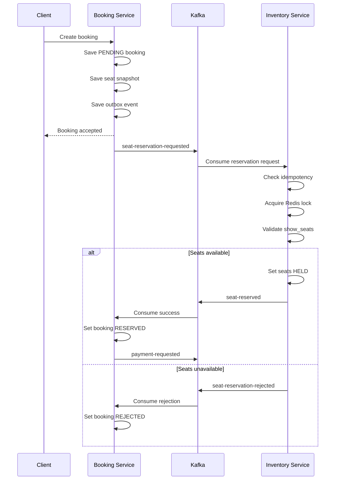

# AI Context

This file provides the minimum authoritative context required for an AI
assistant to continue development of Cinema Booking System without relying
on previous chat history.

The `docs` directory is the project's source of truth.

---

# Current Progress

## Completed

- R1–R19 — Common modules
- R20 — Config Server
- R21 — Discovery Server
- R22 — API Gateway
- R23 — Movie Service
- R24 — Inventory Service
- R25 — User Service
- R26 — Booking Service
- R27.1 — Payment architecture and contract closure
- R27.2 — Payment Service bootstrap and Resource Server security
- R27.3 — Payment aggregate and Flyway schema
- R27.4 — `payment-requested` validation and idempotent consumption
- R27.5 — Provider port, operation worker, and provider idempotency
- R27.6 — Authenticated webhook and provider-result processing

## Completed Inventory Round

> **R24 — Inventory Service**

Inventory Service implementation, stabilization, security verification,
integration testing, concurrency testing and documentation synchronization
are complete.

Approved domain model:

```text
Cinema
    ↓
Room
    ↓
Seat

Room + external Movie ID
    ↓
Showtime
    ↓
ShowSeat
```

Inventory Service owns:

- Cinemas
- Rooms
- Fixed physical seats
- Room seat layouts
- Showtimes
- `show_seats`
- Seat availability and reservation state
- Database-backed ShowSeat concurrency control
- Redis coordination for later operations where explicitly required
- Inventory Outbox records
- Inventory consumer-processing records

Completed implementation state:

1. Inventory Service bootstrap — completed.
2. Cinema implementation — completed.
3. Room implementation — completed.
4. Fixed Seat layout implementation — completed.
5. Showtime and overlap validation — completed.
6. ShowSeat generation and idempotency — completed.
7. Transactional booking ShowSeat transitions — completed.
8. Administrative availability transitions — completed.
9. ShowSeat endpoint authorization — completed.
10. Schema, JPA mapping and data-ownership verification — completed.
11. Business-invariant verification — completed.
12. API, security, architecture and quality-gate verification — completed.
13. Documentation synchronization and R24 closure — completed.

Latest completed R24 checkpoint:

> **R24.5.9 — Documentation synchronization and R24 closure**

Completion status:

```text
R24.5.1–R24.5.9 — DONE
R24.5             — DONE
R24               — DONE
```

Verified ShowSeat rules:

- every mutable operation uses `@Transactional`;
- mutable ShowSeat state is loaded through `findByIdForUpdate(...)`;
- `PESSIMISTIC_WRITE` is preserved until the transaction finishes;
- current single-row transitions do not duplicate database locking with Redis;
- booked ShowSeats cannot return to an availability state;
- hold ownership and expiration are enforced;
- shared public exceptions and Inventory error codes are used;
- client-supplied role or identity headers are not trusted;
- competing holds for the same ShowSeat allow at most one success.

Verified endpoint authorization:

- approved ShowSeat query endpoints are public;
- generation and availability administration require `inventory:manage`;
- hold, book and release require the Client Credentials scope `inventory:write`;
- unauthenticated, forbidden and successful-access cases are tested;
- JWT role and permission claims are mapped to granted authorities;
- blank and duplicate authorities are removed.

## Latest Completed Round

R26 Booking Service is complete.

Completed checkpoints:

```text
R26.1  — Booking architecture and contract closure        — DONE
R26.2  — Booking Service bootstrap and security           — DONE
R26.3  — Booking aggregate and Flyway schema              — DONE
R26.4  — Authenticated create and query APIs              — DONE
R26.5  — Client request idempotency                       — DONE
R26.6  — Transactional Outbox contract hardening          — DONE
R26.7  — seat-reservation-requested publication           — DONE
R26.8  — Inventory event integration                      — DONE
R26.9  — Reservation result handling                      — DONE
R26.10 — Expiration and cancellation                      — DONE
R26.11 — Payment event preparation                        — DONE
R26.12 — Integration and concurrency verification         — DONE
R26.13 — Stabilization and closure                        — DONE
R26    — Booking Service                                  — DONE
```

Verified Booking baseline:

- authenticated ownership comes only from the JWT UUID subject;
- Booking Service never accepts a request-owned `userId`;
- Booking Service does not access Inventory persistence or `show_seats`;
- Booking and Inventory coordinate through canonical Kafka events;
- Booking mutations and outgoing events use Transactional Outbox;
- state-changing consumers use processed-event idempotency;
- duplicate and delayed events cannot reverse decided Booking state;
- cancellation and expiration use persisted expiration boundaries;
- `payment-requested` preserves source correlation and causation;
- Booking, seat snapshots, processed markers and outgoing Outbox records commit
  or roll back atomically;
- focused Booking verification and the root Maven reactor verification pass.

## Current Payment Round

R27 Payment Service is in progress.

Completed checkpoints:

```text
R27.1 — Payment architecture and contract closure                 — DONE
R27.2 — Payment Service bootstrap and Resource Server security    — DONE
R27.3 — Payment aggregate and Flyway schema                       — DONE
R27.4 — payment-requested validation and idempotent consumption   — DONE
R27.5 — Provider port, operation worker, and provider idempotency — DONE
R27.6 — Authenticated webhook and provider-result processing      — DONE
```

Current checkpoint:

```text
R27.7 — payment-succeeded and payment-failed Outbox publication — NEXT
```

R27.6 accepts provider callbacks only after provider-specific verification. The
HTTP endpoint does not require a customer bearer token, but this must never be
described as an unauthenticated payment decision.

Production MoMo/VNPay integration is not implemented. R27.7 must atomically
persist terminal Payment state and its canonical Outbox event.

Payment Service owns payment attempts, provider interaction, provider
idempotency, payment-result events, refund state and Payment-owned persistence.

R27 must consume the canonical `payment-requested` event without importing
Booking entities, repositories or database tables.

R25.13 completed:

- Gateway uses reactive JWT validation and shared reactive `401`/`403` responses.
- Gateway exposes only explicit routes and disables Discovery Locator routes.
- Gateway removes untrusted identity headers while preserving bearer tokens.
- Movie Service requires `movie:manage` for catalog mutations.
- Inventory administration requires `inventory:manage`.
- Showtime administration requires `showtime:manage`.
- ShowSeat hold, book and release require `inventory:write`.
- Gateway, Movie Service and Inventory Service validate tokens independently.

ADR-013 accepts the following decisions:

- User Service integrates Spring Authorization Server.
- User Service is the single authoritative OAuth2 and OpenID Connect issuer.
- `common-security` validates tokens but does not issue them.
- Authorization Code with PKCE, Refresh Token and Client Credentials are approved.
- Resource Owner Password Credentials is prohibited.
- JWT access tokens use RS256, UUID v7 subjects and the `cinema-api` audience.
- Initial access-token lifetime is 15 minutes.
- Refresh tokens are opaque, rotate after use and have an initial maximum lifetime of 30 days.
- Refresh-token history stores SHA-256 hashes and tracks `ACTIVE`, `ROTATED`,
  `REUSED` and `REVOKED`.
- Rotated-token reuse invalidates the affected authorization family.
- Explicit OAuth2 token revocation is exposed through `/oauth2/revoke`.
- OIDC RP-Initiated Logout is exposed through `/connect/logout`.
- OIDC logout validates the ID-token hint, registered post-logout redirect URI and
  hashed session `sid`.
- Successful OIDC logout invalidates the HTTP session and applicable authorization
  tokens and revokes refresh-token history.
- User Service owns private signing keys and publishes public keys through JWK Set.
- Gateway and protected business services validate tokens independently.
- Production privileged access requires MFA or an approved external control.

Authoritative decision record:

```text
docs/decisions/ADR-013-spring-authorization-server.md
```

---

# Locked Architecture

Do not modify the following unless the user explicitly requests it:

- Module structure
- Technology stack
- Package naming
- Database ownership
- Event contracts
- Architecture patterns
- Coding conventions
- Dependency rules
- Round scope

Do not introduce new technologies, patterns, modules, or infrastructure
without explicit approval.

---

# Technology Stack

- Java 21
- Spring Boot 3.5.16
- Maven Multi Module
- Spring Data JPA
- Hibernate 6
- MySQL 8
- Flyway
- Redis
- Redisson
- Apache Kafka
- MapStruct
- Jackson
- Spring Security
- JWT and OAuth2
- OpenAPI and Swagger
- JUnit 5
- Mockito
- Testcontainers
- Docker Compose
- Spring Cloud Config
- Eureka Discovery
- Spring Cloud Gateway
- Micrometer Tracing
- OpenTelemetry
- Elasticsearch
- MinIO

Do not change technology versions or replace technologies unless
explicitly requested.

---

# Architecture Decisions

The project uses:

- Microservices Architecture
- Event-Driven Architecture
- Saga Pattern using Choreography
- Transactional Outbox Pattern
- Idempotent Consumer Pattern
- Database per Service
- Eventual Consistency
- Distributed Lock
- UUID Version 7
- Standard `ApiResponse`
- `BusinessException` as the base business exception
- MapStruct for object mapping
- Jackson ISO-8601 date/time serialization
- No Lombok in common modules
- Flyway-managed database schemas

---

# Service Ownership Rule

Each microservice exclusively owns its domain database.

A service must not:

- Connect to another service's database
- Query another service's tables
- Modify another service's tables
- Import or reuse another service's repository
- Create physical foreign keys across service databases

Cross-service communication must use:

- APIs for synchronous requests
- Kafka events for asynchronous workflows
- Transactional Outbox for reliable publication
- Idempotent Consumer for reliable consumption

Service ownership:

| Service              | Owned data                                      |
| -------------------- | ----------------------------------------------- |
| Movie Service        | Movies, genres and movie metadata               |
| User Service         | Users, roles, permissions and refresh tokens    |
| Inventory Service    | Cinemas, rooms, seats, showtimes and show seats |
| Booking Service      | Booking lifecycle and requested seat snapshots  |
| Payment Service      | Payment transactions                            |
| Notification Service | Notifications and delivery history              |

---

# Seat Inventory Ownership

Inventory Service exclusively owns:

- Cinemas
- Rooms
- Fixed physical seats
- Room seat layouts
- Showtimes
- `show_seats`
- Seat availability state
- Seat reservation state
- Seat release operations
- Database-backed ShowSeat concurrency control
- Redis coordination for future operations where explicitly required
- Inventory reservation result events

Booking Service must not:

- Query `show_seats`
- Update `show_seats`
- Use `ShowSeatRepository`
- Use Inventory Service entities
- Connect to `cinema_inventory_db`
- Acquire Redis seat locks
- Create a physical foreign key to `show_seats`

Booking Service may store an immutable seat snapshot for its own booking
record.

Possible snapshot fields:

```text
booking_id
inventory_seat_id
showtime_id
seat_number
seat_type
price
```

`inventory_seat_id` is an external reference, not a cross-database foreign
key.

Approved `ShowSeatStatus` transitions:

```text
AVAILABLE → HELD → BOOKED
     ↑        ↓
     └────────┘
```

Approved administrative availability transitions:

```text
AVAILABLE   → UNAVAILABLE
HELD        → UNAVAILABLE
UNAVAILABLE → AVAILABLE
```

Redis provides coordination only. Database conditional updates or locking
are the final consistency guarantee against double booking.

---

# Standard Seat Reservation Flow

The following is the authoritative seat reservation flow:

> The Booking-to-Inventory reservation flow is implemented and verified through
> R26. Payment processing after `payment-requested` remains R27 scope.


```mermaid
sequenceDiagram
    participant Client
    participant Booking as Booking Service
    participant Kafka
    participant Inventory as Inventory Service

    Client->>Booking: Create booking
    Booking->>Booking: Save PENDING booking
    Booking->>Booking: Save seat snapshot
    Booking->>Booking: Save outbox event
    Booking-->>Client: Booking accepted

    Booking->>Kafka: seat-reservation-requested
    Kafka->>Inventory: Consume reservation request

    Inventory->>Inventory: Check idempotency
    Inventory->>Inventory: Acquire Redis lock
    Inventory->>Inventory: Validate show_seats

    alt Seats available
        Inventory->>Inventory: Set seats HELD
        Inventory->>Kafka: seat-reserved
        Kafka->>Booking: Consume success
        Booking->>Booking: Set booking RESERVED
        Booking->>Kafka: payment-requested
    else Seats unavailable
        Inventory->>Kafka: seat-reservation-rejected
        Kafka->>Booking: Consume rejection
        Booking->>Booking: Set booking REJECTED
    end
```

The old flow in which Booking Service directly updates `show_seats` is
invalid and must not be reintroduced.

---

# Booking Service Responsibilities

When creating a booking, the Booking Service local transaction performs:

1. Create the booking with status `PENDING`.
2. Store the requested seat snapshot.
3. Create a `SEAT_RESERVATION_REQUESTED` outbox event.
4. Commit the Booking database transaction.

Booking Service publishes:

```text
seat-reservation-requested
payment-requested
booking-cancelled
booking-expired
```

The exact immutable payloads and canonical envelope metadata are defined in
`docs/07_EVENT_CATALOG.md`. Internal JPA entities are never used as integration
event payloads.

Booking Service does not validate seat availability against the Inventory
database.

---

# Inventory Service Responsibilities

When Inventory Service receives a reservation request, it performs:

1. Check idempotency using `eventId`.
2. Acquire Redis distributed locks where the approved multi-seat operation
   requires them.
3. Query Inventory-owned `show_seats`.
4. Verify that all requested seats are `AVAILABLE`.
5. Atomically change available seats to `HELD`.
6. Store the result event in its outbox table.
7. Commit the Inventory database transaction.
8. Release the Redis locks.

Success topic:

```text
seat-reserved
```

The canonical success payload includes authoritative Inventory seat IDs, seat
numbers, seat types, prices, total amount, currency, hold time and hold
expiration. The exact versioned contract is defined in
`docs/07_EVENT_CATALOG.md`.

Rejection topic:

```text
seat-reservation-rejected
```

The canonical rejection payload uses an approved stable reason code and does
not expose internal exception, database or stack-trace details. The exact
versioned contract is defined in `docs/07_EVENT_CATALOG.md`.

---

# Booking Result Handling

When Booking Service consumes `seat-reserved`:

```text
PENDING → RESERVED
```

Booking Service then publishes:

```text
payment-requested
```

The processed-event marker, Booking transition, BookingSeat snapshot completion
and `payment-requested` Outbox insertion commit or roll back together.

When Booking Service consumes `seat-reservation-rejected`:

```text
PENDING → REJECTED
```

Booking Service must not create a payment request after seat reservation is
rejected.

All consumers must implement idempotent processing.

---

# Seat Release Flow

R26 cancellation and expiration publish their canonical lifecycle events:

```text
booking-cancelled
booking-expired
```

Booking Service does not also publish `seat-release-requested` for those
transitions. Future Inventory consumers conditionally release only ShowSeats
that remain `HELD` by the same Booking.

The separate `seat-release-requested` contract is reserved for the future R27
payment-failure compensation path. Inventory Service remains the only service
allowed to change `show_seats`. A successful payment will change matching held
seats from `HELD` to `BOOKED` through an Inventory-owned transition.

---

# Security and Credential Rules

Never hard-code:

- Database passwords
- API keys
- JWT secrets
- Access tokens
- Private keys
- Production usernames

Use environment variables:

```yaml
spring:
  datasource:
    username: ${MOVIE_DB_USERNAME}
    password: ${MOVIE_DB_PASSWORD}
```

Password environment variables must not have real default values.

Allowed example:

```yaml
username: ${MOVIE_DB_USERNAME:cinema_movie}
password: ${MOVIE_DB_PASSWORD}
```

Not allowed:

```yaml
username: root
password: root
```

Test rules:

- Prefer Testcontainers-generated database credentials.
- Do not store test passwords in `application-test.yml`.
- Use `@DynamicPropertySource` when datasource properties must be
  registered explicitly.
- Never commit a real `.env` file.
- Keep only placeholder values in `.env.example`.
- Rotate credentials that have previously appeared in Git history.

---

# Common Layer Status

| Module            | Status |
| ----------------- | ------ |
| common-core       | DONE   |
| common-jpa        | DONE   |
| common-exception  | DONE   |
| common-response   | DONE   |
| common-api        | DONE   |
| common-validation | DONE   |
| common-jackson    | DONE   |
| common-logging    | DONE   |
| common-mapper     | DONE   |
| common-security   | DONE   |
| common-lock       | DONE   |
| common-kafka      | DONE   |
| common-outbox     | DONE   |
| common-search     | DONE   |
| common-openapi    | DONE   |
| common-test       | DONE   |
| common-tracing    | DONE   |
| common-storage    | DONE   |

Common modules R1–R19 are complete. Do not refactor completed common
modules unless required by a verified defect or explicitly requested.

---

# Infrastructure Status

| Round | Module           | Status |
| ----- | ---------------- | ------ |
| R20   | Config Server    | DONE   |
| R21   | Discovery Server | DONE   |
| R22   | API Gateway      | DONE   |

Do not rebuild or redesign completed infrastructure modules unless
explicitly requested.

---

# Business Service Status

| Round | Service              | Status      |
| ----- | -------------------- | ----------- |
| R23   | Movie Service        | DONE        |
| R24   | Inventory Service    | DONE        |
| R25   | User Service         | DONE        |
| R26   | Booking Service      | DONE        |
| R27   | Payment Service      | IN PROGRESS |
| R28   | Notification Service | PLANNED     |

Movie, Inventory, User and Booking Service have completed their applicable
implementation and verification requirements.

R26 Booking Service is closed. R27 Payment Service is in progress.
R27.1–R27.6 are complete. R27.7 is the active implementation checkpoint.

---

# Coding Conventions

## Common Modules

Do not use Lombok in common modules.

Use explicit:

- Constructors
- Getters
- `equals`
- `hashCode`
- `toString` where necessary

## Logging

Use SLF4J:

```java
private static final Logger LOGGER =
        LoggerFactory.getLogger(CurrentClass.class);
```

Do not depend on Lombok-generated `log` fields in common modules.

## Mapping

Use MapStruct.

Do not manually map DTOs and entities when a MapStruct mapper is
appropriate.

## Exceptions

All business exceptions must extend the approved `BusinessException`
base.

Do not create independent exception response formats.

## API Responses

Controllers must return the standardized `ApiResponse`.

Do not create service-specific response wrappers.

## Jackson

Use the shared Jackson configuration.

Do not create `ObjectMapper` directly inside application code.

Date and time values must use ISO-8601 serialization.

## Identifiers

Use UUID v7 for:

- Entity identifiers
- Event identifiers
- Correlation identifiers where applicable

Do not return to numeric auto-increment identifiers.

## Database Migrations

Use Flyway for every schema change.

Do not rely on Hibernate to create or update production schemas.

Use:

```yaml
spring:
  jpa:
    hibernate:
      ddl-auto: validate
```

---

# Testing Requirements

Every round must include appropriate tests.

For a business service, verify at least:

- Service unit tests
- Mapper tests
- Utility tests
- Controller tests
- Repository or integration tests
- Flyway migration startup
- Testcontainers integration
- Validation behavior
- Business exception behavior
- Duplicate constraint behavior
- Full Maven verification

R24 Inventory Service verification completed for:

- Cinema service behavior
- Room service behavior
- Fixed physical Seat layout behavior
- Showtime time-range and overlap invariants
- Transactional and idempotent ShowSeat generation
- Atomic `AVAILABLE → HELD` transitions
- Atomic `HELD → BOOKED` transitions
- Atomic `HELD → AVAILABLE` transitions
- Administrative availability transitions
- Hold ownership and expiration
- Duplicate event idempotency
- Concurrent reservation of the same seat
- Endpoint authorization
- Flyway schema validation
- MySQL Testcontainers integration
- Redis Testcontainers integration where required
- Full Maven verification

---

# Completion Rules

A round can be marked complete only when:

1. The requested functionality is implemented.
2. Unit tests pass.
3. Integration tests pass where applicable.
4. Flyway migrations pass.
5. Maven build passes.
6. Security checks pass.
7. Documentation is synchronized.
8. No ownership boundary is violated.

A merged pull request alone does not mean the round is complete.

R24 met all completion requirements on 2026-08-04.
R25 and R26 subsequently met their documented completion requirements.

---

# Current Next Step

- R27.6 — Authenticated webhook and provider-result processing

R27.1–R27.5 are complete. Payment Service now has:

- an independent secured application;
- Flyway-owned Payment persistence;
- canonical and idempotent `payment-requested` consumption;
- stable provider-operation idempotency keys;
- a provider-neutral charge port;
- a normalized provider registry;
- a deterministic local/test `MOCK` adapter;
- bounded `READ_COMMITTED` and `SKIP LOCKED` operation claiming;
- processing-owner leases and expired-lease recovery;
- immutable claimed-operation snapshots;
- provider execution protected by `Propagation.NEVER`;
- lease-guarded result application;
- safe pending and unknown outcome handling;
- late-success routing to `RECONCILIATION_REQUIRED`;
- crash-window and multi-instance MySQL verification.

The provider worker has no scheduled or public trigger through R27.5. It must not
be scheduled before R27.7 adds atomic terminal result Outbox publication.

R27.6 must add:

- provider allowlist resolution at the webhook boundary;
- raw-body preservation for signature verification;
- strict payload-size limits;
- provider-specific signature and timestamp verification;
- replay protection;
- provider-event idempotency;
- Payment and transaction lookup by safe provider references;
- lock ordering compatible with the R27.5 worker;
- webhook-versus-worker race handling;
- exact provider-required acknowledgements without exposing internal errors.

R27.6 must not:

- accept unsigned callbacks;
- trust parsed JSON before signature verification;
- log signatures, secrets, or unrestricted raw bodies;
- publish terminal Kafka events directly;
- introduce real production credentials;
- access Booking or Inventory persistence.

R27.1 architecture and contract closure is complete.
R27.1–R27.4 are complete. Payment Service now has an independent secured
application, Flyway-owned persistence, canonical `payment-requested`
consumption, processed-event idempotency, stable provider-operation
idempotency keys, bounded Kafka retry, and sanitized DLT handling.

R27.5 must add the provider-neutral port, bounded operation claiming, processing
leases, and execution outside database transactions. It must not introduce
production credentials or call providers while holding database locks.

Preserve all completed R26 Booking boundaries.

Payment Service must:

- consume canonical `payment-requested` events idempotently;
- own payment attempts and provider references;
- never store card number, CVV or unrestricted provider credentials in events;
- preserve correlation and causation metadata;
- use Transactional Outbox for payment-result publication;
- avoid direct access to Booking persistence;
- publish canonical `payment-succeeded` or `payment-failed` results;
- treat provider callbacks and retries as at-least-once operations;
- enforce provider idempotency independently of Kafka idempotency.

Authoritative Booking baseline:

```text
docs/16_BOOKING_SERVICE_DESIGN.md
```

Authoritative integration-event contracts:

```text
docs/07_EVENT_CATALOG.md
```
