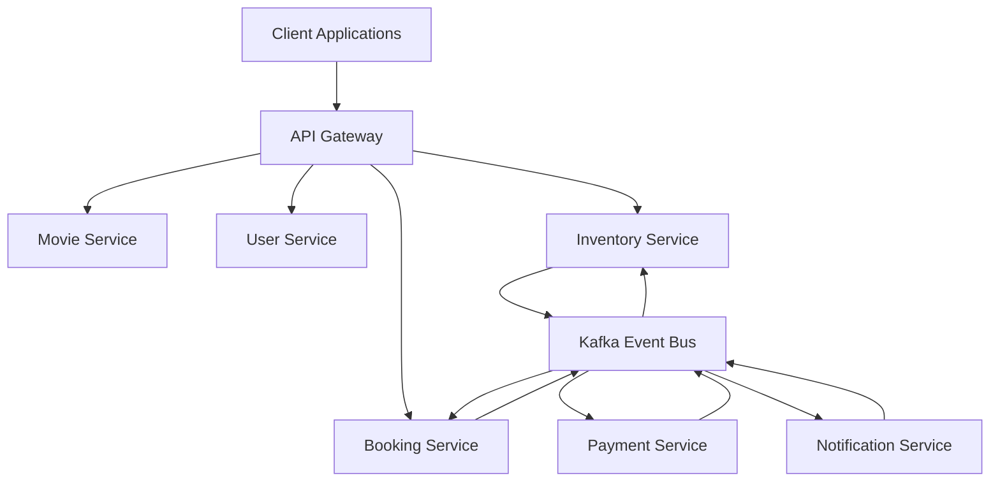
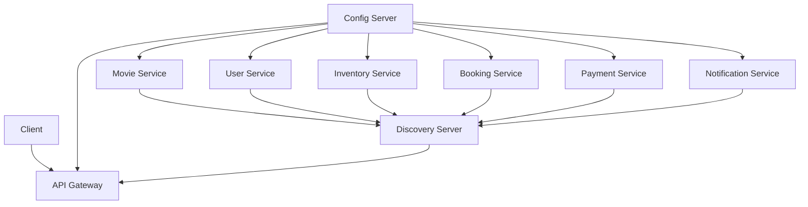
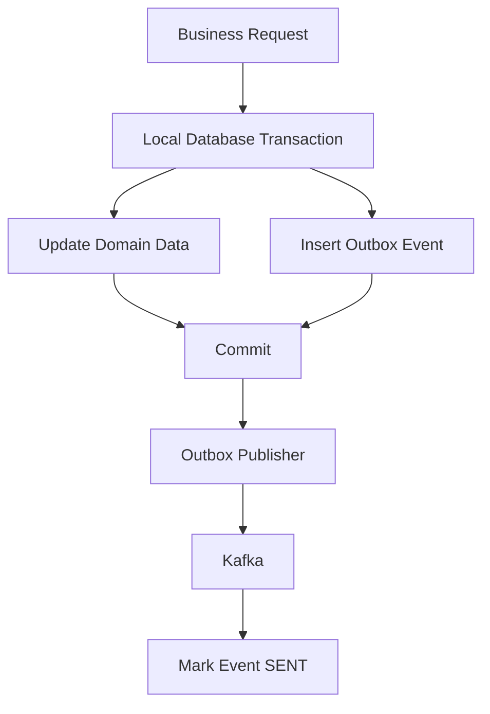
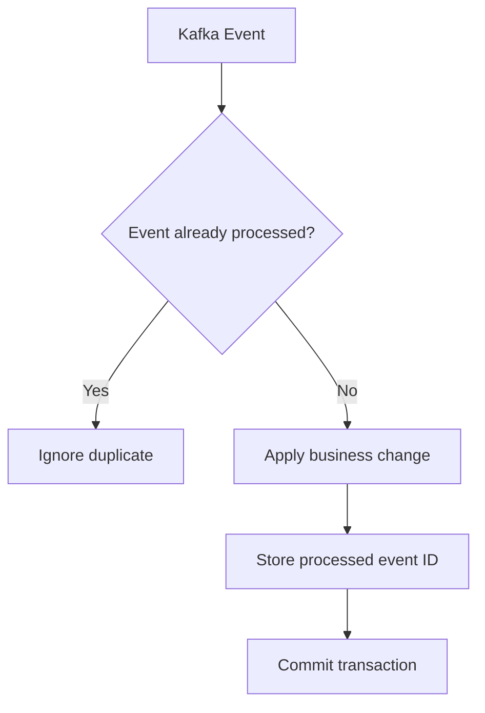
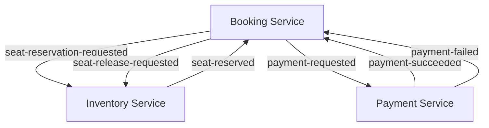
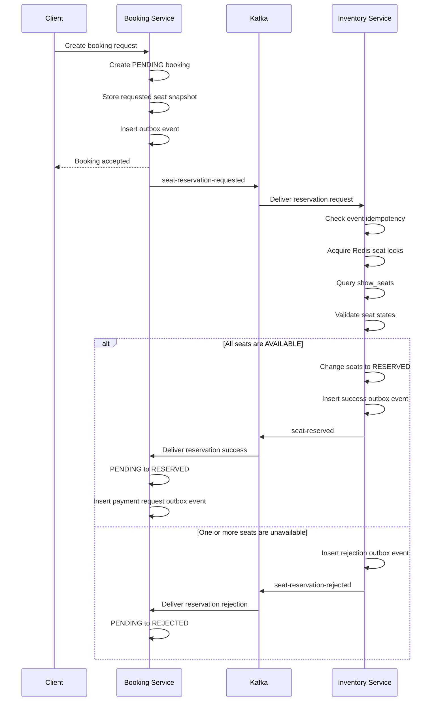
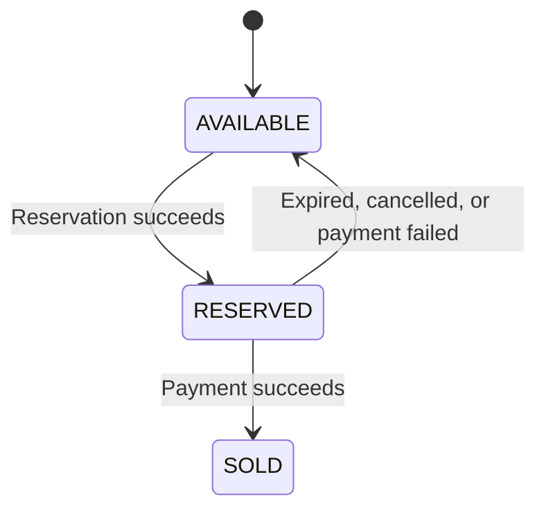
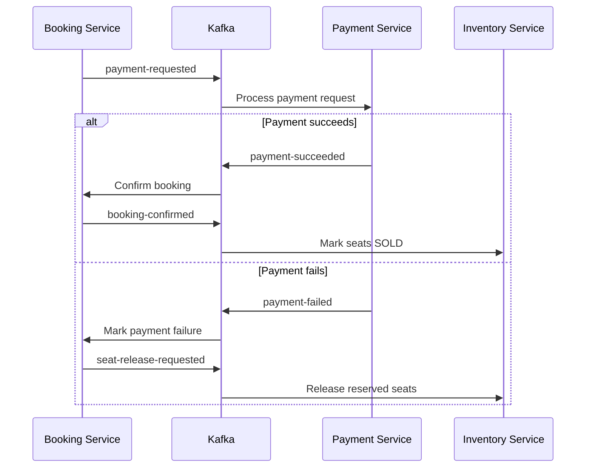
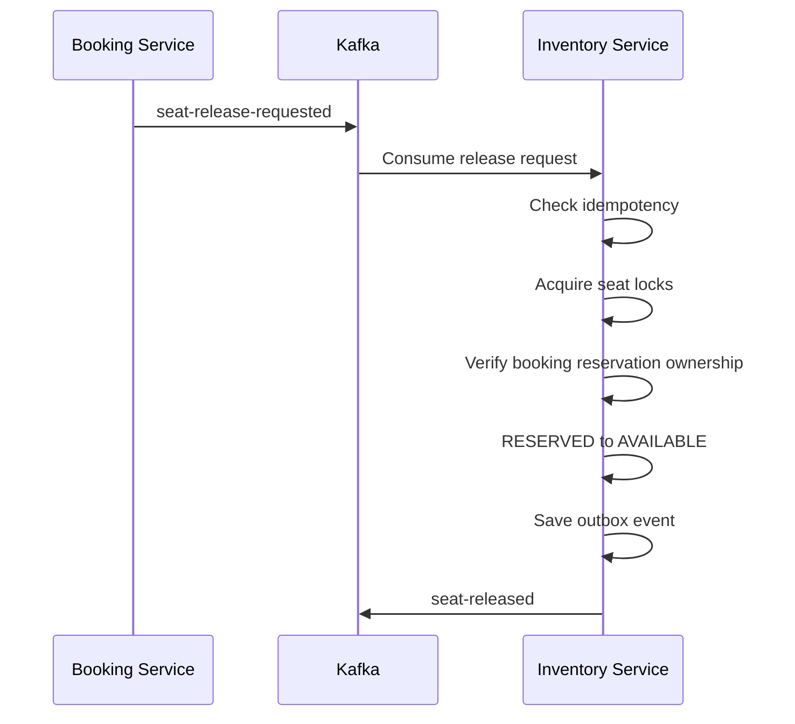
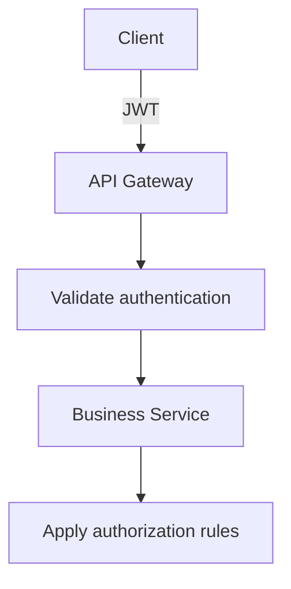

# System Architecture

This document defines the authoritative architecture of Cinema Booking System.

The system is designed as a production-oriented, event-driven microservices
platform using database-per-service, asynchronous workflows, and explicit
domain ownership.

---

# Architecture Goals

The architecture is designed to provide:

- High availability
- Horizontal scalability
- Fault isolation
- Loose coupling
- High cohesion
- Reliable event delivery
- Idempotent event processing
- Eventual consistency
- Clear service ownership
- Safe concurrent seat reservation
- Independent service deployment
- Production-ready observability

---

# Architecture Style

Cinema Booking System uses:

- Microservices Architecture
- Event-Driven Architecture
- Saga Pattern using Choreography
- Transactional Outbox Pattern
- Idempotent Consumer Pattern
- Database per Service
- Distributed Lock
- Eventual Consistency
- API Gateway Pattern
- Service Discovery
- Centralized Configuration

---

# High-Level Architecture



Clients access business services through API Gateway.

Services communicate using:

- REST APIs for synchronous operations
- Kafka events for asynchronous workflows

No service may directly access another service's database.

---

# Infrastructure Architecture



Infrastructure components:

| Component | Responsibility |
|---|---|
| Config Server | Centralized application configuration |
| Discovery Server | Service registration and discovery |
| API Gateway | External routing and cross-cutting request handling |
| Kafka | Asynchronous event transport |
| Redis | Distributed locking and short-lived distributed state |
| MySQL | Service-owned transactional persistence |
| Elasticsearch | Search capabilities where required |
| MinIO | Object and file storage |
| OpenTelemetry | Distributed tracing |
| Docker Compose | Local infrastructure orchestration |

---

# Service Architecture

## Movie Service

Movie Service owns movie catalog data.

Responsibilities:

- Movie management
- Genre management
- Movie–genre relationships
- Movie metadata
- Movie search integration where applicable
- Publishing movie lifecycle events where required

Owned tables include:

```text
movies
genres
movie_genres
```

Movie Service does not own:

- Show-seat inventory
- Bookings
- Payments
- Users

---

## User Service

User Service owns identity and user account data.

Responsibilities:

- User registration
- Authentication support
- User profile management
- Role and permission management
- Refresh token management
- Publishing user lifecycle events where required

Owned tables may include:

```text
users
roles
permissions
user_roles
role_permissions
refresh_tokens
```

User Service does not own:

- Movies
- Seat inventory
- Bookings
- Payments

---

## Inventory Service

Inventory Service exclusively owns seat inventory.

Responsibilities:

- Creating show-seat inventory
- Reading seat availability
- Reserving seats
- Releasing seats
- Marking seats as sold
- Managing seat reservation expiration
- Acquiring Redis distributed locks for seats
- Publishing seat reservation result events
- Idempotently consuming inventory commands

Owned tables include:

```text
show_seats
processed_events
outbox_events
```

Only Inventory Service may:

- Query authoritative `show_seats` state
- Update `show_seats`
- Acquire distributed seat locks
- Change a seat between inventory states
- Determine whether requested seats are available

Other services must not import or reuse Inventory Service repositories,
entities, or datasource configuration.

---

## Booking Service

Booking Service owns the booking lifecycle.

Responsibilities:

- Creating bookings
- Storing requested seat snapshots
- Tracking booking status
- Requesting seat reservation
- Handling reservation results
- Requesting payment
- Handling payment results
- Requesting seat release
- Expiring bookings
- Publishing booking lifecycle events
- Idempotently consuming booking-related events

Owned tables include:

```text
bookings
booking_seats
processed_events
outbox_events
```

Booking Service does not own `show_seats`.

Booking Service must not:

- Query `show_seats`
- Update `show_seats`
- Use `ShowSeatRepository`
- Use Inventory Service entities
- Connect to the Inventory Service database
- Acquire Redis seat locks
- Create cross-database foreign keys

The `booking_seats` table stores booking-owned seat snapshots or external
seat references.

Example fields:

```text
booking_id
inventory_seat_id
showtime_id
seat_number
seat_type
price
```

`inventory_seat_id` is an external reference only. It is not a physical
foreign key to the Inventory Service database.

---

## Payment Service

Payment Service owns payment data and payment processing state.

Responsibilities:

- Creating payment records
- Processing payment requests
- Integrating with payment providers
- Tracking payment status
- Processing refunds
- Publishing payment result events
- Idempotently consuming payment commands

Owned tables may include:

```text
payments
payment_transactions
processed_events
outbox_events
```

Payment Service does not directly update bookings or seat inventory.

It communicates payment results using Kafka events.

---

## Notification Service

Notification Service owns notification and delivery history.

Responsibilities:

- Consuming notification requests
- Sending email notifications
- Sending SMS or other supported notifications
- Tracking delivery status
- Retrying failed deliveries
- Preventing duplicate delivery through idempotency

Owned tables may include:

```text
notifications
notification_deliveries
processed_events
outbox_events
```

Notification Service must not directly modify booking, payment, inventory,
movie, or user data.

---

# Database per Service

Each service has its own logical database.

Example:

```text
cinema_movie_db
cinema_user_db
cinema_inventory_db
cinema_booking_db
cinema_payment_db
cinema_notification_db
```

A service must not:

- Connect to another service's database
- Query another service's tables
- Update another service's tables
- Reuse another service's JPA repository
- Reuse another service's entity as a persistence model
- Create a foreign key across service databases

Cross-service references are stored as identifiers or immutable snapshots.

For example, Booking Service may store:

```text
movie_id
showtime_id
inventory_seat_id
user_id
```

These values are external references and must not have physical
cross-database foreign keys.

---

# Data Ownership

| Domain data | Owning service |
|---|---|
| Movies and genres | Movie Service |
| Users and roles | User Service |
| Show-seat inventory | Inventory Service |
| Seat distributed locks | Inventory Service |
| Bookings and booking seat snapshots | Booking Service |
| Payments and payment transactions | Payment Service |
| Notification delivery history | Notification Service |

The owning service is the only authority allowed to modify its data.

Other services may keep:

- External identifiers
- Immutable snapshots
- Cached projections
- Read models populated by events

These copies do not transfer ownership.

---

# Synchronous Communication

Synchronous communication is used when the caller requires an immediate
response.

Typical use cases:

- Client retrieves movie information
- Client retrieves available seats
- Client creates a booking request
- Gateway routes authenticated requests
- A service requests non-transactional reference information

Synchronous communication must not be used to create distributed database
transactions.

A service must not hold a local database transaction open while depending on
a long-running remote operation.

---

# Asynchronous Communication

Kafka is used for cross-service workflows that require:

- Loose coupling
- Reliable event delivery
- Independent processing
- Retry support
- Eventual consistency
- Saga coordination

Examples:

```text
seat-reservation-requested
seat-reserved
seat-reservation-rejected
payment-requested
payment-succeeded
payment-failed
seat-release-requested
seat-released
booking-confirmed
booking-cancelled
notification-requested
```

Topic names and event contracts must be synchronized with:

```text
docs/07_EVENT_CATALOG.md
```

---

# Event Envelope

Cross-service events should use a standard event envelope.

Example:

```java
public record EventEnvelope<T>(
        UUID eventId,
        String eventType,
        String eventVersion,
        UUID correlationId,
        UUID causationId,
        OffsetDateTime occurredAt,
        String producer,
        T payload
) {
}
```

Required event metadata:

| Field | Purpose |
|---|---|
| `eventId` | Globally unique identifier used for idempotency |
| `eventType` | Logical event type |
| `eventVersion` | Contract version |
| `correlationId` | Connects events in the same distributed workflow |
| `causationId` | Identifies the event or command that caused this event |
| `occurredAt` | Event creation time in ISO-8601 format |
| `producer` | Service that created the event |
| `payload` | Event-specific data |

Identifiers must use UUID v7 where applicable.

Date and time fields must use ISO-8601 serialization.

---

# Transactional Outbox

A service must not rely on the following unsafe sequence:

```text
Commit database transaction
    ↓
Publish Kafka event
```

The process could stop after the database commit and before Kafka
publication, leaving the system inconsistent.

The required approach is Transactional Outbox.



The domain change and outbox insertion occur in the same local database
transaction.

An asynchronous publisher later:

1. Reads pending outbox records.
2. Publishes them to Kafka.
3. Marks successfully published records as sent.
4. Retries failed publications.

Each business service that publishes reliable events owns its own
`outbox_events` table.

---

# Idempotent Consumer

Kafka provides at-least-once delivery behavior in common configurations.

A consumer may receive the same event more than once.

Every state-changing consumer must implement idempotent processing.



The consumer transaction must atomically:

1. Check whether `eventId` has already been processed.
2. Apply the business change.
3. Insert the processed event record.
4. Insert any resulting outbox event.
5. Commit the local transaction.

Example table:

```text
processed_events
```

A unique constraint on `event_id` provides an additional duplicate-processing
guard.

---

# Saga Pattern

The booking workflow uses Saga Pattern with choreography.

There is no central saga orchestrator.

Each service:

1. Consumes an event.
2. Performs its local transaction.
3. Publishes the next event.
4. Performs a compensating action when a later step fails.



Saga state is represented by domain status and event history within the
participating services.

---

# Authoritative Seat Reservation Flow

The authoritative seat reservation flow is asynchronous.

The previous design in which Booking Service directly acquired Redis locks,
queried `show_seats`, and updated seat state is invalid.



---

# Booking Creation Transaction

When a client creates a booking, Booking Service performs one local
transaction:

1. Validate the booking request.
2. Create a booking with status `PENDING`.
3. Store the requested seat snapshot in `booking_seats`.
4. Create a `SEAT_RESERVATION_REQUESTED` outbox event.
5. Commit the Booking database transaction.

Booking Service then returns an accepted booking response.

Booking Service does not synchronously reserve inventory in its local
transaction.

Example event payload:

```java
public record SeatReservationRequestedEvent(
        UUID eventId,
        UUID bookingId,
        UUID userId,
        UUID showtimeId,
        List<String> seatNumbers,
        OffsetDateTime occurredAt
) {
}
```

The final event catalog remains authoritative for the exact event contract.

---

# Inventory Reservation Transaction

When Inventory Service consumes `seat-reservation-requested`, it performs:

1. Check `processed_events` using `eventId`.
2. Acquire Redis locks for all requested seats.
3. Query Inventory-owned `show_seats`.
4. Verify that every requested seat exists.
5. Verify that every requested seat is `AVAILABLE`.
6. Change the seat state to `RESERVED`.
7. Associate the reservation with the booking external reference where
   required.
8. Set reservation expiration.
9. Insert the processed event record.
10. Insert a `SEAT_RESERVED` outbox event.
11. Commit the Inventory database transaction.
12. Release the Redis locks.

If validation fails:

1. Do not reserve any requested seat.
2. Insert the processed event record.
3. Insert a `SEAT_RESERVATION_REJECTED` outbox event.
4. Commit the Inventory database transaction.
5. Release the Redis locks.

The reservation operation is all-or-nothing for the requested seat set.

---

# Distributed Seat Locking

Redis and Redisson are used to serialize competing reservation attempts for
the same seats.

Inventory Service exclusively owns seat-lock behavior.

A conceptual lock key format is:

```text
seat-lock:{showtimeId}:{seatNumber}
```

For multiple seats:

1. Normalize the requested seat numbers.
2. Sort them deterministically.
3. Acquire locks in the same order.
4. Validate all seat states inside the database transaction.
5. Update all requested seats atomically.
6. Commit the transaction.
7. Release locks in reverse order.

Deterministic lock ordering reduces deadlock risk.

Redis locks are not the sole source of correctness.

Correctness must also be protected by:

- Database transactions
- Conditional state transitions
- Optimistic or pessimistic database locking where appropriate
- Unique constraints
- Idempotent event processing

A Redis lock coordinates concurrent requests, while the Inventory database
remains the source of truth.

---

# Seat State Model

A show seat may use states such as:

```text
AVAILABLE
RESERVED
SOLD
```

Typical transitions:



Only Inventory Service may perform these transitions.

Invalid transitions must be rejected or safely ignored according to
idempotency and domain rules.

Examples:

- `AVAILABLE → SOLD` without a valid reservation is invalid.
- `SOLD → AVAILABLE` is invalid under the normal booking flow.
- Repeating `RESERVED → RESERVED` for the same booking may be treated as an
  idempotent success.
- A release request for a seat reserved by another booking must not release
  that seat.

---

# Reservation Result Handling

## Reservation Success

When Booking Service consumes `seat-reserved`:

1. Check event idempotency.
2. Verify that the booking exists.
3. Verify that the result belongs to that booking.
4. Change booking status:

```text
PENDING → RESERVED
```

5. Store the processed event record.
6. Insert a `PAYMENT_REQUESTED` outbox event.
7. Commit the Booking database transaction.

Booking Service then publishes:

```text
payment-requested
```

## Reservation Rejection

When Booking Service consumes `seat-reservation-rejected`:

1. Check event idempotency.
2. Verify that the booking exists.
3. Change booking status:

```text
PENDING → REJECTED
```

4. Store the rejection reason where required.
5. Store the processed event record.
6. Commit the Booking database transaction.

No payment request is created for a rejected seat reservation.

---

# Payment Flow



Payment Service must not update the Booking database.

Booking Service must not update the Payment database.

Inventory Service must not infer payment state by querying Payment Service's
database.

Each state change is performed through local transactions and events.

---

# Booking Confirmation

When Booking Service consumes `payment-succeeded`:

1. Check event idempotency.
2. Verify the payment result belongs to the booking.
3. Change booking status:

```text
RESERVED → CONFIRMED
```

4. Store the processed event record.
5. Insert a `BOOKING_CONFIRMED` outbox event.
6. Commit the Booking database transaction.

Inventory Service may consume the appropriate confirmation event and change
the owned seat state:

```text
RESERVED → SOLD
```

The exact topic and contract must match the event catalog.

---

# Payment Failure Compensation

When Booking Service consumes `payment-failed`:

1. Check event idempotency.
2. Change the booking to the approved failure or cancellation state.
3. Store the processed event record.
4. Insert a `SEAT_RELEASE_REQUESTED` outbox event.
5. Commit the Booking database transaction.

Inventory Service then performs the compensating action:

```text
RESERVED → AVAILABLE
```

Only seats reserved for the corresponding booking may be released.

---

# Seat Release Flow

Seat release may be triggered by:

- Payment failure
- Booking cancellation
- Booking expiration
- Reservation timeout



Inventory Service must verify that the seats are currently reserved for the
same booking before releasing them.

A delayed release event must never release seats owned by a newer
reservation.

---

# Booking Expiration

Booking expiration is managed by Booking Service.

A booking may expire when payment is not completed before the configured
deadline.

Booking Service performs:

1. Find eligible expired bookings.
2. Change the booking to `EXPIRED`.
3. Insert a `SEAT_RELEASE_REQUESTED` outbox event.
4. Commit the Booking database transaction.

Inventory Service consumes the release request and restores the applicable
seat inventory.

Expiration processing must be idempotent and safe when multiple scheduler
instances run concurrently.

---

# Failure Handling

Distributed workflows must expect partial failure.

Examples:

- Kafka temporarily unavailable
- Consumer processing failure
- Database unavailable
- Redis unavailable
- Duplicate event delivery
- Delayed event delivery
- Event delivery out of order
- Service restart after transaction commit
- Payment provider timeout

Required protections:

- Transactional Outbox
- Idempotent Consumer
- Retry with bounded backoff
- Dead-letter handling where appropriate
- Correlation identifiers
- State-transition validation
- Reservation expiration
- Compensating events
- Observability and alerting

A failed remote step must not roll back a transaction already committed by
another service.

---

# Event Ordering

Global Kafka event ordering is not assumed.

Ordering is only expected where explicitly guaranteed by topic partitioning.

Events for the same aggregate should use a stable partition key such as:

```text
bookingId
```

Consumers must still validate domain state because:

- Events may be delayed.
- Retries may cause duplicates.
- Different topics may not preserve relative ordering.
- Operational replay may reintroduce older events.

An event must not force an invalid backward state transition.

---

# Event Versioning

Event contracts must be versioned.

Rules:

- Prefer backward-compatible additions.
- Do not silently rename or remove required fields.
- Do not change the meaning of an existing field.
- Record incompatible changes as a new event version.
- Consumers should tolerate unknown optional fields.
- Event versions must be documented in the event catalog.

Example:

```text
eventType: seat-reservation-requested
eventVersion: 1
```

---

# API Gateway

API Gateway is the single external entry point for client traffic.

Responsibilities may include:

- Request routing
- Authentication token forwarding
- Authorization integration
- Correlation ID propagation
- CORS handling
- Request and response logging
- Rate limiting when introduced by the approved roadmap
- Circuit breaker integration when explicitly configured

API Gateway must not contain business-domain logic.

It must not directly access business-service databases.

---

# Service Discovery

Business and infrastructure services register with Discovery Server.

Service Discovery supports:

- Logical service names
- Dynamic instance discovery
- Client-side or gateway-integrated load balancing
- Multiple service instances

Services must not depend on hard-coded instance addresses in production
configuration.

---

# Centralized Configuration

Config Server provides centralized configuration.

Configuration must separate:

- Shared settings
- Service-specific settings
- Environment-specific settings
- Secret references

Config Server repositories must not contain real secrets.

Sensitive values must be supplied through approved environment or secret
management mechanisms.

Example:

```yaml
spring:
  datasource:
    username: ${MOVIE_DB_USERNAME}
    password: ${MOVIE_DB_PASSWORD}
```

Passwords must not have real committed default values.

---

# Security Architecture

The security architecture uses Spring Security with JWT and OAuth2 support.

Conceptual flow:



Security principles:

- Authenticate external requests.
- Authorize protected operations.
- Propagate required identity context safely.
- Do not trust client-provided user identifiers without verification.
- Do not log tokens or secrets.
- Do not commit JWT secrets or private keys.
- Apply service-level authorization where required.

Detailed security rules belong in:

```text
docs/08_SECURITY.md
```

---

# Observability

The platform uses structured logging, metrics, and distributed tracing.

Required correlation metadata includes:

- Trace ID
- Span ID
- Correlation ID
- Event ID
- Aggregate ID where applicable
- Service name

Sensitive data must not appear in logs.

Do not log:

- Passwords
- Access tokens
- Refresh tokens
- Private keys
- Full payment details
- Secret configuration values

Distributed tracing must propagate context across:

- Gateway requests
- Service-to-service requests
- Kafka producers
- Kafka consumers

---

# Persistence Rules

Each service uses:

- Spring Data JPA
- Hibernate
- MySQL
- Flyway

Production schema management uses Flyway.

Required setting:

```yaml
spring:
  jpa:
    hibernate:
      ddl-auto: validate
```

Do not use Hibernate schema generation as the production migration strategy.

Every schema change requires a new Flyway migration.

Existing applied migrations must not be modified after release.

---

# UUID Strategy

UUID Version 7 is used for:

- Entity identifiers
- Event identifiers
- Correlation identifiers where applicable
- Outbox record identifiers where applicable
- Processed event identifiers where applicable

Benefits include:

- Global uniqueness
- Time-ordered identifiers
- Better index locality than fully random UUIDs
- Safe identifier generation across service instances

Numeric auto-increment identifiers must not be reintroduced unless explicitly
approved.

---

# Shared Modules

Shared modules provide reusable technical building blocks.

They must not contain business-service ownership or cross-service persistence
logic.

Examples:

```text
common-core
common-jpa
common-exception
common-response
common-api
common-validation
common-jackson
common-logging
common-mapper
common-security
common-lock
common-kafka
common-outbox
common-search
common-openapi
common-test
common-tracing
common-storage
```

Shared modules may contain:

- Technical abstractions
- Common response models
- Exception foundations
- Serialization configuration
- Kafka infrastructure
- Outbox infrastructure
- Testing utilities
- Logging and tracing support

Shared modules must not contain:

- `MovieEntity`
- `BookingEntity`
- `ShowSeatEntity`
- `PaymentEntity`
- Service-specific repositories
- Service-specific business rules
- A shared database schema

---

# Dependency Boundaries

Business services may depend on approved common modules.

A business service must not depend directly on another business service's
implementation module.

Invalid examples:

```text
booking-service → inventory-service
payment-service → booking-service
notification-service → payment-service
```

Cross-service integration must use:

- Published API contracts
- Kafka event contracts
- External identifiers
- Approved shared technical abstractions

Common modules must not depend on business-service modules.

---

# Deployment Model

Each service is independently deployable.

A conceptual deployment includes:

```text
API Gateway
Config Server
Discovery Server
Movie Service instances
User Service instances
Inventory Service instances
Booking Service instances
Payment Service instances
Notification Service instances
Kafka cluster
Redis
Service-owned MySQL databases
Elasticsearch
MinIO
Observability infrastructure
```

Scaling a service must not require scaling all other services.

State must not depend on local application memory when multiple instances are
running.

---

# Local Development

Docker Compose provides local infrastructure.

Typical startup order:

```text
Databases, Kafka, Redis and supporting infrastructure
    ↓
Config Server
    ↓
Discovery Server
    ↓
API Gateway
    ↓
Business Services
```

Services must receive credentials through environment variables or approved
local secret configuration.

Real credentials must never be committed.

---

# Architecture Invariants

The following rules are mandatory:

1. Every service owns its own database.
2. No cross-database foreign keys are allowed.
3. No service directly queries or updates another service's tables.
4. Inventory Service exclusively owns `show_seats`.
5. Inventory Service exclusively owns Redis seat locks.
6. Booking Service stores seat snapshots, not Inventory persistence entities.
7. Booking Service and Inventory Service coordinate through Kafka events.
8. Reliable event publication uses Transactional Outbox.
9. State-changing consumers use Idempotent Consumer.
10. Distributed transactions use Saga Pattern with choreography.
11. Schema changes use Flyway.
12. Entity and event identifiers use UUID v7.
13. Date and time serialization uses ISO-8601.
14. Secrets must not be committed.
15. Shared modules must not contain service-specific domain ownership.

Any implementation that violates these invariants must be corrected before a
round can be marked complete.

---

# Invalid Architecture Examples

The following designs are not allowed.

## Booking Service directly updates inventory

```java
showSeatRepository.markReserved(showtimeId, seatNumbers);
```

This is invalid when executed by Booking Service because `show_seats` belongs
to Inventory Service.

## Booking Service imports Inventory entities

```java
import com.cinema.inventory.entity.ShowSeatEntity;
```

This creates prohibited service implementation coupling.

## Cross-database foreign key

```sql
ALTER TABLE booking_seats
ADD CONSTRAINT fk_booking_seat_inventory
FOREIGN KEY (inventory_seat_id)
REFERENCES cinema_inventory_db.show_seats(id);
```

Cross-database foreign keys violate database-per-service ownership.

## Database commit followed by direct Kafka publication

```java
bookingRepository.save(booking);
kafkaTemplate.send(topic, event);
```

Without an outbox record in the same database transaction, a process failure
can lose the event.

## Non-idempotent event consumer

```java
@KafkaListener(topics = "payment-succeeded")
public void consume(PaymentSucceededEvent event) {
    bookingService.confirm(event.bookingId());
}
```

Without processed-event checking, duplicate delivery may repeat side effects.

---

# Valid Architecture Examples

## Booking requests inventory reservation

```text
Booking Service local transaction
    ↓
bookings: PENDING
booking_seats: snapshot
outbox_events: SEAT_RESERVATION_REQUESTED
    ↓
Kafka
    ↓
Inventory Service
```

## Inventory owns the seat update

```text
Inventory Service local transaction
    ↓
processed_events
show_seats: AVAILABLE → RESERVED
outbox_events: SEAT_RESERVED
```

## Booking handles reservation result

```text
Booking Service local transaction
    ↓
processed_events
bookings: PENDING → RESERVED
outbox_events: PAYMENT_REQUESTED
```

Each service modifies only its owned data.

---

# Verification Checklist

Architecture changes must verify:

- [ ] No service accesses another service's datasource
- [ ] No cross-database foreign key exists
- [ ] Booking Service does not use `ShowSeatRepository`
- [ ] Booking Service does not use `ShowSeatEntity`
- [ ] Booking Service does not update `show_seats`
- [ ] Inventory Service owns seat locks
- [ ] Inventory Service owns seat state transitions
- [ ] Events have stable identifiers
- [ ] State-changing consumers are idempotent
- [ ] Reliable publishers use Transactional Outbox
- [ ] Flyway owns schema changes
- [ ] Credentials use environment variables
- [ ] Documentation matches the implemented event contracts
- [ ] `mvn clean verify` passes

Useful repository checks:

```bash
git grep -n -E "ShowSeatRepository|ShowSeatEntity|show_seats" \
    -- services/booking-service
```

```bash
git grep -n -i -E \
    "password:[[:space:]]+(root|admin|password|123456)"
```

```bash
git diff --check
```

```bash
mvn clean verify
```

A reference to `show_seats` in Booking Service documentation may be valid only
when it explicitly states that Booking Service must not access that table.

---

# Related Documentation

See:

```text
docs/00_PROJECT_CONTEXT.md
docs/01_AI_CONTEXT.md
docs/03_TECHNOLOGY_STACK.md
docs/04_MODULES.md
docs/05_CODING_CONVENTIONS.md
docs/06_DATABASE_DESIGN.md
docs/07_EVENT_CATALOG.md
docs/08_SECURITY.md
docs/09_OUTBOX.md
docs/10_ROADMAP.md
docs/11_CHANGELOG.md
docs/12_DEPENDENCY_RULES.md
docs/13_SEQUENCE_DIAGRAMS.md
docs/14_DEPLOYMENT.md
docs/decisions/
```

When documents conflict, database ownership and accepted Architecture Decision
Records must be used to resolve the inconsistency.
