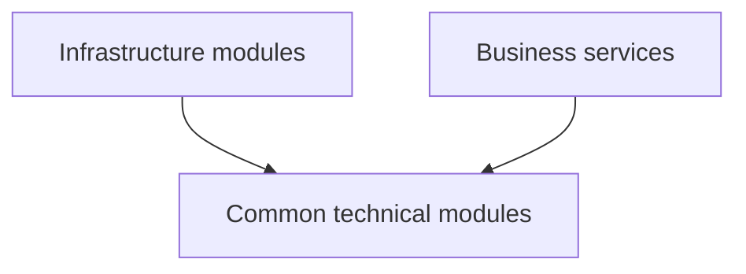
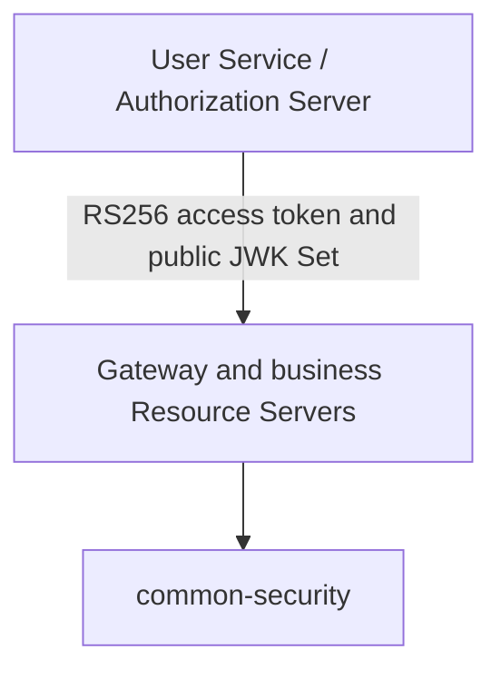

# Modules

Version R25

This document describes the modules registered by the root Maven reactor, their
responsibilities, and the dependency boundaries that every implementation must
preserve.

---

# Root Structure

```text
cinema-system/
├── common/
├── infrastructure/
├── services/
├── docs/
└── pom.xml
```

The root `pom.xml` is the authoritative Maven module registry. A directory is
not considered an active module until it is registered in that reactor.

---

# Common Modules

Common modules contain reusable technical capabilities. They must remain
independent of business-service entities, repositories, tables, and domain
rules.

## common-core

Provides foundational, framework-light utilities:

- Common constants
- Time abstraction
- UUID generation and validation helpers
- String, collection, enum, object, number, and JSON utilities
- Technical exception foundation

It must not depend on a business service.

---

## common-jpa

Provides reusable JPA infrastructure:

- `BaseEntity`
- Persistable and versioned entity foundations
- Base repository contract
- Auditing configuration and `AuditorAware`

It must not contain service-owned entities or repositories.

---

## common-exception

Provides the shared exception contract:

- `ErrorCode`
- `ErrorCategory`
- `CommonErrorCode`
- `BusinessException`
- Validation, not-found, conflict, unauthorized, forbidden, resource-locked,
  and internal-server exceptions

Business services define their own error-code enums and use these shared
exception types. They must not use `IllegalArgumentException` as an API or
domain error contract.

---

## common-response

Provides transport-neutral response models:

- `ApiResponse`
- `ErrorBody`
- `ValidationError`
- `PageInfo`
- `PageResponse`
- Response factory

---

## common-api

Provides servlet API support:

- Global exception handling
- Standard response construction
- Validation error mapping
- Page-response mapping
- API constants

It may depend on `common-exception` and `common-response`, but it must not own
business error codes.

---

## common-validation

Provides reusable Bean Validation components:

- Create, update, and delete validation groups
- Enum-value validation
- UUIDv7 validation
- Shared validation constants

---

## common-jackson

Provides consistent JSON behavior:

- Shared Jackson configuration
- JSON constants
- JSON utility operations

Domain-specific serializers belong to the owning service unless they are an
accepted platform-wide contract.

---

## common-logging

Provides structured logging support:

- Correlation-ID servlet filter
- Logging aspect
- Log context
- Logging utilities and constants

Tokens, credentials, signing keys, and other secrets must never be logged.

---

## common-mapper

Provides reusable MapStruct foundations:

- Base mapper contract
- Collection and page mapping
- Mapper configuration
- Mapping utilities

Each business service owns its domain mappers. MapStruct-generated
implementations must remain available during both focused module tests and the
root Maven reactor build.

---

## common-security

Provides reusable OAuth2 Resource Server mechanics for Gateway and protected
business services:

- Resource Server security configuration
- Servlet security configuration
- Issuer and JWK-based `JwtDecoder` construction
- Reactive issuer and JWK-based `ReactiveJwtDecoder` construction
- Signature, issuer, timestamp, and audience validation
- Required `cinema-api` audience validation
- Shared JWT role and permission conversion
- `AuthenticationUser` and current-user access
- Security-context utilities
- Permission evaluation
- Standard servlet and reactive JSON `401 Unauthorized` and `403 Forbidden` responses
- Shared security properties and constants

`common-security` does not issue tokens and is not an Authorization Server. It
must not contain:

- Login, authorization, consent, or token endpoints
- OAuth2 client registration persistence
- Authorization or consent persistence
- Refresh-token persistence or rotation logic
- Signing private keys
- A shared HMAC secret
- User-account or role persistence

User Service owns those Authorization Server responsibilities under ADR-013.

---

## common-lock

Provides distributed locking:

- Redisson configuration
- Distributed-lock service
- Lock annotation and aspect
- Lock-key generation

Lock ownership and lock-key composition remain business decisions of the
calling service. Inventory Service owns seat-locking rules.

---

## common-kafka

Provides Kafka infrastructure:

- Base event contract
- Producer and consumer configuration
- Event serialization
- Producer and event-publisher abstractions
- Retry and error handling
- Kafka constants

Business event payloads and topic semantics belong to their owning domains and
the accepted event catalog.

---

## common-outbox

Provides Transactional Outbox infrastructure:

- Outbox entity and repository
- Outbox service
- Kafka outbox publisher
- Scheduler
- Status and aggregate foundations
- Outbox message and payload models
- Publication error handling

The calling service owns its outbox table and writes the outbox row in the same
local database transaction as its aggregate change.

---

## common-search

Provides search abstractions and Elasticsearch integration:

- Search client
- Search service
- Search query, sort, hit, and page models
- Search-document foundation
- Search utilities and errors

Search indexes are projections and must not become authoritative domain data.

---

## common-storage

Provides object-storage abstraction:

- Storage service contract
- MinIO implementation
- Storage configuration and properties
- Upload, download, and metadata models
- Storage exception

Service-specific access policies remain in the owning service.

---

## common-tracing

Provides observability tracing support:

- Tracing auto-configuration
- Trace-context abstraction
- Micrometer trace-context provider
- Tracing service

---

## common-openapi

Provides shared OpenAPI configuration and properties. Business services remain
responsible for documenting their own endpoints, request models, responses,
authorization requirements, and error codes.

---

## common-test

Provides reusable test support:

- Unit- and integration-test annotations
- MySQL Testcontainers foundation
- Kafka Testcontainers foundation
- Redis Testcontainers foundation
- JSON test utilities

Test infrastructure must preserve the same important contracts used by the
production runtime.

---

## common-util

Reserved Maven module. New utilities should first be placed in the most
specific existing module, usually `common-core`. Do not duplicate utilities
only to populate this module.

---

# Infrastructure Modules

## config-service

Provides centralized configuration through Spring Cloud Config. Configuration
repositories must contain secret references, not committed credentials or
private keys.

## discovery-service

Provides service registration and discovery. Production services must not
depend on hard-coded instance addresses.

## gateway-service

Provides the external routing and reactive security boundary:

- Explicit route resolution through service discovery
- Disabled automatic Discovery Locator routes
- Request-ID and correlation-ID propagation
- Edge CORS and approved public-route policies
- Stateless reactive OAuth2 Resource Server authentication
- RS256 signature, issuer, timestamp and `cinema-api` audience validation
- Shared reactive JSON `401 Unauthorized` and `403 Forbidden` responses
- Bearer-token forwarding
- Fail-closed handling for undeclared exchanges
- Removal of untrusted client identity headers
- Preservation of bearer tokens for independent downstream validation
- Cross-service routing verification with invalid tokens blocked at the edge

Gateway uses `common-security` and does not own signing keys, users, roles,
permissions or domain authorization data.

Gateway is not the sole authorization boundary and must not contain
business-domain logic or access business-service databases. Protected downstream
services must independently validate tokens and enforce their owned authorization
rules.

---

# Business Service Modules

## movie-service

- Public Movie and Genre reads
- `movie:manage` enforcement for Movie and Genre mutations
- Independent servlet JWT validation

Owns movies, genres, movie lifecycle, and movie-query APIs.

## inventory-service

- Public inventory and showtime reads
- `inventory:manage` enforcement for inventory administration
- `showtime:manage` enforcement for showtime lifecycle operations
- `inventory:write` enforcement for ShowSeat hold, book and release
- Independent servlet JWT and service-token validation

Owns cinemas, rooms, seats, showtimes, show-seat inventory, seat state
transitions, and seat concurrency control. No other service may directly
update `show_seats`.

## booking-service

Owns bookings and booking-seat references. It coordinates reservation outcomes
but does not own show-seat records.

## payment-service

Owns payments, payment state transitions, provider interactions, and payment
events.

## notification-service

Owns notification delivery, templates, channel policies, and delivery state.

## user-service

Owns identity and user-account data. Under ADR-013 it also hosts Spring
Authorization Server and owns:

- User registration and profile management
- Authentication and privileged MFA policy
- Roles and permissions
- OAuth2/OIDC endpoints
- Registered OAuth2 clients
- Authorization grants and consent
- Authorization, access, and refresh token lifecycle
- Signing private-key custody and public JWK Set publication
- Token revocation

Approved grants are Authorization Code with PKCE, Refresh Token, and approved
Client Credentials. Resource Owner Password Credentials must not be added.

Current implemented baseline through R25.8 and the implemented portion of R25.9:

- service bootstrap, configuration, discovery and MySQL persistence;
- Flyway-managed user, profile, credential, role, permission and assignment tables;
- UUID v7 identifiers and JPA auditing;
- normalized unique email and username identities;
- role/permission catalog and effective-authority loading;
- delegating password encoding, bcrypt hashes and hash upgrade support;
- JPA-backed `UserDetailsService`, DAO authentication and account-status enforcement;
- account lifecycle transitions;
- secure, hashed, expiring, revocable and single-use email-verification tokens;
- separate Authorization Server and application security filter chains;
- externalized canonical issuer settings and OpenID Connect enablement;
- Flyway V5 and JDBC registered-client persistence;
- controlled public PKCE and confidential service-client registration;
- encoded client secrets, exact redirect URI validation and client-specific
  token lifetime policy;
- unit, repository, Flyway and MySQL integration tests.

Not implemented yet:

- public registration, profile and verification HTTP APIs;
- email delivery;
- password-reset tokens and recovery flow;
- end-to-end Authorization Code with PKCE, Refresh Token and Client Credentials
  protocol-flow verification;
- OAuth2 authorization and consent persistence runtime;
- RSA signing/JWK publication and JWT claim customization;
- refresh-token rotation, logout and authorization-session revocation.

---

# Dependency Rules

The allowed compile-time direction is:



Rules:

- A business service must never depend on another business-service module.
- A common module must never depend on a business-service module.
- Gateway must never import service entities, repositories, or business rules.
- Services must never share a database schema or use cross-database foreign
  keys.
- Synchronous service communication uses an approved API through service
  discovery or Gateway according to the architecture.
- Asynchronous service communication uses versioned Kafka contracts.
- A service must not import another service's internal Java classes as an
  alternative to a network contract.
- Shared modules must not become a hidden monolith of cross-domain logic.

---

# Security Dependency Boundary



`common-security` supplies validation mechanics. User Service supplies identity
and token authority. Business services still own domain authorization such as
resource ownership, allowed state transitions, and privileged operations.

---

# Verification Checklist

- [ ] Every directory intended as a Maven module is registered by the root POM
- [ ] No common module imports a business-service package
- [ ] No business service has a Maven dependency on another business service
- [ ] No business service accesses another service's datasource
- [ ] Inventory Service remains the sole owner of show-seat writes and locks
- [ ] User Service remains the sole Authorization Server and signing-key owner
- [x] Gateway and protected services use `common-security` as Resource Servers
- [ ] `common-security` contains no token issuer or refresh-token persistence
- [ ] Domain failures use `common-exception`, not `IllegalArgumentException`
- [ ] MapStruct implementations are generated in focused and root reactor builds
- [ ] `mvn clean verify` passes from the repository root

Useful checks:

```bash
git grep -n -E "services/.+-service" -- '*/pom.xml'
```

```bash
git grep -n -E "ShowSeatRepository|ShowSeatEntity|show_seats" \
    -- services/booking-service
```

```bash
mvn clean verify
```

---

# Related Documentation

```text
docs/00_PROJECT_CONTEXT.md
docs/01_AI_CONTEXT.md
docs/02_ARCHITECTURE.md
docs/08_SECURITY.md
docs/10_ROADMAP.md
docs/12_DEPENDENCY_RULES.md
docs/decisions/ADR-013-spring-authorization-server.md
```

When documents conflict, accepted Architecture Decision Records and explicit
domain data ownership take precedence.
