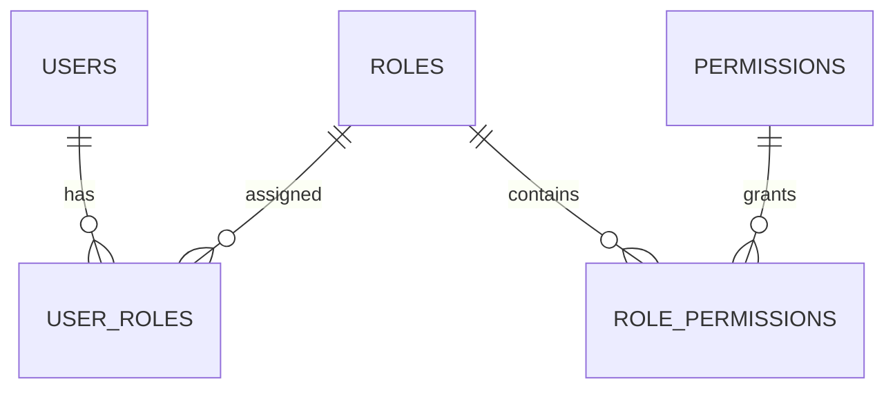
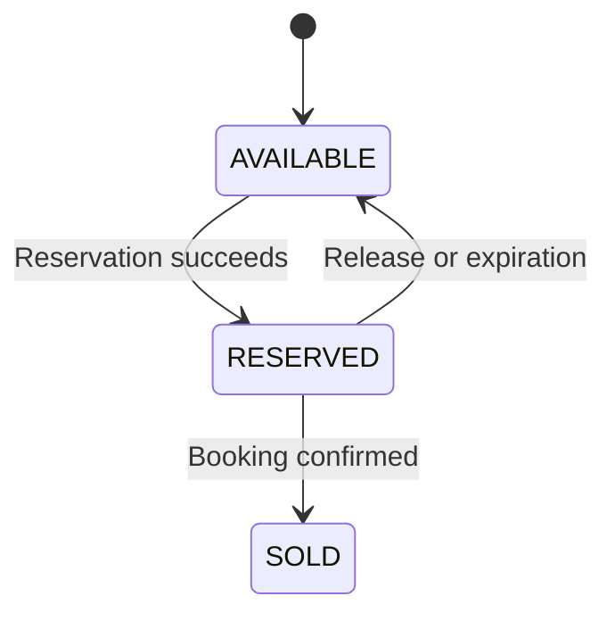
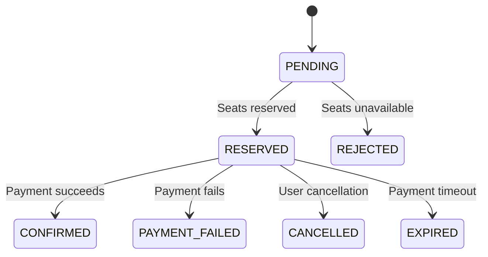
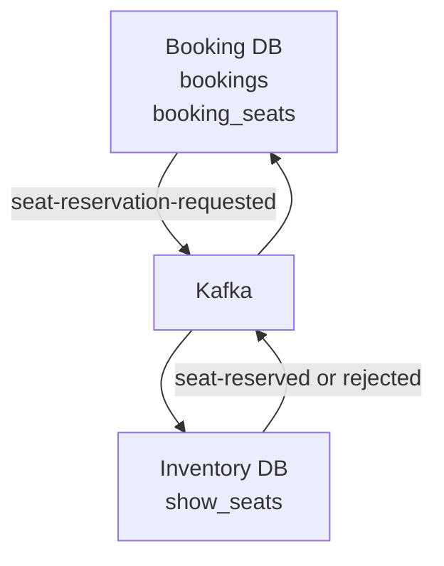

# Database Design

This document defines the authoritative database ownership, schema design rules,
table responsibilities, relationships, constraints, indexing strategy, and
migration requirements for Cinema Booking System.

The system uses database-per-service.

Each microservice exclusively owns its database and persistence model.

---

# Database Principles

The database design follows these principles:

- Database per Service
- Explicit domain ownership
- No cross-database foreign keys
- UUID Version 7 identifiers
- Flyway-managed schemas
- Hibernate schema validation
- Transactional Outbox
- Idempotent Consumer
- Optimistic or pessimistic concurrency control where appropriate
- UTC-compatible date and time storage
- Immutable cross-service snapshots where required
- Constraints enforced at database level
- Indexes based on verified access patterns

---

# Logical Databases

Each business service owns a separate logical database.

| Service | Database |
|---|---|
| Movie Service | `cinema_movie_db` |
| User Service | `cinema_user_db` |
| Inventory Service | `cinema_inventory_db` |
| Booking Service | `cinema_booking_db` |
| Payment Service | `cinema_payment_db` |
| Notification Service | `cinema_notification_db` |

Infrastructure services must not use these databases for their own persistence.

A service must not:

- Connect to another service's database
- Query another service's tables
- Update another service's tables
- Import another service's JPA entities
- Import another service's repositories
- Create physical foreign keys across databases
- Join tables across service databases
- Use another service's Flyway migrations

---

# Identifier Strategy

UUID Version 7 is used for identifiers where applicable.

This includes:

- Entity identifiers
- Event identifiers
- Correlation identifiers
- Outbox event identifiers
- Processed event identifiers
- External references between services

Recommended Java type:

```java
UUID
```

Recommended MySQL storage:

```sql
BINARY(16)
```

UUID values must be converted consistently between Java and MySQL.

Numeric auto-increment identifiers must not be reintroduced unless explicitly
approved.

Benefits of UUID v7 include:

- Global uniqueness
- Time-ordered generation
- Improved index locality compared with random UUID v4
- Safe generation by multiple service instances
- No dependency on a central identifier generator

---

# Date and Time Strategy

Application date and time values should use:

```java
OffsetDateTime
```

or another approved Java time type when domain semantics require it.

Database columns should preserve sufficient precision.

Recommended MySQL type:

```sql
TIMESTAMP(6)
```

or:

```sql
DATETIME(6)
```

The selected type must be used consistently within each service.

Rules:

- Persist timestamps in UTC.
- Serialize API and event timestamps using ISO-8601.
- Do not store formatted date strings in business columns.
- Use database defaults only when ownership of timestamp creation is explicit.
- Application-generated event timestamps must not be silently replaced by a
  database timestamp.
- Audit timestamps should include microsecond precision where supported.

Common audit columns:

```text
created_at
updated_at
```

Optional lifecycle columns:

```text
deleted_at
processed_at
expires_at
reserved_at
confirmed_at
cancelled_at
```

---

# Audit Columns

Domain tables should use the shared JPA auditing approach where applicable.

Typical columns:

```sql
created_at TIMESTAMP(6) NOT NULL,
updated_at TIMESTAMP(6) NOT NULL
```

Entities that support logical deletion may additionally contain:

```sql
deleted_at TIMESTAMP(6) NULL
```

Logical deletion must not be introduced automatically.

Whether a domain uses hard deletion or logical deletion must follow its approved
business rules.

---

# Enum Storage

Java enum values must be stored as readable strings.

Use:

```java
@Enumerated(EnumType.STRING)
```

Recommended database type:

```sql
VARCHAR(50)
```

Do not store enum ordinals.

Ordinal values are unsafe because changing enum order changes persisted meaning.

Database constraints may restrict accepted values when the set is stable and
the migration impact has been considered.

---

# Monetary Values

Monetary values must use decimal arithmetic.

Recommended Java type:

```java
BigDecimal
```

Recommended MySQL type:

```sql
DECIMAL(19, 2)
```

Do not use:

```text
float
double
```

for monetary persistence or calculations.

Currency must be explicit when more than one currency can be supported.

Example:

```text
amount
currency
```

Historical booking and payment amounts must not be recalculated from mutable
catalog data.

---

# Optimistic Locking

Mutable aggregates may use optimistic locking.

Recommended entity field:

```java
@Version
private Long version;
```

Recommended database column:

```sql
version BIGINT NOT NULL DEFAULT 0
```

Optimistic locking is useful for detecting concurrent updates, but it does not
replace:

- Redis distributed seat locks
- Database transactions
- Conditional state transitions
- Unique constraints
- Idempotent event processing

Inventory Service may additionally use pessimistic locking or conditional update
queries for critical seat state changes.

---

# Movie Service Database

Database:

```text
cinema_movie_db
```

Movie Service owns:

```text
movies
genres
movie_genres
```

It may also own technical tables such as:

```text
outbox_events
processed_events
```

when Movie Service publishes or consumes reliable events.

---

## Movies Table

The `movies` table stores movie catalog information.

Conceptual columns:

```text
id
title
slug
description
duration_minutes
release_date
age_rating
language
director
poster_url
trailer_url
status
created_at
updated_at
version
```

Example design:

```sql
CREATE TABLE movies (
    id BINARY(16) NOT NULL,
    title VARCHAR(255) NOT NULL,
    slug VARCHAR(255) NOT NULL,
    description TEXT NULL,
    duration_minutes INT NOT NULL,
    release_date DATE NULL,
    age_rating VARCHAR(30) NULL,
    language VARCHAR(100) NULL,
    director VARCHAR(255) NULL,
    poster_url VARCHAR(1000) NULL,
    trailer_url VARCHAR(1000) NULL,
    status VARCHAR(50) NOT NULL,
    created_at TIMESTAMP(6) NOT NULL,
    updated_at TIMESTAMP(6) NOT NULL,
    version BIGINT NOT NULL DEFAULT 0,
    CONSTRAINT pk_movies PRIMARY KEY (id),
    CONSTRAINT uk_movies_slug UNIQUE (slug),
    CONSTRAINT ck_movies_duration_positive
        CHECK (duration_minutes > 0)
);
```

If the implemented Movie Service currently defines a stricter unique title
rule, its Flyway migration and business validation must remain synchronized.

A normalized title column may be introduced only through an approved migration
when required for consistent case-insensitive duplicate detection.

---

## Genres Table

The `genres` table stores Movie Service-owned genres.

Conceptual columns:

```text
id
name
slug
description
created_at
updated_at
version
```

Example design:

```sql
CREATE TABLE genres (
    id BINARY(16) NOT NULL,
    name VARCHAR(100) NOT NULL,
    slug VARCHAR(100) NOT NULL,
    description VARCHAR(500) NULL,
    created_at TIMESTAMP(6) NOT NULL,
    updated_at TIMESTAMP(6) NOT NULL,
    version BIGINT NOT NULL DEFAULT 0,
    CONSTRAINT pk_genres PRIMARY KEY (id),
    CONSTRAINT uk_genres_name UNIQUE (name),
    CONSTRAINT uk_genres_slug UNIQUE (slug)
);
```

Genre name and slug uniqueness must be enforced both:

- In application business validation
- At database constraint level

The database constraint remains the final concurrency guard.

---

## Movie Genres Table

The `movie_genres` table represents the many-to-many relationship between
movies and genres inside Movie Service.

```sql
CREATE TABLE movie_genres (
    movie_id BINARY(16) NOT NULL,
    genre_id BINARY(16) NOT NULL,
    CONSTRAINT pk_movie_genres
        PRIMARY KEY (movie_id, genre_id),
    CONSTRAINT fk_movie_genres_movie
        FOREIGN KEY (movie_id)
        REFERENCES movies (id),
    CONSTRAINT fk_movie_genres_genre
        FOREIGN KEY (genre_id)
        REFERENCES genres (id)
);
```

These foreign keys are valid because all participating tables belong to the
same service and database.

A genre currently referenced by `movie_genres` must not be deleted unless the
approved business operation explicitly removes its relationships first.

Movie Service must return a business exception for attempts to delete an
in-use genre.

---

# User Service Database

Database:

```text
cinema_user_db
```

User Service owns identity, authorization, user profiles, and refresh tokens.

Conceptual tables:

```text
users
roles
permissions
user_roles
role_permissions
refresh_tokens
```

---

## Users Table

Conceptual columns:

```text
id
email
username
password_hash
first_name
last_name
phone_number
status
email_verified
created_at
updated_at
version
```

Requirements:

- Email must be unique according to the approved normalization rule.
- Username must be unique when username authentication is supported.
- Passwords must be stored only as secure password hashes.
- Plain-text passwords must never be persisted.
- Authentication secrets must never appear in audit logs.
- User status must use a string enum.
- External services may store `user_id`, but it is not a physical foreign key.

---

## Roles and Permissions

Conceptual relationships:



Join tables should use composite primary keys or equivalent unique constraints.

Role names and permission codes must be unique.

---

## Refresh Tokens

Refresh token persistence may include:

```text
id
user_id
token_hash
expires_at
revoked_at
created_at
```

Rules:

- Prefer storing a secure token hash instead of the raw token.
- `user_id` may reference `users` because both tables belong to User Service.
- Expired and revoked tokens must not be accepted.
- Token cleanup must be safe when multiple service instances run concurrently.

---

# Inventory Service Database

Database:

```text
cinema_inventory_db
```

Inventory Service exclusively owns:

```text
show_seats
```

It also owns its technical reliability tables:

```text
processed_events
outbox_events
```

Only Inventory Service may:

- Query authoritative show-seat state
- Reserve seats
- Release seats
- Mark seats as sold
- Associate a reservation with a booking reference
- Manage seat reservation expiration
- Acquire Redis distributed locks for seats

---

## Show Seats Table

The `show_seats` table stores the authoritative state of a seat for a specific
showtime.

Conceptual columns:

```text
id
showtime_id
seat_number
seat_type
price
status
reserved_by_booking_id
reserved_at
reservation_expires_at
created_at
updated_at
version
```

Example design:

```sql
CREATE TABLE show_seats (
    id BINARY(16) NOT NULL,
    showtime_id BINARY(16) NOT NULL,
    seat_number VARCHAR(20) NOT NULL,
    seat_type VARCHAR(50) NOT NULL,
    price DECIMAL(19, 2) NOT NULL,
    status VARCHAR(50) NOT NULL,
    reserved_by_booking_id BINARY(16) NULL,
    reserved_at TIMESTAMP(6) NULL,
    reservation_expires_at TIMESTAMP(6) NULL,
    created_at TIMESTAMP(6) NOT NULL,
    updated_at TIMESTAMP(6) NOT NULL,
    version BIGINT NOT NULL DEFAULT 0,
    CONSTRAINT pk_show_seats PRIMARY KEY (id),
    CONSTRAINT uk_show_seats_showtime_seat
        UNIQUE (showtime_id, seat_number),
    CONSTRAINT ck_show_seats_price_non_negative
        CHECK (price >= 0)
);
```

`showtime_id` is an external reference unless showtime data is later formally
assigned to Inventory Service through an approved architecture decision.

`reserved_by_booking_id` is an external Booking Service reference.

Neither column creates a cross-database foreign key.

---

## Seat Status

Approved conceptual states:

```text
AVAILABLE
RESERVED
SOLD
```

Valid normal transitions:



Inventory Service must reject or safely ignore invalid transitions.

Examples:

- `AVAILABLE → SOLD` without a valid reservation is invalid.
- `SOLD → AVAILABLE` is invalid under the standard workflow.
- A seat reserved by booking A must not be released by booking B.
- A delayed event must not overwrite a newer reservation.
- A repeated reservation event for the same booking may be handled
  idempotently.

---

## Seat Reservation Query Requirements

Reservation processing must:

1. Normalize requested seat numbers.
2. Reject duplicated seat numbers in the same request.
3. Acquire Redis locks in deterministic order.
4. Query all requested seats.
5. Verify that the number of returned seats matches the request.
6. Verify that all seats are `AVAILABLE`.
7. Update the complete set atomically.
8. Store the processed event.
9. Store the result outbox event.
10. Commit the local transaction.
11. Release locks.

The operation is all-or-nothing.

Inventory Service must not partially reserve a requested seat set.

Useful indexes may include:

```sql
CREATE INDEX idx_show_seats_showtime_status
    ON show_seats (showtime_id, status);

CREATE INDEX idx_show_seats_reservation_expiration
    ON show_seats (status, reservation_expires_at);

CREATE INDEX idx_show_seats_booking
    ON show_seats (reserved_by_booking_id);
```

Indexes must be verified against actual repository queries.

---

# Booking Service Database

Database:

```text
cinema_booking_db
```

Booking Service owns:

```text
bookings
booking_seats
processed_events
outbox_events
```

Booking Service does not own `show_seats`.

It must not connect to `cinema_inventory_db`.

---

## Bookings Table

The `bookings` table stores booking lifecycle state.

Conceptual columns:

```text
id
user_id
showtime_id
status
total_amount
currency
expires_at
confirmed_at
cancelled_at
rejection_reason
created_at
updated_at
version
```

Example design:

```sql
CREATE TABLE bookings (
    id BINARY(16) NOT NULL,
    user_id BINARY(16) NOT NULL,
    showtime_id BINARY(16) NOT NULL,
    status VARCHAR(50) NOT NULL,
    total_amount DECIMAL(19, 2) NOT NULL,
    currency VARCHAR(3) NOT NULL,
    expires_at TIMESTAMP(6) NULL,
    confirmed_at TIMESTAMP(6) NULL,
    cancelled_at TIMESTAMP(6) NULL,
    rejection_reason VARCHAR(500) NULL,
    created_at TIMESTAMP(6) NOT NULL,
    updated_at TIMESTAMP(6) NOT NULL,
    version BIGINT NOT NULL DEFAULT 0,
    CONSTRAINT pk_bookings PRIMARY KEY (id),
    CONSTRAINT ck_bookings_total_non_negative
        CHECK (total_amount >= 0)
);
```

`user_id` and `showtime_id` are external references.

They must not have physical foreign keys to another service database.

Useful indexes may include:

```sql
CREATE INDEX idx_bookings_user_created
    ON bookings (user_id, created_at);

CREATE INDEX idx_bookings_status_expiration
    ON bookings (status, expires_at);
```

---

## Booking Status

Conceptual booking states may include:

```text
PENDING
RESERVED
REJECTED
CONFIRMED
PAYMENT_FAILED
CANCELLED
EXPIRED
```

The exact enum must remain synchronized between:

- Java domain model
- Flyway migrations
- Event handlers
- Tests
- Event catalog

Normal flow:



State-changing queries must validate the expected current state.

An event must not force an invalid backward transition.

---

## Booking Seats Table

The `booking_seats` table stores immutable booking-owned seat snapshots.

Conceptual columns:

```text
id
booking_id
inventory_seat_id
showtime_id
seat_number
seat_type
price
created_at
```

Example design:

```sql
CREATE TABLE booking_seats (
    id BINARY(16) NOT NULL,
    booking_id BINARY(16) NOT NULL,
    inventory_seat_id BINARY(16) NULL,
    showtime_id BINARY(16) NOT NULL,
    seat_number VARCHAR(20) NOT NULL,
    seat_type VARCHAR(50) NOT NULL,
    price DECIMAL(19, 2) NOT NULL,
    created_at TIMESTAMP(6) NOT NULL,
    CONSTRAINT pk_booking_seats PRIMARY KEY (id),
    CONSTRAINT fk_booking_seats_booking
        FOREIGN KEY (booking_id)
        REFERENCES bookings (id),
    CONSTRAINT uk_booking_seats_booking_seat
        UNIQUE (booking_id, showtime_id, seat_number),
    CONSTRAINT ck_booking_seats_price_non_negative
        CHECK (price >= 0)
);
```

The foreign key from `booking_seats.booking_id` to `bookings.id` is valid because
both tables belong to Booking Service.

The following fields are external references and must not have cross-database
foreign keys:

```text
inventory_seat_id
showtime_id
```

Snapshot values must not be silently changed when the catalog or inventory price
changes later.

---

# Payment Service Database

Database:

```text
cinema_payment_db
```

Payment Service owns:

```text
payments
payment_transactions
processed_events
outbox_events
```

---

## Payments Table

Conceptual columns:

```text
id
booking_id
user_id
amount
currency
provider
status
provider_reference
failure_code
failure_message
requested_at
completed_at
created_at
updated_at
version
```

Requirements:

- `booking_id` is an external reference.
- Payment Service must not create a foreign key to Booking Service.
- Amount must be stored using decimal arithmetic.
- Provider references should be uniquely constrained when the provider
  guarantees uniqueness.
- Sensitive payment data must not be stored unless explicitly required and
  protected.
- Full card numbers, CVV values, and access credentials must never be stored.
- Duplicate `payment-requested` events must not create duplicate charges.

A unique business constraint may combine:

```text
booking_id
payment attempt
provider
```

The exact idempotency strategy must match the payment provider integration.

---

## Payment Transactions Table

`payment_transactions` may store provider interactions and payment attempts.

Conceptual columns:

```text
id
payment_id
transaction_type
provider_transaction_id
status
amount
currency
request_reference
created_at
completed_at
```

The table may reference `payments` because both belong to Payment Service.

Provider request and response payloads must be sanitized before persistence.

Secrets and full sensitive payment details must not be stored.

---

# Notification Service Database

Database:

```text
cinema_notification_db
```

Notification Service owns:

```text
notifications
notification_deliveries
processed_events
outbox_events
```

---

## Notifications Table

Conceptual columns:

```text
id
recipient_reference
channel
template_code
subject
content
status
scheduled_at
sent_at
created_at
updated_at
version
```

Rules:

- External user or booking identifiers are references only.
- Notification Service must not query another service's database to resolve
  domain state.
- Required notification data should arrive in the event or be obtained through
  an approved API.
- Sensitive personal information must be minimized.
- Template and delivery behavior must remain idempotent.

---

## Notification Deliveries Table

Conceptual columns:

```text
id
notification_id
provider
provider_message_id
attempt_number
status
failure_reason
attempted_at
created_at
```

A delivery record may reference `notifications` within the same database.

Indexes should support:

- Pending delivery polling
- Retry scheduling
- Provider message lookup
- Notification delivery history

---

# Transactional Outbox Table

Each service that reliably publishes Kafka events owns its own
`outbox_events` table.

The table must exist in the same database as the domain transaction that creates
the event.

Conceptual columns:

```text
id
aggregate_type
aggregate_id
event_type
event_version
topic
partition_key
correlation_id
causation_id
payload
status
retry_count
created_at
updated_at
processed_at
next_attempt_at
last_error
```

Example design:

```sql
CREATE TABLE outbox_events (
    id BINARY(16) NOT NULL,
    aggregate_type VARCHAR(100) NOT NULL,
    aggregate_id BINARY(16) NOT NULL,
    event_type VARCHAR(150) NOT NULL,
    event_version VARCHAR(20) NOT NULL,
    topic VARCHAR(255) NOT NULL,
    partition_key VARCHAR(255) NOT NULL,
    correlation_id BINARY(16) NULL,
    causation_id BINARY(16) NULL,
    payload LONGTEXT NOT NULL,
    status VARCHAR(50) NOT NULL,
    retry_count INT NOT NULL DEFAULT 0,
    created_at TIMESTAMP(6) NOT NULL,
    updated_at TIMESTAMP(6) NOT NULL,
    processed_at TIMESTAMP(6) NULL,
    next_attempt_at TIMESTAMP(6) NULL,
    last_error VARCHAR(2000) NULL,
    CONSTRAINT pk_outbox_events PRIMARY KEY (id)
);
```

The exact schema must remain synchronized with `common-outbox`.

Do not create a service-specific incompatible outbox schema when the shared
module defines the approved persistence contract.

Recommended polling index:

```sql
CREATE INDEX idx_outbox_status_next_attempt_created
    ON outbox_events (status, next_attempt_at, created_at);
```

Possible statuses:

```text
NEW
PROCESSING
SENT
FAILED
```

Use only statuses supported by the implemented common outbox contract.

---

# Outbox Transaction Rule

The domain mutation and outbox insertion must occur in the same local database
transaction.

Correct:

```text
Begin transaction
    Create or update domain data
    Insert outbox event
Commit transaction
```

Incorrect:

```text
Commit domain transaction
Publish directly to Kafka
```

If a service stops after committing its database transaction, the outbox record
must remain available for later publication.

Outbox publishers must support:

- Concurrent service instances
- Safe record claiming
- Retry
- Bounded error information
- Successful publication marking
- Recovery after process restart

---

# Processed Events Table

Each state-changing Kafka consumer must implement idempotency.

The consuming service owns a `processed_events` table.

Conceptual columns:

```text
id
event_id
event_type
consumer
processed_at
```

Example design:

```sql
CREATE TABLE processed_events (
    id BINARY(16) NOT NULL,
    event_id BINARY(16) NOT NULL,
    event_type VARCHAR(150) NOT NULL,
    consumer VARCHAR(150) NOT NULL,
    processed_at TIMESTAMP(6) NOT NULL,
    CONSTRAINT pk_processed_events PRIMARY KEY (id),
    CONSTRAINT uk_processed_events_event_consumer
        UNIQUE (event_id, consumer)
);
```

If an event may be processed by only one logical consumer per service, a unique
constraint on `event_id` may be sufficient.

The chosen constraint must match actual consumer semantics.

The event ID column must use the same MySQL UUID representation as the JPA
mapping.

For UUID mappings expecting `BINARY(16)`, do not create:

```sql
event_id VARCHAR(36)
```

unless the entity mapping is explicitly configured to use a textual UUID.

---

# Idempotent Consumer Transaction

Consumer processing must occur in one local transaction:

```text
Begin transaction
    Check processed event
    Apply domain state change
    Insert processed event
    Insert resulting outbox event if required
Commit transaction
```

If the transaction fails, none of these changes may be committed.

A consumer must handle the unique-constraint race safely when multiple instances
receive or process the same event.

---

# Foreign Key Rules

Foreign keys are allowed only between tables owned by the same service and
stored in the same service database.

Valid examples:

```text
movie_genres.movie_id → movies.id
movie_genres.genre_id → genres.id
booking_seats.booking_id → bookings.id
payment_transactions.payment_id → payments.id
notification_deliveries.notification_id → notifications.id
```

Invalid examples:

```text
booking_seats.inventory_seat_id → cinema_inventory_db.show_seats.id
bookings.user_id → cinema_user_db.users.id
payments.booking_id → cinema_booking_db.bookings.id
show_seats.reserved_by_booking_id → cinema_booking_db.bookings.id
```

Cross-service references are stored as UUID values without physical foreign
keys.

Their validity is maintained through:

- Service APIs
- Kafka events
- Immutable snapshots
- Saga state transitions
- Reconciliation processes where approved

---

# Deletion Rules

Deletion behavior must be explicit.

Avoid broad cascading deletes that can remove business history unexpectedly.

Rules:

- Historical bookings must not disappear because a movie is deleted.
- Historical payments must not disappear because a booking is cancelled.
- Booking seat snapshots must remain stable for audit and history.
- Notification history must follow the approved retention policy.
- Outbox and processed event cleanup must use an approved retention process.
- Deleting a genre in use by a movie must be rejected.
- Deleting a booking must not affect Inventory Service data.
- No deletion may cascade across service boundaries.

Foreign key `ON DELETE` behavior must be selected deliberately in Flyway.

Do not rely on implicit ORM cascade behavior as the only deletion rule.

---

# Unique Constraints

Business uniqueness must be protected at database level.

Potential constraints include:

```text
movies.slug
genres.name
genres.slug
movie_genres(movie_id, genre_id)
users.email
users.username
roles.name
permissions.code
show_seats(showtime_id, seat_number)
booking_seats(booking_id, showtime_id, seat_number)
processed_events(event_id, consumer)
```

Application-level duplicate checks improve error messages but do not replace
database constraints.

Concurrent requests can pass an application existence check simultaneously.

The database unique constraint remains the final protection.

Constraint violations must be translated into the approved business exception
and standardized `ApiResponse`.

---

# Indexing Strategy

Indexes must support real query patterns.

Typical access patterns include:

- Movie lookup by slug
- Movie filtering by status
- Genre lookup by name or slug
- User lookup by normalized email
- Seat lookup by showtime and seat number
- Available-seat lookup by showtime
- Reservation expiration scanning
- Booking lookup by user and creation time
- Booking expiration scanning
- Payment lookup by booking
- Outbox polling
- Processed-event duplicate checking
- Notification retry polling

Rules:

- Do not add speculative indexes without an expected query.
- Avoid duplicating indexes already provided by primary or unique constraints.
- Prefer composite index column order based on filtering and sorting behavior.
- Verify important queries with execution plans when data volume becomes
  representative.
- Remember that every index adds write and storage cost.

---

# Text Columns

Use column lengths based on domain requirements.

General guidance:

| Data | Suggested type |
|---|---|
| Short code | `VARCHAR(50)` |
| Name | `VARCHAR(100)` or `VARCHAR(255)` |
| Slug | `VARCHAR(255)` |
| URL | `VARCHAR(1000)` |
| Short error | `VARCHAR(500)` |
| Detailed description | `TEXT` |
| Serialized event payload | `LONGTEXT` |

Do not use a small text type for JSON event payloads.

Outbox payload columns must support realistic event size and match Hibernate
schema validation.

---

# JSON Persistence

Serialized event payloads may be stored as:

```text
LONGTEXT
```

or an approved MySQL JSON type when the shared outbox implementation supports
it consistently.

The persistence type must match:

- Flyway migration
- JPA entity mapping
- Hibernate validation
- Outbox publisher behavior
- Testcontainers integration tests

Application code must use the shared Jackson configuration.

Do not instantiate an independent `ObjectMapper` inside domain services.

Date and time values in JSON must use ISO-8601.

---

# Character Set and Collation

MySQL databases and tables should use:

```text
utf8mb4
```

The selected collation must support project search and comparison requirements.

Case-insensitive uniqueness behavior must be deliberate.

For example, the system must decide whether these are duplicates:

```text
Action
action
ACTION
```

Do not rely accidentally on environment-specific default collations.

Flyway migrations should define charset and collation consistently when
required.

---

# Flyway Migration Rules

Flyway is the only approved production schema migration mechanism.

Every service owns its migrations.

Typical location:

```text
services/<service-name>/src/main/resources/db/migration
```

Example:

```text
services/movie-service/src/main/resources/db/migration
```

Migration naming:

```text
V1__create_movie_schema.sql
V2__add_movie_indexes.sql
V3__add_movie_status.sql
```

Rules:

1. Every schema change requires a new migration.
2. Do not modify an applied migration after release.
3. Do not use Hibernate to update the production schema.
4. Migration order must be deterministic.
5. Migrations must start successfully on an empty database.
6. Migrations must upgrade a supported existing database.
7. Entity mappings must validate against the migrated schema.
8. Foreign key and unique constraint names must be explicit.
9. Destructive migrations require explicit approval and a migration plan.
10. Data backfills must consider transaction size and production impact.

Required JPA configuration:

```yaml
spring:
  jpa:
    hibernate:
      ddl-auto: validate
```

Do not use:

```yaml
ddl-auto: update
```

for production schema management.

---

# Testcontainers Verification

Business services using MySQL must include integration tests with MySQL
Testcontainers.

Tests must verify:

- Container startup
- Datasource configuration
- Flyway migration startup
- Hibernate schema validation
- Repository operations
- UUID mapping
- Unique constraints
- Foreign keys within the service database
- Enum mapping
- Date and time precision where relevant
- Duplicate constraint behavior
- Transactional behavior

Use Testcontainers-generated credentials.

Do not store real database credentials in:

```text
application-test.yml
```

When properties must be registered explicitly, use:

```java
@DynamicPropertySource
```

Tests must not depend on a developer's locally installed MySQL instance.

---

# Credential Rules

Database credentials must be supplied through environment variables or an
approved secret mechanism.

Example:

```yaml
spring:
  datasource:
    url: ${MOVIE_DB_URL}
    username: ${MOVIE_DB_USERNAME:cinema_movie}
    password: ${MOVIE_DB_PASSWORD}
```

Password variables must not contain real committed defaults.

Not allowed:

```yaml
spring:
  datasource:
    username: root
    password: root
```

Also not allowed:

```yaml
password: ${MOVIE_DB_PASSWORD:root}
```

Rules:

- Never commit real `.env` files.
- Keep only placeholders in `.env.example`.
- Do not log datasource passwords.
- Do not place credentials in Flyway scripts.
- Do not reuse production credentials in tests.
- Rotate any credential previously exposed in Git history.

---

# Transaction Boundaries

A local transaction may modify only one service-owned database.

Valid Booking Service transaction:

```text
bookings
booking_seats
outbox_events
```

Valid Inventory Service transaction:

```text
show_seats
processed_events
outbox_events
```

Invalid transaction:

```text
cinema_booking_db.bookings
cinema_inventory_db.show_seats
```

The system must not attempt a distributed database transaction across services.

Cross-service consistency is handled through:

- Saga choreography
- Transactional Outbox
- Idempotent Consumer
- Compensating events
- Eventual consistency

---

# Booking and Inventory Boundary

Booking Service stores booking intent and immutable seat snapshots.

Inventory Service stores authoritative seat state.



Booking Service must not:

- Query `show_seats`
- Update `show_seats`
- Import `ShowSeatEntity`
- Import `ShowSeatRepository`
- Connect to `cinema_inventory_db`
- Acquire Redis seat locks
- Create a foreign key to `show_seats`

Inventory Service must not:

- Update `bookings`
- Update `booking_seats`
- Connect to `cinema_booking_db`
- Create a foreign key to `bookings`

---

# Reservation Ownership Protection

Inventory Service must record enough information to prevent delayed or unrelated
events from changing a newer reservation.

At minimum, a reserved seat should be associated with:

```text
reserved_by_booking_id
reservation_expires_at
```

A release operation must conditionally verify:

```text
status = RESERVED
reserved_by_booking_id = requested booking ID
```

Conceptual conditional update:

```sql
UPDATE show_seats
SET status = 'AVAILABLE',
    reserved_by_booking_id = NULL,
    reserved_at = NULL,
    reservation_expires_at = NULL,
    updated_at = CURRENT_TIMESTAMP(6),
    version = version + 1
WHERE id = ?
  AND status = 'RESERVED'
  AND reserved_by_booking_id = ?;
```

A zero-row update must not be treated automatically as a successful state
change.

The service must distinguish between:

- Idempotent already-released state
- Reservation owned by another booking
- Seat already sold
- Missing seat
- Stale event

---

# Schema Ownership Summary

| Table | Owning service |
|---|---|
| `movies` | Movie Service |
| `genres` | Movie Service |
| `movie_genres` | Movie Service |
| `users` | User Service |
| `roles` | User Service |
| `permissions` | User Service |
| `user_roles` | User Service |
| `role_permissions` | User Service |
| `refresh_tokens` | User Service |
| `show_seats` | Inventory Service |
| `bookings` | Booking Service |
| `booking_seats` | Booking Service |
| `payments` | Payment Service |
| `payment_transactions` | Payment Service |
| `notifications` | Notification Service |
| `notification_deliveries` | Notification Service |
| `outbox_events` | The publishing service |
| `processed_events` | The consuming service |

The same technical table name may exist in multiple service databases.

Those tables are separate service-owned instances, not a shared schema.

---

# Invalid Database Designs

## Cross-database foreign key

```sql
ALTER TABLE cinema_booking_db.booking_seats
ADD CONSTRAINT fk_booking_inventory_seat
FOREIGN KEY (inventory_seat_id)
REFERENCES cinema_inventory_db.show_seats (id);
```

This violates database-per-service ownership.

---

## Booking Service querying Inventory tables

```sql
SELECT *
FROM cinema_inventory_db.show_seats
WHERE showtime_id = ?;
```

Booking Service must request reservation through the approved Kafka workflow.

---

## Shared business database

```text
cinema_db
├── movies
├── users
├── show_seats
├── bookings
└── payments
```

A single shared business database removes service ownership and is not approved.

---

## Hibernate schema update

```yaml
spring:
  jpa:
    hibernate:
      ddl-auto: update
```

This bypasses the required Flyway migration process.

---

## UUID type mismatch

Flyway:

```sql
event_id VARCHAR(36)
```

Entity:

```java
@Column(name = "event_id")
private UUID eventId;
```

If Hibernate expects `BINARY(16)`, this causes schema validation failure.

Flyway and entity UUID mappings must use the same representation.

---

## Hard-coded database credentials

```yaml
spring:
  datasource:
    username: root
    password: root
```

Credentials must come from environment variables or approved secret storage.

---

# Database Verification Checklist

Before marking a service round complete, verify:

- [ ] The service uses its own logical database
- [ ] No datasource connects to another service database
- [ ] No cross-database foreign key exists
- [ ] UUID mappings match Flyway column types
- [ ] UUID v7 is used for new entity identifiers
- [ ] Enum values are stored as strings
- [ ] Monetary values use `DECIMAL` and `BigDecimal`
- [ ] Date and time columns match Java mappings
- [ ] Audit columns are mapped consistently
- [ ] Unique business rules have database constraints
- [ ] Required repository queries have appropriate indexes
- [ ] Outbox schema matches `common-outbox`
- [ ] Processed-event schema matches consumer idempotency semantics
- [ ] Outbox payload size matches the JPA mapping
- [ ] Flyway starts on an empty MySQL database
- [ ] Hibernate `ddl-auto` is `validate`
- [ ] MySQL Testcontainers integration tests pass
- [ ] No committed database password exists
- [ ] `mvn clean verify` passes
- [ ] Documentation matches implemented migrations

---

# Useful Repository Checks

Search for prohibited Booking Service inventory access:

```bash
git grep -n -E \
    "ShowSeatRepository|ShowSeatEntity|show_seats|cinema_inventory_db" \
    -- services/booking-service
```

Search for cross-service database references:

```bash
git grep -n -E \
    "cinema_(movie|user|inventory|booking|payment|notification)_db" \
    -- services
```

Review each match and confirm that a service references only its own database.

Search for hard-coded credentials:

```bash
git grep -n -i -E \
    "password:[[:space:]]+(root|admin|password|123456)"
```

Search for unsafe Hibernate schema settings:

```bash
git grep -n -E \
    "ddl-auto:[[:space:]]*(create|create-drop|update)"
```

Verify formatting:

```bash
git diff --check
```

Run the complete build:

```bash
mvn clean verify
```

---

# Related Documentation

See:

```text
docs/00_PROJECT_CONTEXT.md
docs/01_AI_CONTEXT.md
docs/02_ARCHITECTURE.md
docs/03_TECHNOLOGY_STACK.md
docs/04_MODULES.md
docs/05_CODING_CONVENTIONS.md
docs/07_EVENT_CATALOG.md
docs/08_SECURITY.md
docs/09_OUTBOX.md
docs/10_ROADMAP.md
docs/11_CHANGELOG.md
docs/12_DEPENDENCY_RULES.md
docs/13_SEQUENCE_DIAGRAMS.md
docs/14_DEPLOYMENT.md
docs/decisions/
```

When implementation, migrations, and documentation conflict:

1. Respect accepted Architecture Decision Records.
2. Preserve database-per-service ownership.
3. Preserve Inventory Service ownership of `show_seats`.
4. Do not create cross-database foreign keys.
5. Correct the inconsistent implementation or documentation before marking the
   round complete.
