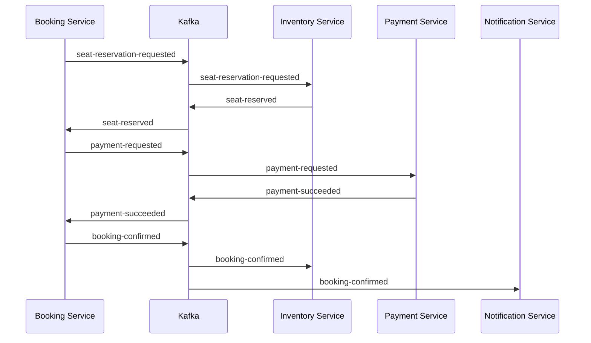
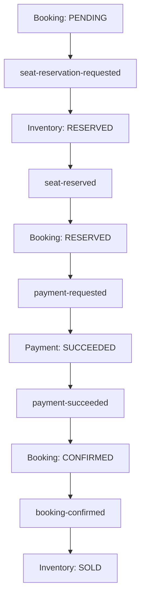
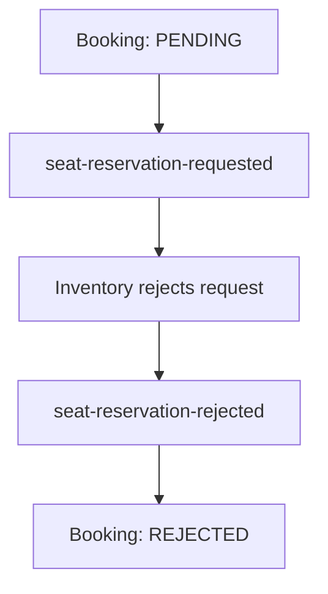
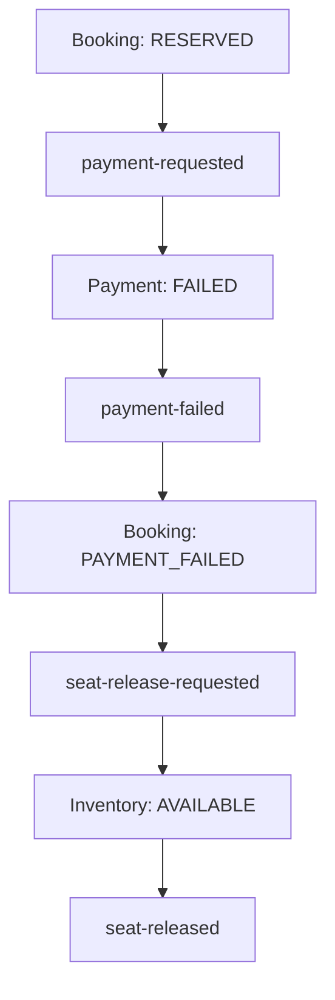

# Event Catalog

This document defines the authoritative Kafka event contracts, ownership,
versioning, routing, metadata, payload requirements, producer and consumer
responsibilities, idempotency rules, and Saga choreography for Cinema Booking
System.

Events are integration contracts.

They must remain stable, versioned, documented, and independent from internal JPA
entities.

---

# Event-Driven Principles

The event architecture follows these principles:

- Saga Pattern with choreography
- Transactional Outbox for reliable publication
- Idempotent Consumer for state-changing handlers
- At-least-once delivery
- Database per Service
- No shared business database
- No cross-service JPA entity sharing
- UUID Version 7 identifiers
- ISO-8601 timestamps
- Explicit event ownership
- Explicit schema versioning
- Backward-compatible evolution
- Deterministic partition keys
- Correlation and causation tracking
- Minimal sensitive information
- Immutable published events

Kafka delivery must be treated as at least once.

Consumers must assume that:

- An event may be delivered more than once.
- An event may be delayed.
- Events from different aggregate keys may arrive in different orders.
- A consumer may restart after applying a database change.
- A producer may retry publication.
- A message may reach a dead-letter topic.
- A newer event may already have changed aggregate state.

Exactly-once business processing must not be assumed from Kafka configuration
alone.

---

# Integration Event Definition

An integration event represents a fact or request exchanged between services.

Two conceptual categories are used:

## Command-style event

A command-style event requests that another service perform an operation.

Examples:

```text
seat-reservation-requested
payment-requested
seat-release-requested
```

The owning consumer may accept, reject, or idempotently ignore the request.

## Fact-style event

A fact-style event reports something that already occurred within the producer's
owned domain.

Examples:

```text
seat-reserved
seat-reservation-rejected
payment-succeeded
payment-failed
booking-confirmed
booking-cancelled
```

Event names must describe domain intent clearly.

Internal implementation names such as repository methods or entity class names
must not appear in public event contracts.

---

# Event Envelope

Every integration event must use a common envelope.

Conceptual structure:

```json
{
  "eventId": "019c1234-5678-7abc-8def-0123456789ab",
  "eventType": "seat-reservation-requested",
  "eventVersion": "1",
  "occurredAt": "2026-07-23T08:30:15.123456Z",
  "producer": "booking-service",
  "aggregateType": "BOOKING",
  "aggregateId": "019c1234-1111-7abc-8def-0123456789ab",
  "correlationId": "019c1234-2222-7abc-8def-0123456789ab",
  "causationId": null,
  "payload": {}
}
```

Required envelope fields:

| Field | Type | Required | Description |
|---|---|---:|---|
| `eventId` | UUID v7 | Yes | Globally unique event identifier |
| `eventType` | String | Yes | Stable event contract name |
| `eventVersion` | String | Yes | Payload contract version |
| `occurredAt` | ISO-8601 timestamp | Yes | Time the domain event occurred |
| `producer` | String | Yes | Publishing service |
| `aggregateType` | String | Yes | Aggregate category |
| `aggregateId` | UUID | Yes | Aggregate used for ordering and tracing |
| `correlationId` | UUID | Yes | Identifier shared across the business flow |
| `causationId` | UUID | No | Event that caused this event |
| `payload` | Object | Yes | Event-specific immutable data |

If the implemented common Kafka contract uses equivalent field names, the
implementation and this document must be synchronized before a round is complete.

---

# Identifier Rules

Identifiers use UUID Version 7 where generated by this project.

This includes:

```text
eventId
aggregateId
correlationId
bookingId
paymentId
notificationId
reservationRequestId
```

Rules:

- `eventId` identifies one published event.
- A retry of the same logical outbox event retains the same `eventId`.
- A new business outcome uses a new `eventId`.
- `correlationId` remains stable across one booking Saga.
- `causationId` references the immediate triggering event.
- Business entity identifiers must not be replaced with Kafka offsets.
- Numeric auto-increment event identifiers must not be introduced.

Example causal chain:

```text
seat-reservation-requested.eventId = E1
seat-reserved.causationId = E1
payment-requested.causationId = E2
payment-succeeded.causationId = E3
booking-confirmed.causationId = E4
```

All events in this chain use the same `correlationId`.

---

# Timestamp Rules

Event timestamps must:

- Use ISO-8601 serialization
- Include an offset or UTC marker
- Preserve sufficient precision
- Represent the domain occurrence time
- Remain unchanged during publication retries

Recommended Java type:

```java
OffsetDateTime
```

Example:

```text
2026-07-23T15:30:15.123456+07:00
```

or normalized UTC:

```text
2026-07-23T08:30:15.123456Z
```

The following array representation is not allowed:

```json
[2026, 7, 23, 15, 30, 15, 123456000]
```

All event serialization must use the approved shared Jackson configuration.

---

# Event Contract Rules

Integration event contracts must:

- Be immutable
- Use explicit field names
- Avoid internal database column names when they leak implementation details
- Avoid publishing JPA entities
- Avoid lazy-loaded relationships
- Avoid service-specific repository models
- Include all data required for normal consumer processing
- Minimize synchronous callbacks to the producer
- Avoid secrets and unnecessary personal information
- Document units and currency
- Document nullable fields
- Preserve historical values where required
- Use string enum values
- Use decimal-compatible monetary values

Recommended Java representation:

```java
public record SeatReservedPayload(
    UUID bookingId,
    UUID showtimeId,
    List<ReservedSeat> seats,
    BigDecimal totalAmount,
    String currency,
    OffsetDateTime reservationExpiresAt
) {
}
```

Do not publish:

```java
public class SeatReservedEvent extends ShowSeatEntity {
}
```

Integration contracts must not depend on persistence inheritance.

---

# Kafka Topic Naming

Topic names use lowercase kebab-case.

Approved business topics:

```text
seat-reservation-requested
seat-reserved
seat-reservation-rejected
payment-requested
payment-succeeded
payment-failed
seat-release-requested
seat-released
booking-confirmed
booking-cancelled
booking-expired
```

Dead-letter topics should use a consistent suffix:

```text
<source-topic>.dlt
```

Examples:

```text
payment-requested.dlt
seat-reserved.dlt
```

Retry-topic naming may be introduced only when the common Kafka retry strategy
requires it.

Do not create multiple undocumented names for the same contract.

For example, these must not coexist without an explicit migration:

```text
payment-success
payment-succeeded
payments.success
```

This catalog standardizes the fact-style name as:

```text
payment-succeeded
```

---

# Partition Key Strategy

Events affecting the same booking Saga should normally use:

```text
bookingId
```

as the Kafka message key.

This preserves ordering for one booking within a topic partition.

Examples:

| Event | Recommended key |
|---|---|
| `seat-reservation-requested` | `bookingId` |
| `seat-reserved` | `bookingId` |
| `seat-reservation-rejected` | `bookingId` |
| `payment-requested` | `bookingId` |
| `payment-succeeded` | `bookingId` |
| `payment-failed` | `bookingId` |
| `seat-release-requested` | `bookingId` |
| `seat-released` | `bookingId` |
| `booking-confirmed` | `bookingId` |
| `booking-cancelled` | `bookingId` |
| `booking-expired` | `bookingId` |

The outbox `partition_key` must match the Kafka record key used by the publisher.

Partition ordering does not remove the need for:

- Idempotency
- Expected-state validation
- Reservation ownership validation
- Version compatibility
- Stale event handling

---

# Event Ownership Summary

| Event | Producer | Primary consumer |
|---|---|---|
| `seat-reservation-requested` | Booking Service | Inventory Service |
| `seat-reserved` | Inventory Service | Booking Service |
| `seat-reservation-rejected` | Inventory Service | Booking Service |
| `payment-requested` | Booking Service | Payment Service |
| `payment-succeeded` | Payment Service | Booking Service |
| `payment-failed` | Payment Service | Booking Service |
| `seat-release-requested` | Booking Service | Inventory Service |
| `seat-released` | Inventory Service | Booking Service |
| `booking-confirmed` | Booking Service | Inventory Service, Notification Service |
| `booking-cancelled` | Booking Service | Inventory Service, Notification Service |
| `booking-expired` | Booking Service | Inventory Service, Notification Service |

Additional consumers may be added only when their ownership and idempotency
requirements are documented.

---

# Booking Saga Overview

The normal booking flow is:



Failure paths use compensating events.

No service updates another service's database during this flow.

---

# `seat-reservation-requested`

Requests Inventory Service to reserve a complete set of seats for a booking.

## Ownership

| Attribute | Value |
|---|---|
| Producer | Booking Service |
| Consumer | Inventory Service |
| Aggregate | Booking |
| Partition key | `bookingId` |
| Current version | `1` |

## Producer transaction

Booking Service must perform one local transaction:

```text
Create booking with PENDING status
Create immutable booking seat request snapshots
Create seat-reservation-requested outbox event
Commit
```

Booking Service must not update `show_seats`.

## Payload

```json
{
  "bookingId": "019c1234-1111-7abc-8def-0123456789ab",
  "userId": "019c1234-2222-7abc-8def-0123456789ab",
  "showtimeId": "019c1234-3333-7abc-8def-0123456789ab",
  "seats": [
    {
      "seatNumber": "H7"
    },
    {
      "seatNumber": "H8"
    }
  ],
  "requestedAt": "2026-07-23T08:30:15.123456Z",
  "reservationExpiresAt": "2026-07-23T08:40:15.123456Z"
}
```

## Required fields

| Field | Required | Description |
|---|---:|---|
| `bookingId` | Yes | Booking Service aggregate identifier |
| `userId` | Yes | External user reference |
| `showtimeId` | Yes | Showtime reference |
| `seats` | Yes | Non-empty requested seat set |
| `seats[].seatNumber` | Yes | Normalized seat label |
| `requestedAt` | Yes | Request creation time |
| `reservationExpiresAt` | Yes | Requested reservation deadline |

## Consumer behavior

Inventory Service must:

1. Check `processed_events`.
2. Normalize and validate seat numbers.
3. Reject duplicate seat numbers.
4. Acquire Redis locks in deterministic order.
5. Load all requested `show_seats`.
6. Confirm all seats exist.
7. Confirm all seats are `AVAILABLE`, or already reserved by the same booking.
8. Reserve the complete set atomically.
9. Associate the reservation with `bookingId`.
10. Store the processed event.
11. Create either `seat-reserved` or `seat-reservation-rejected`.
12. Commit the local transaction.
13. Release locks.

Partial reservation is not allowed.

---

# `seat-reserved`

Reports that Inventory Service successfully reserved the complete requested seat
set.

## Ownership

| Attribute | Value |
|---|---|
| Producer | Inventory Service |
| Consumer | Booking Service |
| Aggregate | Booking reservation |
| Partition key | `bookingId` |
| Current version | `1` |

## Payload

```json
{
  "bookingId": "019c1234-1111-7abc-8def-0123456789ab",
  "showtimeId": "019c1234-3333-7abc-8def-0123456789ab",
  "seats": [
    {
      "inventorySeatId": "019c1234-4444-7abc-8def-0123456789ab",
      "seatNumber": "H7",
      "seatType": "STANDARD",
      "price": 90000.00
    },
    {
      "inventorySeatId": "019c1234-5555-7abc-8def-0123456789ab",
      "seatNumber": "H8",
      "seatType": "STANDARD",
      "price": 90000.00
    }
  ],
  "totalAmount": 180000.00,
  "currency": "VND",
  "reservedAt": "2026-07-23T08:30:16.123456Z",
  "reservationExpiresAt": "2026-07-23T08:40:15.123456Z"
}
```

## Consumer behavior

Booking Service must perform one local transaction:

```text
Check processed event
Verify booking exists
Verify expected booking status is PENDING
Update booking seat snapshots with authoritative reservation values
Update booking PENDING → RESERVED
Store processed event
Create payment-requested outbox event
Commit
```

A duplicate event must not create duplicate payments.

A delayed event must not restore a cancelled, rejected, or expired booking to
`RESERVED`.

---

# `seat-reservation-rejected`

Reports that Inventory Service could not reserve the complete requested seat set.

## Ownership

| Attribute | Value |
|---|---|
| Producer | Inventory Service |
| Consumer | Booking Service |
| Aggregate | Booking reservation |
| Partition key | `bookingId` |
| Current version | `1` |

## Payload

```json
{
  "bookingId": "019c1234-1111-7abc-8def-0123456789ab",
  "showtimeId": "019c1234-3333-7abc-8def-0123456789ab",
  "reasonCode": "SEAT_UNAVAILABLE",
  "message": "One or more requested seats are unavailable",
  "unavailableSeats": [
    "H7"
  ],
  "rejectedAt": "2026-07-23T08:30:16.123456Z"
}
```

Approved conceptual reason codes:

```text
SEAT_NOT_FOUND
SEAT_UNAVAILABLE
DUPLICATE_SEAT
INVALID_REQUEST
RESERVATION_EXPIRED
INVENTORY_CONFLICT
```

The public reason message must not expose internal stack traces or database
details.

## Consumer behavior

Booking Service must:

```text
Check processed event
Verify booking status
Update PENDING → REJECTED
Store rejection reason
Store processed event
Commit
```

No payment request may be created for a rejected reservation.

---

# `payment-requested`

Requests Payment Service to create or execute a payment attempt for a reserved
booking.

## Ownership

| Attribute | Value |
|---|---|
| Producer | Booking Service |
| Consumer | Payment Service |
| Aggregate | Booking |
| Partition key | `bookingId` |
| Current version | `1` |

## Payload

```json
{
  "bookingId": "019c1234-1111-7abc-8def-0123456789ab",
  "userId": "019c1234-2222-7abc-8def-0123456789ab",
  "amount": 180000.00,
  "currency": "VND",
  "paymentAttempt": 1,
  "reservationExpiresAt": "2026-07-23T08:40:15.123456Z",
  "requestedAt": "2026-07-23T08:30:17.123456Z"
}
```

## Consumer behavior

Payment Service must:

1. Check `processed_events`.
2. Verify the payment request is not expired.
3. Resolve or create the idempotent payment attempt.
4. Prevent duplicate provider charges.
5. Store Payment Service-owned state.
6. Store the processed event.
7. Create `payment-succeeded` or `payment-failed`.
8. Commit its local transaction.

Provider calls require an explicit idempotency strategy.

A database processed-event check alone does not guarantee that an external payment
provider will not receive a duplicate request.

---

# `payment-succeeded`

Reports that payment completed successfully.

## Ownership

| Attribute | Value |
|---|---|
| Producer | Payment Service |
| Consumer | Booking Service |
| Aggregate | Payment |
| Partition key | `bookingId` |
| Current version | `1` |

## Payload

```json
{
  "paymentId": "019c1234-6666-7abc-8def-0123456789ab",
  "bookingId": "019c1234-1111-7abc-8def-0123456789ab",
  "amount": 180000.00,
  "currency": "VND",
  "provider": "MOCK",
  "providerReference": "PAY-20260723-000001",
  "paidAt": "2026-07-23T08:31:10.123456Z"
}
```

Sensitive payment credentials must not be included.

## Consumer behavior

Booking Service must:

```text
Check processed event
Verify booking exists
Verify amount and currency match
Verify expected booking status is RESERVED
Update RESERVED → CONFIRMED
Set confirmed_at
Store processed event
Create booking-confirmed outbox event
Commit
```

A duplicate event must not confirm the booking twice or create duplicate downstream
side effects.

A payment received after booking expiration requires an explicit reconciliation or
refund policy. It must not silently restore an expired booking.

---

# `payment-failed`

Reports that a payment attempt failed.

## Ownership

| Attribute | Value |
|---|---|
| Producer | Payment Service |
| Consumer | Booking Service |
| Aggregate | Payment |
| Partition key | `bookingId` |
| Current version | `1` |

## Payload

```json
{
  "paymentId": "019c1234-6666-7abc-8def-0123456789ab",
  "bookingId": "019c1234-1111-7abc-8def-0123456789ab",
  "failureCode": "PAYMENT_DECLINED",
  "message": "The payment was declined",
  "failedAt": "2026-07-23T08:31:10.123456Z",
  "retryable": false
}
```

Approved conceptual failure codes may include:

```text
PAYMENT_DECLINED
PAYMENT_TIMEOUT
PROVIDER_UNAVAILABLE
INVALID_PAYMENT_REQUEST
RESERVATION_EXPIRED
DUPLICATE_PAYMENT
```

## Consumer behavior

Booking Service must:

```text
Check processed event
Verify expected booking state
Update RESERVED → PAYMENT_FAILED
Store processed event
Create seat-release-requested outbox event
Commit
```

Internal provider errors and stack traces must not be placed in public event
messages.

---

# `seat-release-requested`

Requests Inventory Service to release seats owned by a booking that will not
complete.

Typical causes:

```text
PAYMENT_FAILED
BOOKING_CANCELLED
BOOKING_EXPIRED
```

## Ownership

| Attribute | Value |
|---|---|
| Producer | Booking Service |
| Consumer | Inventory Service |
| Aggregate | Booking |
| Partition key | `bookingId` |
| Current version | `1` |

## Payload

```json
{
  "bookingId": "019c1234-1111-7abc-8def-0123456789ab",
  "showtimeId": "019c1234-3333-7abc-8def-0123456789ab",
  "seatIds": [
    "019c1234-4444-7abc-8def-0123456789ab",
    "019c1234-5555-7abc-8def-0123456789ab"
  ],
  "reason": "PAYMENT_FAILED",
  "requestedAt": "2026-07-23T08:31:11.123456Z"
}
```

## Consumer behavior

Inventory Service must release a seat only when:

```text
status = RESERVED
reserved_by_booking_id = event.bookingId
```

Inventory Service must not release:

- A seat reserved by another booking
- A sold seat
- A newer reservation
- A seat whose state was changed by a later valid command

The complete release operation and resulting `seat-released` outbox record must be
committed in one local transaction.

---

# `seat-released`

Reports the result of a seat release operation.

## Ownership

| Attribute | Value |
|---|---|
| Producer | Inventory Service |
| Consumer | Booking Service |
| Aggregate | Booking reservation |
| Partition key | `bookingId` |
| Current version | `1` |

## Payload

```json
{
  "bookingId": "019c1234-1111-7abc-8def-0123456789ab",
  "showtimeId": "019c1234-3333-7abc-8def-0123456789ab",
  "releasedSeatIds": [
    "019c1234-4444-7abc-8def-0123456789ab",
    "019c1234-5555-7abc-8def-0123456789ab"
  ],
  "reason": "PAYMENT_FAILED",
  "releasedAt": "2026-07-23T08:31:12.123456Z"
}
```

Booking Service may use this event for Saga completion and audit state.

It must not directly inspect Inventory Service tables to confirm release.

---

# `booking-confirmed`

Reports that a booking completed successfully.

## Ownership

| Attribute | Value |
|---|---|
| Producer | Booking Service |
| Consumers | Inventory Service, Notification Service |
| Aggregate | Booking |
| Partition key | `bookingId` |
| Current version | `1` |

## Payload

```json
{
  "bookingId": "019c1234-1111-7abc-8def-0123456789ab",
  "userId": "019c1234-2222-7abc-8def-0123456789ab",
  "showtimeId": "019c1234-3333-7abc-8def-0123456789ab",
  "paymentId": "019c1234-6666-7abc-8def-0123456789ab",
  "seats": [
    {
      "seatNumber": "H7",
      "seatType": "STANDARD",
      "price": 90000.00
    },
    {
      "seatNumber": "H8",
      "seatType": "STANDARD",
      "price": 90000.00
    }
  ],
  "totalAmount": 180000.00,
  "currency": "VND",
  "confirmedAt": "2026-07-23T08:31:11.123456Z"
}
```

## Inventory Service behavior

Inventory Service must:

```text
Check processed event
Verify seats are RESERVED by this booking
Update RESERVED → SOLD
Clear or finalize reservation metadata
Store processed event
Commit
```

Inventory Service remains the only service allowed to update `show_seats`.

## Notification Service behavior

Notification Service must:

```text
Check processed event
Create idempotent confirmation notification
Store processed event
Create delivery work or outbox record if required
Commit
```

Notification Service must not query Booking Service's database.

Required notification data must be present in the event or obtained through an
approved API.

---

# `booking-cancelled`

Reports that a booking was cancelled.

## Ownership

| Attribute | Value |
|---|---|
| Producer | Booking Service |
| Consumers | Inventory Service, Notification Service |
| Aggregate | Booking |
| Partition key | `bookingId` |
| Current version | `1` |

## Payload

```json
{
  "bookingId": "019c1234-1111-7abc-8def-0123456789ab",
  "userId": "019c1234-2222-7abc-8def-0123456789ab",
  "showtimeId": "019c1234-3333-7abc-8def-0123456789ab",
  "reason": "USER_REQUESTED",
  "cancelledAt": "2026-07-23T08:35:00.123456Z"
}
```

Cancellation does not itself authorize Inventory Service to reverse sold seats.

Inventory behavior depends on the approved cancellation and refund policy.

For a booking whose seats are still only `RESERVED`, Inventory Service may release
them after validating reservation ownership.

---

# `booking-expired`

Reports that a booking expired before successful completion.

## Ownership

| Attribute | Value |
|---|---|
| Producer | Booking Service |
| Consumers | Inventory Service, Notification Service |
| Aggregate | Booking |
| Partition key | `bookingId` |
| Current version | `1` |

## Payload

```json
{
  "bookingId": "019c1234-1111-7abc-8def-0123456789ab",
  "userId": "019c1234-2222-7abc-8def-0123456789ab",
  "showtimeId": "019c1234-3333-7abc-8def-0123456789ab",
  "expiredAt": "2026-07-23T08:40:15.123456Z"
}
```

Inventory Service must conditionally release only seats still reserved by the same
booking.

A delayed expiration event must not release seats that are already `SOLD` or owned
by another booking.

---

# Successful Saga



Each arrow crossing a service boundary represents Kafka communication.

Each local state change and its outgoing event must use a local database transaction
with Transactional Outbox.

---

# Reservation Failure Saga



No payment request is created.

---

# Payment Failure Compensation



Compensation is an explicit business action.

It is not a distributed rollback.

---

# Consumer Groups

Each logical consumer must use its own consumer group.

Conceptual examples:

| Service | Event | Consumer group |
|---|---|---|
| Inventory Service | `seat-reservation-requested` | `inventory-seat-reservation` |
| Booking Service | `seat-reserved` | `booking-seat-reserved` |
| Booking Service | `seat-reservation-rejected` | `booking-seat-rejected` |
| Payment Service | `payment-requested` | `payment-request-processing` |
| Booking Service | `payment-succeeded` | `booking-payment-succeeded` |
| Booking Service | `payment-failed` | `booking-payment-failed` |
| Inventory Service | `seat-release-requested` | `inventory-seat-release` |
| Inventory Service | `booking-confirmed` | `inventory-booking-confirmed` |
| Notification Service | `booking-confirmed` | `notification-booking-confirmed` |

Multiple instances of the same logical consumer must share the same consumer group.

Different services must not accidentally share a group when both need to receive
the event.

---

# Idempotent Consumer Rules

Every state-changing consumer must use its service-owned `processed_events` table.

The idempotency key is based on:

```text
eventId
consumer
```

Conceptual transaction:

```text
Begin transaction
    Check whether eventId was processed by this logical consumer
    Validate current aggregate state
    Apply domain changes
    Insert processed_events record
    Insert resulting outbox event if required
Commit
```

Rules:

- Marking an event as processed before the domain transaction is unsafe.
- Applying the domain change and storing the processed event in separate
  transactions is unsafe.
- In-memory sets are not sufficient.
- Kafka offset commits are not a replacement for business idempotency.
- A unique constraint must protect concurrent duplicate processing.
- A duplicate event must not repeat an external payment charge.
- Consumers must safely handle a unique-constraint race.

---

# Transactional Outbox Rules

Every reliable producer must write the outgoing event to `outbox_events` in the same
transaction as its domain state change.

Correct:

```text
Booking transaction
    bookings: PENDING → RESERVED
    processed_events: seat-reserved event ID
    outbox_events: payment-requested
Commit
```

Incorrect:

```java
bookingRepository.save(booking);
kafkaTemplate.send("payment-requested", event);
```

The outbox record must preserve:

```text
event ID
event type
event version
topic
partition key
aggregate ID
correlation ID
causation ID
payload
creation time
publication status
```

Publication retries must reuse the same event contract and `eventId`.

See:

```text
docs/09_OUTBOX.md
```

---

# Event Ordering

Kafka guarantees ordering only within one partition.

The project therefore uses `bookingId` as the key for the booking Saga where
applicable.

Consumers must still validate current state.

Examples:

- `payment-succeeded` must not blindly change `EXPIRED → CONFIRMED`.
- `seat-release-requested` must not release a seat owned by another booking.
- `booking-confirmed` must not convert an unrelated reservation to `SOLD`.
- `seat-reserved` must not restore a rejected or cancelled booking.
- A duplicate `payment-requested` must not create another charge.

Event ordering is a transport property.

Aggregate transition validation remains a domain responsibility.

---

# Event Versioning

Every event contains an explicit `eventVersion`.

Initial version:

```text
1
```

Backward-compatible changes may include:

- Adding an optional field
- Adding a field with a safe default
- Adding a new enum value when consumers handle unknown values safely
- Clarifying documentation without changing semantics

Potentially breaking changes include:

- Renaming a field
- Removing a field
- Changing a field type
- Changing monetary units
- Changing timestamp semantics
- Changing nullability from optional to required
- Reusing an enum value with a new meaning
- Changing the event's business meaning

Breaking changes require a new event version.

Possible migration strategies:

```text
Dual publish old and new versions
Consumer-first deployment
Topic versioning when required
Schema upcasting at the consumer boundary
```

A producer must not publish an incompatible payload under the existing version.

---

# Enum Evolution

Event enum values are public contract data.

Consumers must not rely exclusively on Java deserialization that fails immediately
for every unknown enum value unless that behavior is explicitly intended.

When forward compatibility is required, consumers should:

- Preserve the raw value
- Map unknown values to a safe unsupported state
- Reject the event with a controlled error
- Route permanently unsupported events according to the DLT policy

Unknown values must not be silently interpreted as a different business state.

---

# Retry Policy

Retry behavior must distinguish transient and permanent failures.

Transient examples:

```text
Temporary database connection failure
Kafka broker interruption
Temporary downstream provider unavailability
Optimistic locking conflict that can be retried safely
```

Permanent examples:

```text
Unsupported event version
Malformed payload
Missing required identifier
Invalid enum value
Business state incompatible with the event
```

Rules:

- Retries must be bounded.
- Backoff must be configured.
- Repeated processing must remain idempotent.
- Error logs must include event and correlation identifiers.
- Payloads containing sensitive data must not be logged in full.
- Permanent failures must not block a partition indefinitely.
- The final recovery path must be documented.

---

# Dead-Letter Topics

Events that cannot be processed after the approved retry policy may be sent to a
dead-letter topic.

Naming:

```text
<source-topic>.dlt
```

A dead-letter record should retain sufficient metadata:

```text
original topic
original partition
original offset
consumer group
event ID
event type
event version
correlation ID
failure classification
bounded error message
failure timestamp
```

Rules:

- A DLT is not successful business processing.
- DLT records require monitoring.
- Replay must be controlled and idempotent.
- Operators must determine whether the event is safe to replay.
- Sensitive payloads must remain protected.
- A replay must preserve or deliberately map the original `eventId`.
- Deleting DLT records without investigation is not an approved recovery process.

---

# Event Validation

Consumers must validate:

- Envelope presence
- Supported event type
- Supported event version
- Valid UUID fields
- Required payload fields
- Non-empty seat collections
- Duplicate seat values
- Non-negative monetary values
- Supported currency
- Valid ISO-8601 timestamps
- Aggregate identifier consistency
- Kafka key consistency where required
- Business state preconditions

Transport deserialization success does not imply business validity.

Invalid input must produce a controlled failure classification.

---

# Monetary Data

Event monetary fields use decimal values.

Java:

```java
BigDecimal
```

Example JSON:

```json
{
  "amount": 180000.00,
  "currency": "VND"
}
```

Rules:

- Do not use floating-point calculations.
- Currency must be explicit.
- Amount semantics must be documented.
- Booking and Payment Service must compare amount and currency.
- Historical amounts must not be recalculated from current Inventory or Movie data.
- Events must not rely on locale-formatted monetary strings.

---

# Seat Snapshot Rules

Booking events may contain seat snapshots.

A snapshot may include:

```text
inventorySeatId
seatNumber
seatType
price
```

These values represent the seat at booking time.

Booking Service stores the snapshot in `booking_seats`.

It must not:

- Import `ShowSeatEntity`
- Import `ShowSeatRepository`
- Query `show_seats`
- Update `show_seats`
- Treat the snapshot as authoritative current Inventory state

Inventory Service remains the owner of seat availability and reservation state.

---

# Sensitive Data Rules

Events must not contain:

- Plain-text passwords
- Password hashes
- Refresh tokens
- Access tokens
- Database credentials
- Payment provider secrets
- CVV values
- Full card numbers
- Unnecessary personal information
- Internal stack traces

Events should contain only the information required by approved consumers.

When a notification requires contact data, the contract must use an approved
minimal representation or an approved API lookup.

Sensitive values must not be copied into:

```text
Kafka headers
outbox last_error
consumer logs
DLT error messages
tracing attributes
```

---

# Logging and Tracing

Event processing logs should include:

```text
eventId
eventType
eventVersion
correlationId
causationId
aggregateId
producer
consumer
topic
partition
offset
```

Do not log complete payloads by default.

Trace context may additionally be propagated using approved Kafka headers.

Business correlation must not depend exclusively on tracing infrastructure.

`correlationId` remains part of the event contract even when distributed tracing is
temporarily unavailable.

---

# Schema and Contract Testing

Event contract tests must verify:

- Serialization
- Deserialization
- ISO-8601 timestamps
- UUID fields
- Decimal monetary values
- Required fields
- Unknown-field compatibility
- Enum behavior
- Event version handling
- Partition key selection
- Correlation and causation propagation
- No JPA entity leakage
- No sensitive data leakage

Integration tests should use Kafka Testcontainers where Kafka behavior is involved.

Tests must verify duplicate delivery.

Example scenario:

```text
Publish payment-succeeded event twice
    ↓
Booking becomes CONFIRMED once
    ↓
One booking-confirmed logical event is created
```

Tests must also verify stale event handling.

---

# Invalid Event Designs

## Publishing a JPA entity

```java
kafkaTemplate.send("seat-reserved", showSeatEntity);
```

This leaks Inventory Service persistence into the integration contract.

---

## Direct publication after database save

```java
bookingRepository.save(booking);
kafkaTemplate.send("payment-requested", event);
```

A process failure between these operations can lose the event.

Use Transactional Outbox.

---

## Missing event identifier

```json
{
  "bookingId": "019c1234-1111-7abc-8def-0123456789ab",
  "status": "CONFIRMED"
}
```

Without `eventId`, reliable consumer idempotency cannot be implemented consistently.

---

## Timestamp array

```json
{
  "createdAt": [2026, 7, 23, 15, 30, 15]
}
```

Event timestamps must use ISO-8601 strings.

---

## Service-specific Java class header

```text
__TypeId__ = com.cinema.payment.internal.PaymentSucceededEntity
```

Consumers must not require the producer's internal Java package.

Contracts must be deserialized according to the approved event type and version,
not an internal entity class name.

---

## Duplicate side effects

```java
@KafkaListener(topics = "payment-succeeded")
public void consume(PaymentSucceededEvent event) {
    bookingService.confirm(event.bookingId());
}
```

This is invalid when no processed-event check and expected-state validation exist.

---

## Booking Service updating inventory

```java
@KafkaListener(topics = "seat-reservation-requested")
public void consume(SeatReservationRequestedEvent event) {
    showSeatRepository.reserve(event.showtimeId(), event.seatNumbers());
}
```

Booking Service must not own or use `ShowSeatRepository`.

Inventory Service is the only valid consumer that changes `show_seats`.

---

# Event Catalog Summary

| Topic | Producer | Consumer | Result |
|---|---|---|---|
| `seat-reservation-requested` | Booking | Inventory | Attempts atomic seat reservation |
| `seat-reserved` | Inventory | Booking | Booking becomes `RESERVED` |
| `seat-reservation-rejected` | Inventory | Booking | Booking becomes `REJECTED` |
| `payment-requested` | Booking | Payment | Creates idempotent payment attempt |
| `payment-succeeded` | Payment | Booking | Booking becomes `CONFIRMED` |
| `payment-failed` | Payment | Booking | Booking becomes `PAYMENT_FAILED` |
| `seat-release-requested` | Booking | Inventory | Releases booking-owned reservation |
| `seat-released` | Inventory | Booking | Confirms compensation result |
| `booking-confirmed` | Booking | Inventory | Seats become `SOLD` |
| `booking-confirmed` | Booking | Notification | Sends confirmation notification |
| `booking-cancelled` | Booking | Inventory | Conditionally releases reserved seats |
| `booking-cancelled` | Booking | Notification | Sends cancellation notification |
| `booking-expired` | Booking | Inventory | Conditionally releases expired reservation |
| `booking-expired` | Booking | Notification | Sends expiration notification if required |

---

# Event Verification Checklist

Before marking an event-driven round complete, verify:

- [ ] Every event has a stable `eventId`
- [ ] New identifiers use UUID v7
- [ ] Every event declares `eventType` and `eventVersion`
- [ ] Every event uses ISO-8601 timestamps
- [ ] Every Saga event propagates `correlationId`
- [ ] Result events set the correct `causationId`
- [ ] Kafka topic names match this catalog
- [ ] Kafka keys use the documented aggregate identifier
- [ ] Events do not expose JPA entities
- [ ] Events do not expose service-internal repositories or packages
- [ ] Monetary values use `BigDecimal`
- [ ] Currency is explicit
- [ ] Sensitive data is excluded
- [ ] Reliable producers use Transactional Outbox
- [ ] State-changing consumers use `processed_events`
- [ ] Consumer domain changes and processed-event insertion share one transaction
- [ ] Duplicate delivery tests pass
- [ ] Stale event tests pass
- [ ] Unsupported event versions are handled safely
- [ ] Retry and DLT behavior are configured
- [ ] Booking Service never updates `show_seats`
- [ ] Inventory Service validates reservation ownership
- [ ] Payment processing prevents duplicate provider charges
- [ ] Event contracts match Java records and tests
- [ ] Documentation matches actual topic configuration
- [ ] `mvn clean verify` passes

---

# Useful Repository Checks

Search for topic names:

```bash
git grep -n -E \
    "seat-reservation-requested|seat-reserved|seat-reservation-rejected|payment-requested|payment-succeeded|payment-failed|seat-release-requested|seat-released|booking-confirmed|booking-cancelled|booking-expired"
```

Search for legacy or conflicting topic names:

```bash
git grep -n -E \
    "seat-reserved-topic|payment-success|payment-successful|payment-failure"
```

Each match must either be migrated or explicitly documented.

Search for direct Kafka publication from business code:

```bash
git grep -n "kafkaTemplate.send" -- services
```

Direct calls are allowed only inside the approved outbox publication
infrastructure, not beside domain repository mutations.

Search for JPA entity leakage into events:

```bash
git grep -n -E \
    "Entity>|Entity event|extends .*Entity|payload.*Entity" \
    -- common services
```

Search for non-idempotent consumers:

```bash
git grep -n "@KafkaListener" -- services
```

Review every state-changing listener and verify `processed_events` participation.

Search for prohibited Booking Service Inventory access:

```bash
git grep -n -E \
    "ShowSeatRepository|ShowSeatEntity|show_seats|cinema_inventory_db" \
    -- services/booking-service
```

Verify formatting:

```bash
git diff --check
```

Run the complete build:

```bash
mvn clean verify
```

---

# Related Documentation

See:

```text
docs/00_PROJECT_CONTEXT.md
docs/01_AI_CONTEXT.md
docs/02_ARCHITECTURE.md
docs/03_TECHNOLOGY_STACK.md
docs/04_MODULES.md
docs/05_CODING_CONVENTIONS.md
docs/06_DATABASE_DESIGN.md
docs/08_SECURITY.md
docs/09_OUTBOX.md
docs/10_ROADMAP.md
docs/11_CHANGELOG.md
docs/12_DEPENDENCY_RULES.md
docs/13_SEQUENCE_DIAGRAMS.md
docs/14_DEPLOYMENT.md
docs/decisions/
```

When implementation and documentation conflict:

1. Respect accepted Architecture Decision Records.
2. Preserve database-per-service ownership.
3. Preserve Inventory Service ownership of `show_seats`.
4. Preserve Transactional Outbox publication.
5. Preserve Idempotent Consumer processing.
6. Preserve UUID v7 identifiers and ISO-8601 timestamps.
7. Do not silently change an existing event contract.
8. Correct inconsistencies before marking the round complete.
