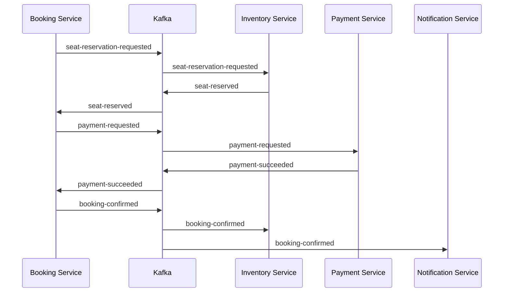

# Event Catalog

Version: R26
Last updated: 2026-08-25

This document defines the authoritative Kafka event contracts, ownership,
versioning, routing, metadata, payload requirements, producer and consumer
responsibilities, idempotency rules, and Saga choreography for Cinema Booking
System.

Events are integration contracts.

They must remain stable, versioned, documented, and independent from internal JPA
entities.

Implementation status:

- The event infrastructure and reliability foundations exist in common modules.
- Inventory Service event production and consumption required through R24 and R26
  are implemented and verified.
- Booking Service event production and consumption required through R26 are
  implemented and verified.
- Implemented Booking events include `seat-reservation-requested`,
  `payment-requested`, `booking-cancelled` and `booking-expired`.
- Implemented Inventory result events consumed by Booking Service include
  `seat-reserved` and `seat-reservation-rejected`.
- Payment provider execution and Payment-owned result events remain R27 scope.
- Notification event consumption remains R28 scope.
- Documentation of a future topic is not proof that its producer or consumer
  currently exists.

---

# Event-Driven Principles

The event architecture follows these principles:

- Saga Pattern with choreography
- Transactional Outbox for reliable publication
- Idempotent Consumer for state-changing handlers
- At-least-once delivery
- Database per Service
- No shared business database
- No cross-service JPA entity sharing
- UUID Version 7 identifiers
- ISO-8601 timestamps
- Explicit event ownership
- Explicit schema versioning
- Backward-compatible evolution
- Deterministic partition keys
- Correlation and causation tracking
- Minimal sensitive information
- Immutable published events

Kafka delivery must be treated as at least once.

Consumers must assume that:

- An event may be delivered more than once.
- An event may be delayed.
- Events from different aggregate keys may arrive in different orders.
- A consumer may restart after applying a database change.
- A producer may retry publication.
- A message may reach a dead-letter topic.
- A newer event may already have changed aggregate state.

Exactly-once business processing must not be assumed from Kafka configuration
alone.

---

# Integration Event Definition

An integration event represents a fact or request exchanged between services.

Two conceptual categories are used:

## Command-style event

A command-style event requests that another service perform an operation.

Examples:

```text
seat-reservation-requested
payment-requested
seat-release-requested
```

The owning consumer may accept, reject, or idempotently ignore the request.

## Fact-style event

A fact-style event reports something that already occurred within the producer's
owned domain.

Examples:

```text
seat-reserved
seat-reservation-rejected
payment-succeeded
payment-failed
booking-confirmed
booking-cancelled
```

Event names must describe domain intent clearly.

Internal implementation names such as repository methods or entity class names
must not appear in public event contracts.

---

# Event Envelope

Every integration event must use a common envelope.

Conceptual structure:

```json
{
  "eventId": "019c1234-5678-7abc-8def-0123456789ab",
  "eventType": "seat-reservation-requested",
  "eventVersion": "1",
  "occurredAt": "2026-07-23T08:30:15.123456Z",
  "producer": "booking-service",
  "aggregateType": "BOOKING",
  "aggregateId": "019c1234-1111-7abc-8def-0123456789ab",
  "correlationId": "019c1234-2222-7abc-8def-0123456789ab",
  "causationId": null,
  "payload": {}
}
```

Required envelope fields:

| Field           | Type               | Required | Description                                |
| --------------- | ------------------ | -------: | ------------------------------------------ |
| `eventId`       | UUID v7            |      Yes | Globally unique event identifier           |
| `eventType`     | String             |      Yes | Stable event contract name                 |
| `eventVersion`  | String             |      Yes | Payload contract version                   |
| `occurredAt`    | ISO-8601 timestamp |      Yes | Time the domain event occurred             |
| `producer`      | String             |      Yes | Publishing service                         |
| `aggregateType` | String             |      Yes | Aggregate category                         |
| `aggregateId`   | UUID               |      Yes | Aggregate used for ordering and tracing    |
| `correlationId` | UUID               |      Yes | Identifier shared across the business flow |
| `causationId`   | UUID               |       No | Event that caused this event               |
| `payload`       | Object             |      Yes | Event-specific immutable data              |

If the implemented common Kafka contract uses equivalent field names, the
implementation and this document must be synchronized before a round is complete.

---

# Identifier Rules

Identifiers use UUID Version 7 where generated by this project.

This includes:

```text
eventId
aggregateId
correlationId
bookingId
paymentId
notificationId
reservationRequestId
```

Rules:

- `eventId` identifies one published event.
- A retry of the same logical outbox event retains the same `eventId`.
- A new business outcome uses a new `eventId`.
- `correlationId` remains stable across one booking Saga.
- `causationId` references the immediate triggering event.
- Business entity identifiers must not be replaced with Kafka offsets.
- Numeric auto-increment event identifiers must not be introduced.

Example causal chain:

```text
seat-reservation-requested.eventId = E1
seat-reserved.causationId = E1
payment-requested.causationId = E2
payment-succeeded.causationId = E3
booking-confirmed.causationId = E4
```

All events in this chain use the same `correlationId`.

---

# Timestamp Rules

Event timestamps must:

- Use ISO-8601 serialization
- Include an offset or UTC marker
- Preserve sufficient precision
- Represent the domain occurrence time
- Remain unchanged during publication retries

Recommended Java type:

```java
OffsetDateTime
```

Example:

```text
2026-07-23T15:30:15.123456+07:00
```

or normalized UTC:

```text
2026-07-23T08:30:15.123456Z
```

The following array representation is not allowed:

```json
[2026, 7, 23, 15, 30, 15, 123456000]
```

All event serialization must use the approved shared Jackson configuration.

---

# Event Contract Rules

Integration event contracts must:

- Be immutable
- Use explicit field names
- Avoid internal database column names when they leak implementation details
- Avoid publishing JPA entities
- Avoid lazy-loaded relationships
- Avoid service-specific repository models
- Include all data required for normal consumer processing
- Minimize synchronous callbacks to the producer
- Avoid secrets and unnecessary personal information
- Document units and currency
- Document nullable fields
- Preserve historical values where required
- Use string enum values
- Use decimal-compatible monetary values

Recommended Java representation:

```java
public record SeatReservedPayload(
    UUID bookingId,
    UUID showtimeId,
    List<ReservedSeat> seats,
    BigDecimal totalAmount,
    String currency,
    OffsetDateTime holdExpiresAt
) {
}
```

Do not publish:

```java
public class SeatReservedEvent extends ShowSeatEntity {
}
```

Integration contracts must not depend on persistence inheritance.

---

# Kafka Topic Naming

Topic names use lowercase kebab-case.

Approved business topics:

```text
seat-reservation-requested
seat-reserved
seat-reservation-rejected
payment-requested
payment-succeeded
payment-failed
seat-release-requested
seat-released
booking-confirmed
booking-cancelled
booking-expired
```

Dead-letter topics should use a consistent suffix:

```text
<source-topic>.dlt
```

Examples:

```text
payment-requested.dlt
seat-reserved.dlt
```

Retry-topic naming may be introduced only when the common Kafka retry strategy
requires it.

Do not create multiple undocumented names for the same contract.

For example, these must not coexist without an explicit migration:

```text
payment-success
payment-succeeded
payments.success
```

This catalog standardizes the fact-style name as:

```text
payment-succeeded
```

---

# Partition Key Strategy

Events affecting the same booking Saga should normally use:

```text
bookingId
```

as the Kafka message key.

This preserves ordering for one booking within a topic partition.

Examples:

| Event                        | Recommended key |
| ---------------------------- | --------------- |
| `seat-reservation-requested` | `bookingId`     |
| `seat-reserved`              | `bookingId`     |
| `seat-reservation-rejected`  | `bookingId`     |
| `payment-requested`          | `bookingId`     |
| `payment-succeeded`          | `bookingId`     |
| `payment-failed`             | `bookingId`     |
| `seat-release-requested`     | `bookingId`     |
| `seat-released`              | `bookingId`     |
| `booking-confirmed`          | `bookingId`     |
| `booking-cancelled`          | `bookingId`     |
| `booking-expired`            | `bookingId`     |

The outbox `partition_key` must match the Kafka record key used by the publisher.

Partition ordering does not remove the need for:

- Idempotency
- Expected-state validation
- Reservation ownership validation
- Version compatibility
- Stale event handling

---

# Event Ownership Summary

| Event                         | Producer          | Primary consumer                        |
| ----------------------------- | ----------------- | --------------------------------------- |
| `seat-reservation-requested`  | Booking Service   | Inventory Service                       |
| `seat-reserved`               | Inventory Service | Booking Service                         |
| `seat-reservation-rejected`   | Inventory Service | Booking Service                         |
| `payment-requested`           | Booking Service   | Payment Service                         |
| `payment-succeeded`           | Payment Service   | Booking Service                         |
| `payment-failed`              | Payment Service   | Booking Service                         |
| `seat-release-requested`      | Booking Service   | Inventory Service                       |
| `seat-released`               | Inventory Service | Booking Service                         |
| `booking-confirmed`           | Booking Service   | Inventory Service, Notification Service |
| `booking-cancelled`           | Booking Service   | Inventory Service, Notification Service |
| `booking-expired`             | Booking Service   | Inventory Service, Notification Service |
| `user-registered`             | User Service      | Approved consumers only                 |
| `user-email-verified`         | User Service      | Approved consumers only                 |
| `user-account-status-changed` | User Service      | Approved consumers only                 |

Additional consumers may be added only when their ownership and idempotency
requirements are documented.

The three User Service events are R25 candidate contracts. They become active
only when a concrete consumer requirement, minimal payload, retention policy,
privacy review, Java contract, and integration test are accepted. Internal
security audit records and OAuth2 protocol activity are not automatically Kafka
integration events.

---

# Booking Saga Overview

The normal booking flow is:


```mermaid
sequenceDiagram
    participant B as Booking Service
    participant K as Kafka
    participant I as Inventory Service
    participant P as Payment Service
    participant N as Notification Service

    B->>K: seat-reservation-requested
    K->>I: seat-reservation-requested
    I->>K: seat-reserved
    K->>B: seat-reserved
    B->>K: payment-requested
    K->>P: payment-requested
    P->>K: payment-succeeded
    K->>B: payment-succeeded
    B->>K: booking-confirmed
    K->>I: booking-confirmed
    K->>N: booking-confirmed
```

Failure paths use compensating events.

No service updates another service's database during this flow.

---

# `seat-reservation-requested`

Requests Inventory Service to place an expiring hold on a complete set of
ShowSeats for a booking. The topic retains the established booking-domain term
`reservation`; Inventory's authoritative state is `HELD`.

## Ownership

| Attribute       | Value             |
| --------------- | ----------------- |
| Producer        | Booking Service   |
| Consumer        | Inventory Service |
| Aggregate       | Booking           |
| Partition key   | `bookingId`       |
| Current version | `1`               |

## Producer transaction

Booking Service performs one local transaction:

```text
Create booking with PENDING status
Create immutable booking seat request snapshots
Create seat-reservation-requested outbox event
Commit
```

Booking Service must not update `show_seats`.

## Payload

```json
{
  "bookingId": "019c1234-1111-7abc-8def-0123456789ab",
  "userId": "019c1234-2222-7abc-8def-0123456789ab",
  "showtimeId": "019c1234-3333-7abc-8def-0123456789ab",
  "seats": [
    {
      "seatNumber": "H7"
    },
    {
      "seatNumber": "H8"
    }
  ],
  "requestedAt": "2026-07-23T08:30:15.123456Z",
  "holdExpiresAt": "2026-07-23T08:40:15.123456Z"
}
```

## Required fields

| Field                | Required | Description                          |
| -------------------- | -------: | ------------------------------------ |
| `bookingId`          |      Yes | Booking Service aggregate identifier |
| `userId`             |      Yes | External user reference              |
| `showtimeId`         |      Yes | Showtime reference                   |
| `seats`              |      Yes | Non-empty requested seat set         |
| `seats[].seatNumber` |      Yes | Normalized seat label                |
| `requestedAt`        |      Yes | Request creation time                |
| `holdExpiresAt`      |      Yes | Requested hold deadline              |

## Consumer behavior

Inventory Service must:

1. Check `processed_events`.
2. Normalize and validate seat numbers.
3. Reject duplicate seat numbers.
4. Acquire distributed locks in deterministic order only when the approved
   multi-seat workflow requires them.
5. Load all requested `show_seats`.
6. Confirm all seats exist.
7. Confirm all seats are `AVAILABLE`, or are an idempotent valid hold by the
   same booking.
8. Change the complete set to `HELD` atomically.
9. Store `held_by_booking_id` and `hold_expires_at`.
10. Store the processed event.
11. Create either `seat-reserved` or `seat-reservation-rejected`.
12. Commit the local transaction.
13. Release locks.

Partial reservation is not allowed.

---

# `seat-reserved`

Reports that Inventory Service successfully placed the requested ShowSeats in
`HELD` state. The event name is expressed in Booking-domain language and does
not introduce an Inventory `RESERVED` state.

## Ownership

| Attribute       | Value               |
| --------------- | ------------------- |
| Producer        | Inventory Service   |
| Consumer        | Booking Service     |
| Aggregate       | Booking reservation |
| Partition key   | `bookingId`         |
| Current version | `1`                 |

## Payload

```json
{
  "bookingId": "019c1234-1111-7abc-8def-0123456789ab",
  "showtimeId": "019c1234-3333-7abc-8def-0123456789ab",
  "seats": [
    {
      "inventorySeatId": "019c1234-4444-7abc-8def-0123456789ab",
      "seatNumber": "H7",
      "seatType": "STANDARD",
      "price": 90000.0
    },
    {
      "inventorySeatId": "019c1234-5555-7abc-8def-0123456789ab",
      "seatNumber": "H8",
      "seatType": "STANDARD",
      "price": 90000.0
    }
  ],
  "totalAmount": 180000.0,
  "currency": "VND",
  "heldAt": "2026-07-23T08:30:16.123456Z",
  "holdExpiresAt": "2026-07-23T08:40:15.123456Z"
}
```

## Consumer behavior

Booking Service must perform one local transaction:

```text
Validate canonical envelope and payload
Insert processed-event marker
Lock Booking
Verify booking exists
Verify expected booking status is PENDING
Verify showtime, expiration and exact requested seat set
Update BookingSeat snapshots with authoritative reservation values
Verify total amount equals the seat-price sum
Update booking PENDING → RESERVED
Create payment-requested Outbox event
Commit
```

The processed-event marker, Booking state change, seat-snapshot updates and
`payment-requested` Outbox insertion commit or roll back together.

The `payment-requested` event:

- uses aggregate type `BOOKING`;
- uses the Booking UUID as aggregate ID;
- uses the Booking UUID string as Kafka partition key;
- preserves the source `seat-reserved` correlation ID;
- uses the source `seat-reserved` event ID as its causation ID;
- creates a new UUID v7 event ID;
- uses trusted server time for `requestedAt` and `occurredAt`;
- uses payment attempt `1` for the initial Payment Service request;
- contains no provider credentials or sensitive payment data.

A duplicate `seat-reserved` delivery must not repeat the Booking transition,
modify completed seat snapshots or create another payment request.

Distinct `seat-reserved` events racing for the same Booking are serialized by
the Booking pessimistic lock. Exactly one transaction may change the Booking to
`RESERVED`, commit its processed-event marker and create a
`payment-requested` event.

A delayed event must not restore a rejected, cancelled or expired Booking to
`RESERVED` and must not create a payment request.

A failed payment Outbox factory or persistence operation rolls back the
processed-event marker, Booking transition and BookingSeat snapshot changes.

---

# `seat-reservation-rejected`

Reports that Inventory Service could not reserve the complete requested seat set.

## Ownership

| Attribute       | Value               |
| --------------- | ------------------- |
| Producer        | Inventory Service   |
| Consumer        | Booking Service     |
| Aggregate       | Booking reservation |
| Partition key   | `bookingId`         |
| Current version | `1`                 |

## Payload

```json
{
  "bookingId": "019c1234-1111-7abc-8def-0123456789ab",
  "showtimeId": "019c1234-3333-7abc-8def-0123456789ab",
  "reasonCode": "SEAT_UNAVAILABLE",
  "message": "One or more requested seats are unavailable",
  "unavailableSeats": ["H7"],
  "rejectedAt": "2026-07-23T08:30:16.123456Z"
}
```

Approved conceptual reason codes:

```text
SEAT_NOT_FOUND
SEAT_UNAVAILABLE
DUPLICATE_SEAT
INVALID_REQUEST
RESERVATION_EXPIRED
INVENTORY_CONFLICT
```

The public reason message must not expose internal stack traces or database
details.

## Consumer behavior

Booking Service must:

```text
Validate canonical envelope and payload
Insert processed-event marker
Lock Booking
Verify booking exists
Verify expected Booking status is PENDING
Verify the result belongs to the same Booking and showtime
Store the approved stable reasonCode
Update PENDING → REJECTED
Commit
```

Booking Service persists the approved `reasonCode`, not arbitrary diagnostic
text from the producer.

A delayed rejection must not reverse a Booking that already became `RESERVED`.
A failed transition must roll back its processed-event marker.

No payment request may be created for a rejected reservation.

---

# `payment-requested`

Requests Payment Service to create or execute a payment attempt for a reserved
booking.

## Ownership

| Attribute       | Value           |
| --------------- | --------------- |
| Producer        | Booking Service |
| Consumer        | Payment Service |
| Aggregate       | Booking         |
| Partition key   | `bookingId`     |
| Current version | `1`             |

## Payload

```json
{
  "bookingId": "019c1234-1111-7abc-8def-0123456789ab",
  "userId": "019c1234-2222-7abc-8def-0123456789ab",
  "amount": 180000.0,
  "currency": "VND",
  "paymentAttempt": 1,
  "holdExpiresAt": "2026-07-23T08:40:15.123456Z",
  "requestedAt": "2026-07-23T08:30:17.123456Z"
}
```

## Consumer behavior

Payment Service must:

1. Check `processed_events`.
2. Verify the payment request is not expired.
3. Resolve or create the idempotent payment attempt.
4. Prevent duplicate provider charges.
5. Store Payment Service-owned state.
6. Store the processed event.
7. Create `payment-succeeded` or `payment-failed`.
8. Commit its local transaction.

Provider calls require an explicit idempotency strategy.

A database processed-event check alone does not guarantee that an external payment
provider will not receive a duplicate request.

---

# `payment-succeeded`

Reports that payment completed successfully.

## Ownership

| Attribute       | Value           |
| --------------- | --------------- |
| Producer        | Payment Service |
| Consumer        | Booking Service |
| Aggregate       | Payment         |
| Partition key   | `bookingId`     |
| Current version | `1`             |

## Payload

```json
{
  "paymentId": "019c1234-6666-7abc-8def-0123456789ab",
  "bookingId": "019c1234-1111-7abc-8def-0123456789ab",
  "amount": 180000.0,
  "currency": "VND",
  "provider": "MOCK",
  "providerReference": "PAY-20260723-000001",
  "paidAt": "2026-07-23T08:31:10.123456Z"
}
```

Sensitive payment credentials must not be included.

## Consumer behavior

Booking Service must:

```text
Check processed event
Verify booking exists
Verify amount and currency match
Verify expected booking status is RESERVED
Update RESERVED → CONFIRMED
Set confirmed_at
Store processed event
Create booking-confirmed outbox event
Commit
```

A duplicate event must not confirm the booking twice or create duplicate downstream
side effects.

A payment received after booking expiration requires an explicit reconciliation or
refund policy. It must not silently restore an expired booking.

---

# `payment-failed`

Reports that a payment attempt failed.

## Ownership

| Attribute       | Value           |
| --------------- | --------------- |
| Producer        | Payment Service |
| Consumer        | Booking Service |
| Aggregate       | Payment         |
| Partition key   | `bookingId`     |
| Current version | `1`             |

## Payload

```json
{
  "paymentId": "019c1234-6666-7abc-8def-0123456789ab",
  "bookingId": "019c1234-1111-7abc-8def-0123456789ab",
  "failureCode": "PAYMENT_DECLINED",
  "message": "The payment was declined",
  "failedAt": "2026-07-23T08:31:10.123456Z",
  "retryable": false
}
```

Approved conceptual failure codes may include:

```text
PAYMENT_DECLINED
PAYMENT_TIMEOUT
PROVIDER_UNAVAILABLE
INVALID_PAYMENT_REQUEST
RESERVATION_EXPIRED
DUPLICATE_PAYMENT
```

## Consumer behavior

Booking Service must:

```text
Check processed event
Verify expected booking state
Update RESERVED → PAYMENT_FAILED
Store processed event
Create seat-release-requested outbox event
Commit
```

Internal provider errors and stack traces must not be placed in public event
messages.

---

# `seat-release-requested`

Requests Inventory Service to release seats owned by a booking that will not
complete.

Typical causes:

```text
PAYMENT_FAILED
BOOKING_CANCELLED
BOOKING_EXPIRED
```

## Ownership

| Attribute       | Value             |
| --------------- | ----------------- |
| Producer        | Booking Service   |
| Consumer        | Inventory Service |
| Aggregate       | Booking           |
| Partition key   | `bookingId`       |
| Current version | `1`               |

## Payload

```json
{
  "bookingId": "019c1234-1111-7abc-8def-0123456789ab",
  "showtimeId": "019c1234-3333-7abc-8def-0123456789ab",
  "seatIds": ["019c1234-4444-7abc-8def-0123456789ab", "019c1234-5555-7abc-8def-0123456789ab"],
  "reason": "PAYMENT_FAILED",
  "requestedAt": "2026-07-23T08:31:11.123456Z"
}
```

## Consumer behavior

Inventory Service must release a seat only when:

```text
status = HELD
held_by_booking_id = event.bookingId
```

Inventory Service must not release:

- A seat held by another booking
- A booked seat
- A newer hold
- A seat whose state was changed by a later valid command

The complete release operation and resulting `seat-released` outbox record must be
committed in one local transaction.

---

# `seat-released`

Reports the result of a seat release operation.

## Ownership

| Attribute       | Value               |
| --------------- | ------------------- |
| Producer        | Inventory Service   |
| Consumer        | Booking Service     |
| Aggregate       | Booking reservation |
| Partition key   | `bookingId`         |
| Current version | `1`                 |

## Payload

```json
{
  "bookingId": "019c1234-1111-7abc-8def-0123456789ab",
  "showtimeId": "019c1234-3333-7abc-8def-0123456789ab",
  "releasedSeatIds": [
    "019c1234-4444-7abc-8def-0123456789ab",
    "019c1234-5555-7abc-8def-0123456789ab"
  ],
  "reason": "PAYMENT_FAILED",
  "releasedAt": "2026-07-23T08:31:12.123456Z"
}
```

Booking Service may use this event for Saga completion and audit state.

It must not directly inspect Inventory Service tables to confirm release.

---

# `booking-confirmed`

Reports that a booking completed successfully.

## Ownership

| Attribute     | Value                                   |
| ------------- | --------------------------------------- |
| Producer      | Booking Service                         |
| Consumers     | Inventory Service, Notification Service |
| Aggregate     | Booking                                 |
| Partition key |
