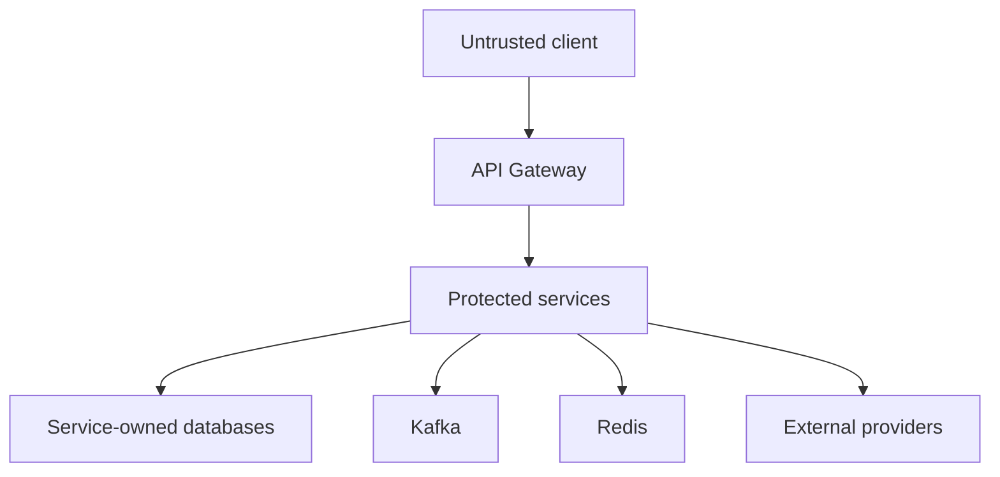
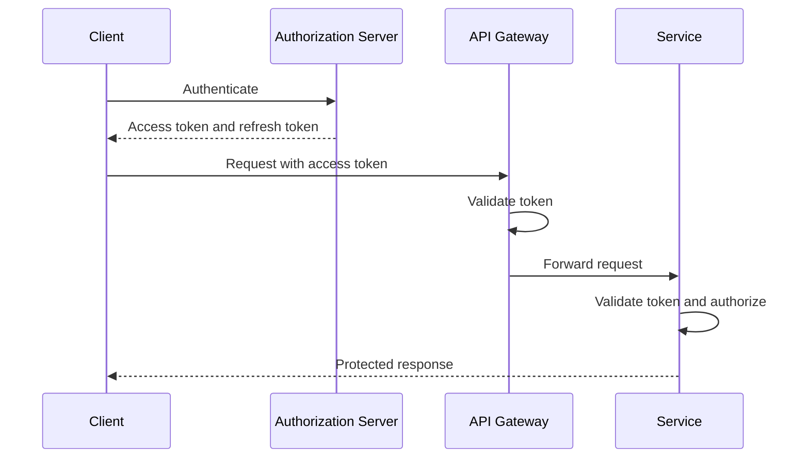

# Security

This document defines the security architecture, trust boundaries, authentication,
authorization, token handling, service-to-service protection, secret management,
input validation, data protection, logging, Kafka security, operational controls,
testing requirements, and implementation rules for Cinema Booking System.

Security is a system-wide responsibility.

It must be enforced at:

- API Gateway boundaries
- Service API boundaries
- Business authorization boundaries
- Kafka producer and consumer boundaries
- Database boundaries
- External provider boundaries
- Deployment and operational boundaries

Security must not depend on frontend behavior alone.

---

# Security Principles

Cinema Booking System follows these principles:

- Deny by default
- Least privilege
- Defense in depth
- Explicit trust boundaries
- Centralized authentication with distributed authorization
- Short-lived access tokens
- Protected refresh tokens
- Strong password hashing
- Minimal sensitive data
- No secrets in source control
- No secrets in logs, events, traces, or error responses
- Service-owned data authorization
- Input validation at every external boundary
- Database per Service
- Secure service-to-service communication
- Auditable privileged operations
- Dependency and container security
- Environment-specific security configuration
- Fail securely
- Idempotent handling of security-sensitive operations

Passing through API Gateway does not automatically make a request trusted.

Every service must protect its own exposed endpoints and business operations.

---

# Scope

This document covers:

```text
Client authentication
User identity
Roles and permissions
JWT access tokens
Refresh tokens
OAuth2 Resource Server
API Gateway security
Microservice endpoint security
Service-to-service authentication
Kafka authentication and authorization
Database credentials
Redis credentials and transport
Secret management
Password handling
Input validation
Error handling
Logging and tracing
Sensitive data protection
CORS
CSRF
Rate limiting
File upload security
Administrative access
Security testing
Deployment controls
```

This document does not define a specific production identity provider unless an
accepted Architecture Decision Record selects one.

The implementation may begin with project-owned authentication while preserving a
migration path to an external OAuth2 or OpenID Connect provider.

---

# Trust Boundaries

The main trust boundaries are:



Security assumptions:

- Client input is untrusted.
- Client-supplied identity claims are untrusted.
- Headers originating outside the trusted infrastructure are untrusted.
- An access token must be validated before its claims are used.
- An internal network location does not prove service identity.
- Kafka messages must be validated before business processing.
- Data read from external systems must be treated as untrusted.
- Each service is responsible for protecting its owned data.
- Compromise of one service must not automatically grant access to every database.

---

# Security Components

Conceptual responsibilities:

| Component | Security responsibility |
|---|---|
| Client | Protect locally stored credentials and tokens |
| API Gateway | Validate tokens, enforce edge policies, route requests |
| User Service | Own users, credentials, roles, and account lifecycle |
| Business services | Enforce endpoint and resource authorization |
| Authorization Server | Authenticate users and issue tokens |
| Kafka | Authenticate clients and authorize topic access |
| Redis | Protect distributed locks, caches, and temporary security data |
| Databases | Enforce isolated credentials and least privilege |
| Config/secret platform | Deliver protected environment configuration |
| Observability platform | Protect logs, metrics, and traces |
| External providers | Authenticate requests and protect provider credentials |

Gateway security is not a substitute for service security.

---

# Authentication Architecture

Authentication establishes who or what is making a request.

The approved application model uses:

```text
OAuth 2.0
OpenID Connect where user identity federation is required
JWT access tokens
Spring Security
OAuth2 Resource Server
```

Conceptual user authentication flow:



Rules:

- Password authentication must occur only through the approved authentication
  endpoint or identity provider.
- Business services must not accept raw user passwords.
- Access tokens must be validated cryptographically.
- Expired tokens must be rejected.
- Tokens with an invalid issuer or audience must be rejected.
- Disabled or locked accounts must not receive new valid sessions.
- Authentication failures must not reveal whether a user exists unnecessarily.

---

# Authorization Server

The system requires one authoritative issuer for access tokens within an environment.

The issuer may be:

- A dedicated standards-compliant identity provider
- Spring Authorization Server
- Another approved OAuth2/OpenID Connect provider

The selected solution must be documented in an Architecture Decision Record before
production use.

The authorization server is responsible for:

- User authentication
- Client authentication where applicable
- Access-token issuance
- Refresh-token issuance and rotation
- Key management
- Token revocation strategy
- Security event recording
- Account status enforcement
- OAuth2 and OpenID Connect protocol behavior

Business services must not independently sign user access tokens with unrelated keys.

---

# Access Token Requirements

Access tokens must be short-lived.

JWT access tokens must include only necessary claims.

Recommended claims:

```json
{
  "iss": "https://identity.cinema.example",
  "sub": "019c1234-1111-7abc-8def-0123456789ab",
  "aud": [
    "cinema-api"
  ],
  "iat": 1784795415,
  "nbf": 1784795415,
  "exp": 1784796315,
  "jti": "019c1234-2222-7abc-8def-0123456789ab",
  "scope": "booking:read booking:create",
  "roles": [
    "USER"
  ]
}
```

Required validation:

| Claim or property | Validation |
|---|---|
| Signature | Must match an approved active key |
| `iss` | Must match the configured issuer |
| `aud` | Must include the intended API audience |
| `sub` | Must identify a valid subject format |
| `exp` | Must not be expired |
| `nbf` | Must not be used before validity begins |
| `iat` | Must be reasonable |
| Algorithm | Must be explicitly allowed |
| Key ID | Must resolve to an approved signing key |

Rules:

- Do not accept unsigned tokens.
- Do not accept an algorithm supplied by the client without an allowlist.
- Do not place passwords or secrets in tokens.
- Do not place full personal profiles in tokens.
- Do not use access tokens as permanent sessions.
- Do not log complete access tokens.
- Do not return tokens in URLs or query parameters.
- Clock-skew tolerance must be small and explicitly configured.
- JWT parsing without signature validation is not authentication.

Recommended signing approach:

```text
Asymmetric signing
Authorization Server owns the private key
Gateway and services receive public verification keys
```

Shared symmetric signing secrets should not be distributed across all services in
production.

---

# Access Token Lifetime

Token lifetime must balance usability and risk.

Conceptual defaults:

```text
Access token: short-lived, such as 5–15 minutes
Refresh token: longer-lived, controlled by rotation and revocation
Service token: short-lived and audience-restricted
```

Exact production values must be environment configuration, not hard-coded domain
constants.

Long-lived access tokens are not allowed without an approved security decision.

---

# Refresh Token Requirements

Refresh tokens are security-sensitive credentials.

Rules:

- Refresh tokens must be transmitted only over TLS.
- Refresh tokens must not be stored in local storage for browser applications.
- Browser applications should prefer `Secure`, `HttpOnly`, appropriately scoped
  cookies when the selected flow supports them.
- Native clients must use protected platform storage.
- Refresh tokens must be rotated after successful use.
- Reuse of an invalidated refresh token must be detected where supported.
- Logout must revoke or invalidate the relevant refresh-token session.
- Password reset and account compromise workflows should revoke active sessions.
- Refresh tokens must not be placed in logs, traces, Kafka events, or URLs.
- Server-side persisted token values should be hashed where practical.
- Refresh tokens must have an explicit maximum lifetime.
- Refresh-token storage and revocation ownership must be documented.

A refresh token must never be accepted as an API access token.

---

# Password Security

If the project owns user passwords, User Service or the selected identity component
owns credential storage.

Password storage rules:

- Store only strong password hashes.
- Never store plain-text passwords.
- Never encrypt passwords for later recovery.
- Use an approved adaptive password hashing algorithm.
- Configure work factors appropriate for the deployment environment.
- Store algorithm parameters with the hash.
- Support controlled hash upgrades after successful authentication.
- Compare passwords using the approved password encoder.
- Never log passwords.
- Never place passwords in events or exception messages.

Recommended algorithms:

```text
Argon2id
bcrypt
scrypt
PBKDF2 when required by platform constraints
```

Spring Security example:

```java
@Bean
PasswordEncoder passwordEncoder() {
    return PasswordEncoderFactories.createDelegatingPasswordEncoder();
}
```

A raw SHA-256 or MD5 password hash is not acceptable.

Password policy should prefer:

- Sufficient minimum length
- Support for password managers
- No silent truncation
- Blocked known-compromised passwords where feasible
- Rate-limited authentication attempts
- Multi-factor authentication for privileged accounts

Arbitrary composition rules must not replace strong hashing and compromise
detection.

---

# Account Security

User account state should support:

```text
ACTIVE
LOCKED
DISABLED
PENDING_VERIFICATION
```

Security-sensitive state transitions must be owned by User Service or the approved
identity provider.

Rules:

- Disabled accounts must not obtain new tokens.
- Locked accounts must follow an explicit recovery policy.
- Email verification tokens must be random, single-purpose, expiring, and
  single-use.
- Password reset tokens must be random, single-purpose, expiring, and single-use.
- Password reset responses must not reveal whether an email address exists.
- Successful password reset should invalidate relevant active sessions.
- Privileged account recovery requires stronger controls.
- Account-status changes must be auditable.

---

# Brute-Force Protection

Authentication endpoints require abuse protection.

Controls may include:

- Per-account attempt throttling
- Per-IP or network throttling
- Progressive delay
- Temporary lockout
- Risk-based challenge
- Multi-factor authentication
- Security monitoring

Rules:

- Lockout must not enable trivial denial-of-service attacks against known accounts.
- Failed-attempt counters must have an expiration policy.
- Distributed deployments must not rely only on in-memory counters.
- Redis-based counters must use namespaced keys and expiration.
- Rate-limit errors must not expose internal thresholds unnecessarily.
- Authentication logs must not include submitted passwords.

---

# Multi-Factor Authentication

Multi-factor authentication should be required for:

```text
Administrative accounts
Operational accounts
Security-sensitive management actions
High-risk account recovery
```

If MFA is not implemented in the current round, production administrative access must
remain blocked or use an external identity provider that enforces MFA.

MFA secrets and recovery codes are sensitive data.

They must be encrypted or hashed according to their verification requirements and
must never appear in logs or events.

---

# Authorization Model

Authorization determines whether an authenticated principal may perform a specific
action.

The project uses layered authorization:

```text
Endpoint authorization
Role or authority checks
Scope checks
Resource ownership checks
Business-state checks
Service ownership checks
```

A role check alone is insufficient for resource access.

Example:

```text
A USER may read a booking
only when booking.userId equals authenticated subject
unless the principal has an approved administrative permission
```

---

# Roles and Authorities

Conceptual application roles:

```text
USER
STAFF
ADMIN
SERVICE
```

Roles must remain coarse-grained.

Fine-grained actions should use authorities or scopes such as:

```text
booking:create
booking:read
booking:cancel
movie:manage
showtime:manage
inventory:manage
payment:read
notification:manage
user:manage
```

Rules:

- Do not grant every authenticated user every business authority.
- Do not infer administrative access from a client-provided header.
- Role names and authority mappings must be centrally documented.
- Services must reject unknown or insufficient authorities.
- Administrative endpoints must be explicitly protected.
- `permitAll()` must be restricted to intentionally public endpoints.
- A wildcard administrative authority requires explicit review.

---

# Resource Ownership Authorization

Services must enforce access to individual resources.

Examples:

## Booking access

A normal user may access a booking only when:

```text
booking.user_id = authenticated subject ID
```

## Booking cancellation

Cancellation requires:

```text
Authenticated user owns the booking
Booking status allows cancellation
Cancellation deadline has not passed
Applicable refund policy permits the action
```

## Payment access

A normal user may access payment information only through an approved API that
validates ownership of the related booking.

## Inventory management

Seat and showtime inventory changes require an approved staff or administrative
authority.

## User management

A normal user may update only approved fields of their own profile.

The request body must not be allowed to assign roles or account status.

---

# Method Security

Business authorization should be enforced close to the protected operation.

Spring method security may be used:

```java
@EnableMethodSecurity
```

Example:

```java
@PreAuthorize(
    "hasAuthority('booking:read') and " +
    "@bookingAuthorization.canRead(#bookingId, authentication)"
)
public BookingResponse getBooking(UUID bookingId) {
    // ...
}
```

Rules:

- Authorization helpers must use service-owned repositories or approved APIs.
- Authorization expressions must remain testable.
- Method security must not replace aggregate business validation.
- Private method annotations are not reliably intercepted through Spring proxies.
- Self-invocation must not be used to bypass expected method-security interception.
- Sensitive service methods must not be exposed through unprotected alternate paths.

---

# API Gateway Security

API Gateway is the public entry point for business APIs.

Responsibilities include:

- TLS termination or participation in approved end-to-end TLS
- Access-token validation
- Route-level authentication rules
- Request-size limits
- Rate limiting
- CORS enforcement
- Rejection of malformed requests
- Removal of untrusted identity headers
- Security headers
- Correlation identifier handling
- Controlled routing
- Protection of actuator and administrative routes

Gateway rules:

- Public routes must be explicitly listed.
- All other routes must require authentication by default.
- The Gateway must not trust client-supplied `X-User-Id`, `X-Roles`, or similar
  identity headers.
- If trusted identity headers are used internally, the Gateway must overwrite them
  after token validation.
- Services must accept such headers only from an authenticated trusted caller.
- Gateway filters must not log authorization headers.
- Unknown routes must not expose internal service topology.
- Direct service access must be restricted by deployment networking or protected with
  equivalent authentication.

Conceptual public endpoints may include:

```text
Authentication entry points
Public movie catalog reads
Public showtime reads
OpenAPI documentation only in approved environments
Health liveness endpoint
```

Public does not mean unlimited.

Rate limits and input validation still apply.

---

# Gateway and Service Token Validation

The preferred model is defense in depth:

```text
Gateway validates the token
Service validates the token again
Service enforces resource authorization
```

Benefits:

- Direct service access remains protected.
- Misrouting does not bypass authentication.
- Services do not depend exclusively on trusted headers.
- Audience restrictions can be enforced per service.
- Authorization decisions remain near owned data.

If an alternative model is selected, such as token exchange at the Gateway, it
requires an Architecture Decision Record and equivalent protection.

---

# Spring Security Resource Server

Protected services should use:

```text
spring-boot-starter-security
spring-boot-starter-oauth2-resource-server
```

Conceptual configuration:

```java
@Bean
SecurityFilterChain securityFilterChain(HttpSecurity http) throws Exception {
    return http
        .csrf(AbstractHttpConfigurer::disable)
        .authorizeHttpRequests(authorize -> authorize
            .requestMatchers("/actuator/health/liveness").permitAll()
            .requestMatchers("/actuator/health/readiness").permitAll()
            .requestMatchers(HttpMethod.POST, "/api/v1/bookings")
                .hasAuthority("SCOPE_booking:create")
            .anyRequest()
                .authenticated()
        )
        .oauth2ResourceServer(oauth2 -> oauth2.jwt(Customizer.withDefaults()))
        .build();
}
```

This is conceptual.

Actual matchers must correspond to service-owned endpoints and documented scopes.

A service must not use:

```java
.anyRequest().permitAll()
```

as a temporary production configuration.

---

# Security Configuration Rules

Spring Security configuration must:

- Use the current supported configuration style
- Avoid deprecated adapter-based configuration
- Declare public routes explicitly
- Require authentication by default
- Validate JWT issuer and audience
- Map scopes and roles intentionally
- Configure consistent authentication errors
- Configure consistent access-denied errors
- Disable unused authentication mechanisms
- Avoid generated default users outside local development
- Avoid hard-coded passwords
- Avoid logging security credentials
- Be covered by integration tests

Security must not be disabled solely to make tests pass.

Tests must supply valid authenticated principals where required.

---

# HTTP Status Semantics

Security failures use consistent semantics:

| Situation | Status |
|---|---:|
| Missing or invalid authentication | `401 Unauthorized` |
| Authenticated but insufficient permission | `403 Forbidden` |
| Resource not found or intentionally concealed | `404 Not Found` |
| Too many requests | `429 Too Many Requests` |

Rules:

- `401` responses should include an appropriate `WWW-Authenticate` header where
  required.
- `403` must not be returned for every invalid token.
- Security responses must use the approved common response format where protocol
  requirements allow.
- Internal verification errors must not be exposed to clients.
- The system may return `404` instead of `403` where revealing resource existence is
  itself sensitive.

---

# Service-to-Service Authentication

Internal service calls require authenticated service identity.

Approved conceptual approaches:

```text
OAuth2 Client Credentials
Mutual TLS
Workload identity provided by the deployment platform
```

Service credentials must:

- Identify one service or workload
- Use a restricted audience
- Use least-privilege scopes
- Be short-lived where possible
- Be independently revocable
- Not be shared by unrelated services
- Not be stored in source control

A service must not impersonate an end user without an explicit delegated-identity
design.

When both user and service context are required, the system must distinguish:

```text
Calling service identity
End-user subject
Delegated authority
```

Forwarding arbitrary user tokens to every downstream service is not automatically
approved.

---

# Internal API Authorization

An authenticated service is not authorized to perform every internal operation.

Examples:

| Caller | Target operation | Required authority |
|---|---|---|
| Booking Service | Read approved user reference | Restricted internal user scope |
| Notification Service | Obtain approved contact data | Restricted notification scope |
| Gateway | Route user request | Audience and route authorization |
| Operations tooling | Administrative action | Administrative service scope |

Services must expose the smallest required internal API surface.

Internal endpoints must not be public merely because they are called by another
service.

---

# Database Security

Each service owns its database and credentials.

Required database separation:

```text
cinema_user_db
cinema_movie_db
cinema_inventory_db
cinema_booking_db
cinema_payment_db
cinema_notification_db
```

Rules:

- Each service uses a dedicated database account.
- A service account receives permissions only for its owned schema.
- Booking Service credentials must not access `cinema_inventory_db`.
- Payment Service credentials must not access `cinema_booking_db`.
- Cross-service database credentials must not be shared.
- Application services must not use the MySQL `root` account.
- Migration credentials should be separated from runtime credentials where
  practical.
- Runtime accounts should not receive schema-management permissions unnecessarily.
- Production database connections must use encrypted transport.
- Database credentials must be injected through approved secret configuration.
- Database backups must be encrypted and access-controlled.
- Database audit requirements must be defined for privileged access.

Example conceptual privileges:

```text
booking_runtime:
    SELECT, INSERT, UPDATE, DELETE on cinema_booking_db only

booking_migration:
    schema migration privileges on cinema_booking_db only
```

No cross-database foreign keys are allowed.

---

# Flyway Security

Flyway migrations must not:

- Create default administrative passwords
- Insert real credentials
- Embed environment secrets
- Grant broad global database privileges
- Create cross-service database access
- Log secret values
- Disable security constraints without an approved replacement

Seed users for local development must use clearly non-production configuration.

Production deployment must not rely on committed default credentials.

---

# Redis Security

Redis is used for distributed locking, caching, rate limiting, or temporary technical
state.

Rules:

- Redis must not be exposed publicly.
- Authentication must be enabled outside isolated local development.
- TLS must be enabled where supported and required.
- Credentials must be stored in the approved secret system.
- Keys must be namespaced by application and purpose.
- Sensitive values should not be stored unless required and protected.
- Access tokens, refresh tokens, passwords, and payment secrets must not be cached as
  plain text.
- Temporary security state must use an expiration.
- Redis logical databases alone are not a strong security boundary.
- Deserialization of untrusted arbitrary objects is prohibited.
- Administrative commands must be restricted operationally.
- Lock values must be safe against accidental release by another owner.

Example key namespaces:

```text
cinema:lock:seat:<showtimeId>:<seatNumber>
cinema:ratelimit:login:<principalHash>
cinema:session:<sessionId>
```

Sensitive raw identifiers should be hashed when exposing them in operational keys
would create unnecessary risk.

---

# Kafka Security

Kafka carries integration events across service trust boundaries.

Production Kafka security should use:

```text
TLS
SASL or mutual TLS
Per-service client identity
Topic-level ACLs
Restricted administrative access
```

Rules:

- Kafka must not be publicly exposed.
- Every producer and consumer must authenticate.
- Services must use distinct credentials.
- Topic ACLs must follow documented event ownership.
- Producers may write only approved topics.
- Consumers may read only approved topics and consumer groups.
- Kafka credentials must not be committed.
- Broker certificates must be validated.
- Hostname verification must not be disabled in production.
- Sensitive data must not be placed in messages unnecessarily.
- Message headers must not carry access tokens or credentials.
- Consumer payloads must be validated.
- Unsupported versions must fail safely.
- DLT access must be restricted.
- Kafka UI must require authentication and restricted network access.
- Kafka UI must not be exposed publicly with anonymous administrative access.

---

# Kafka Authorization Matrix

Conceptual least-privilege matrix:

| Service | Write topics | Read topics |
|---|---|---|
| Booking Service | `seat-reservation-requested`, `payment-requested`, `seat-release-requested`, `booking-confirmed`, `booking-cancelled`, `booking-expired` | `seat-reserved`, `seat-reservation-rejected`, `payment-succeeded`, `payment-failed`, `seat-released` |
| Inventory Service | `seat-reserved`, `seat-reservation-rejected`, `seat-released` | `seat-reservation-requested`, `seat-release-requested`, `booking-confirmed`, `booking-cancelled`, `booking-expired` |
| Payment Service | `payment-succeeded`, `payment-failed` | `payment-requested` |
| Notification Service | Notification-owned events only when defined | `booking-confirmed`, `booking-cancelled`, `booking-expired` |

Topic permissions must match `docs/07_EVENT_CATALOG.md`.

A consumer must not gain write access merely because it can read a topic.

---

# Event Security

Integration events are not automatically trusted because they came from Kafka.

Consumers must validate:

- Event envelope
- Supported event type
- Supported event version
- Producer identity where available
- Required identifiers
- Correlation and causation identifiers
- Payload structure
- Monetary values
- Currency
- Timestamp format
- Business-state preconditions
- Aggregate identifier consistency
- Kafka key consistency
- Idempotency state

Events must not contain:

```text
Passwords
Password hashes
Access tokens
Refresh tokens
Database credentials
Private signing keys
Payment provider secrets
CVV values
Full card numbers
Unnecessary personal data
Internal stack traces
```

Kafka retention increases the impact of sensitive data leakage.

Publish only the minimum required consumer data.

---

# Outbox Security

Outbox payloads contain the same information as integration events and must receive
equivalent protection.

Rules:

- Outbox tables must be accessible only by the owning service.
- Payloads must not contain secrets.
- `last_error` must not contain credentials or complete sensitive payloads.
- Failed publication logs must not dump protected data.
- Outbox administration must require privileged access.
- Manual replay must be authorized and audited.
- Replay must preserve idempotency.
- Outbox cleanup must follow retention requirements.
- Database backups containing outbox payloads must be protected.
- Publication workers must use least-privilege Kafka credentials.

See:

```text
docs/09_OUTBOX.md
```

---

# Secret Management

Secrets include:

```text
Database passwords
Redis passwords
Kafka credentials
JWT private keys
OAuth2 client secrets
Refresh-token encryption keys
Payment provider credentials
SMTP credentials
Cloud storage credentials
Webhook signing secrets
API keys
```

Rules:

- Secrets must not be committed to Git.
- Secrets must not be embedded in Docker images.
- Secrets must not be stored in documentation examples as real values.
- Secrets must not be printed during startup.
- Secrets must not be placed in command-line arguments when safer delivery exists.
- Secrets must be injected through approved environment or secret-management
  mechanisms.
- Services must receive only the secrets they require.
- Production and non-production secrets must be separate.
- Secrets must be rotatable without source changes.
- Secret rotation procedures must be documented.
- Compromised secrets must be revocable.
- Secret files must use restrictive permissions.
- Private signing keys must never be distributed to resource servers.

Example configuration:

```yaml
spring:
  datasource:
    url: ${BOOKING_DB_URL}
    username: ${BOOKING_DB_USERNAME}
    password: ${BOOKING_DB_PASSWORD}
```

Unsafe configuration:

```yaml
spring:
  datasource:
    username: root
    password: root
```

Environment variables are configuration delivery mechanisms, not a complete secret
management strategy by themselves.

---

# Local Development Secrets

Local development may use non-production credentials in an uncommitted local file.

Allowed conceptual files:

```text
.env
application-local.yml
compose override files
```

Requirements:

- Local secret files must be ignored by Git.
- A safe example file may document variable names.
- Example values must be clearly non-production.
- Production credentials must never be reused locally.
- CI credentials must be managed by the CI secret platform.
- Docker Compose configuration committed to the repository must not contain real
  passwords.

Example:

```text
.env.example
```

```dotenv
BOOKING_DB_URL=jdbc:mysql://localhost:3306/cinema_booking_db
BOOKING_DB_USERNAME=cinema_booking
BOOKING_DB_PASSWORD=change-me-locally
```

The example value is documentation, not an approved production password.

---

# Encryption in Transit

Production communication must use encrypted transport.

This includes:

```text
Client to API Gateway
Gateway to services
Service-to-service HTTP
Service to database
Service to Kafka
Service to Redis
Service to external providers
Operational access
```

Rules:

- TLS certificate validation must remain enabled.
- Hostname verification must remain enabled.
- Obsolete protocols and weak cipher suites must be disabled.
- Private certificate keys must be protected as secrets.
- Internal TLS termination points must be documented.
- Plain HTTP may be used only inside explicitly isolated local development.
- Redirecting HTTP to HTTPS does not protect credentials already sent over HTTP;
  secure clients must use HTTPS directly.

---

# Encryption at Rest

Sensitive persistent data must be protected at rest through appropriate platform
controls.

This may include:

- Encrypted database storage
- Encrypted database backups
- Encrypted object storage
- Encrypted disks
- Protected secret stores
- Encrypted Kafka storage when required
- Restricted log storage
- Application-level encryption for selected high-risk fields

Application-level encryption requires explicit key ownership and rotation design.

Do not invent custom cryptographic algorithms.

---

# Personal and Sensitive Data

Services must minimize collection and propagation of personal information.

Potentially sensitive data includes:

```text
Email address
Phone number
Full name
Account identifiers
Payment references
Notification content
IP address
Device information
Audit records
```

Rules:

- Collect only required data.
- Store data only in the owning service.
- Do not copy user profiles into unrelated databases.
- Events must include only required consumer fields.
- Logs and traces must minimize personal data.
- Export and deletion requirements must respect legal and audit obligations.
- Retention periods must be documented.
- Test data must not use copied production personal information.
- Sensitive fields must be masked in administrative views where appropriate.

User Service owns authoritative user profile data.

Notification Service may store only the contact snapshot or delivery information
required by its approved design.

---

# Payment Data Security

Cinema Booking System must minimize payment data exposure.

Rules:

- Do not store CVV.
- Do not store full card numbers unless the system is explicitly designed and
  certified to do so.
- Prefer provider-hosted payment collection or provider tokens.
- Store only required provider references and safe display metadata.
- Payment provider credentials belong only to Payment Service.
- Booking Service must not receive payment provider secrets.
- Payment events must not contain card credentials.
- Provider webhooks must be authenticated and validated.
- Duplicate provider charges must be prevented with provider idempotency controls.
- Refund and reconciliation actions must be authorized and audited.
- Payment errors returned to clients must not expose provider secrets or raw internal
  responses.
- Production payment integrations require a documented compliance review.

A masked card value, when required, must never permit reconstruction of the full card
number.

---

# Webhook Security

External provider webhooks are untrusted external input.

Webhook endpoints must:

- Use HTTPS
- Verify the provider signature
- Use the raw request body when required by the signature protocol
- Validate timestamp or replay-prevention fields
- Reject unsupported algorithms
- Validate event identifiers
- Process idempotently
- Enforce payload-size limits
- Avoid logging protected payload fields
- Return bounded error information
- Store required processing evidence securely

A provider event ID must be recorded to prevent duplicate business effects.

The webhook must not trust a payment status merely because it appears in JSON.

---

# Input Validation

Every external input boundary must validate input.

Boundaries include:

```text
HTTP request path
HTTP query parameters
HTTP headers
HTTP request body
Multipart uploads
Kafka events
Provider callbacks
Configuration values
Administrative commands
```

Validation should include:

- Required fields
- Length limits
- Character rules
- UUID format
- Enum allowlists
- Numeric range
- Decimal precision
- Collection size
- Duplicate values
- Timestamp format
- Time-range consistency
- Pagination limits
- Sort-field allowlists
- Content type
- File type and size
- Business-state preconditions

Bean Validation example:

```java
public record CreateBookingRequest(
    @NotNull UUID showtimeId,
    @NotEmpty
    @Size(max = 10)
    List<@Pattern(regexp = "[A-Z][1-9][0-9]?") String> seatNumbers
) {
}
```

Bean Validation does not replace business validation.

---

# Mass Assignment Protection

Request DTOs must expose only fields the caller is allowed to control.

Unsafe:

```java
public record UpdateUserRequest(
    String displayName,
    String role,
    boolean enabled
) {
}
```

A normal user must not be able to assign:

```text
Role
Authorities
Account status
Payment status
Booking owner
Booking status
Seat availability
Audit fields
Provider references
```

Use operation-specific request DTOs.

Do not bind external request bodies directly to JPA entities.

---

# Injection Prevention

## SQL injection

Use:

- Spring Data repositories
- Parameterized JPQL
- Parameterized native queries
- Prepared statements
- Sort-field allowlists

Do not concatenate untrusted input into SQL.

Unsafe:

```java
String sql = "SELECT * FROM bookings WHERE status = '" + status + "'";
```

## NoSQL and search injection

Search queries must use structured query builders and approved field allowlists.

## Command injection

Do not pass untrusted values to shell commands.

## Template injection

Do not evaluate user input as templates or expressions.

## Header injection

Validate or encode values used in response headers.

## Log injection

Normalize untrusted values and use structured parameterized logging.

---

# Cross-Site Scripting

APIs must return structured data and must not generate unsafe HTML from user input.

Rules:

- Frontends must encode untrusted output according to context.
- Rich text must be sanitized with an approved allowlist.
- Error responses must not reflect raw unsafe input unnecessarily.
- Filenames and notification templates must not be rendered as trusted HTML.
- Content Security Policy should be configured for browser-facing applications.
- User-controlled URLs must be validated before use.
- Do not rely on input filtering alone; output encoding is required.

---

# Cross-Site Request Forgery

CSRF configuration depends on the authentication mechanism.

## Bearer token APIs

For stateless APIs using only an `Authorization: Bearer` header and no
automatically attached browser credential, CSRF protection may be disabled.

## Cookie-authenticated endpoints

If authentication or refresh credentials are stored in cookies, CSRF protection must
be designed explicitly.

Possible controls include:

- SameSite cookies
- CSRF tokens
- Origin validation
- Referer validation as an additional control
- Restricted cookie paths
- Non-GET state changes

Disabling CSRF globally is not automatically safe merely because JWTs exist.

The actual credential transport determines CSRF exposure.

---

# CORS

CORS must use an explicit allowlist.

Rules:

- Do not use `*` with credentials.
- Allow only approved origins.
- Allow only required methods.
- Allow only required headers.
- Expose only required response headers.
- Configure environment-specific origins.
- Keep preflight caching bounded.
- Do not treat CORS as authentication.
- Non-browser clients are not constrained by CORS.

Unsafe production configuration:

```java
configuration.addAllowedOriginPattern("*");
configuration.setAllowCredentials(true);
```

Local development origins must not be silently enabled in production.

---

# Security Headers

Browser-facing responses should use appropriate security headers.

Conceptual headers include:

```text
Strict-Transport-Security
Content-Security-Policy
X-Content-Type-Options
Referrer-Policy
Permissions-Policy
Cache-Control for sensitive responses
Frame protection through CSP frame-ancestors or equivalent
```

Rules:

- HSTS must be enabled only where HTTPS is correctly deployed.
- Sensitive responses should prevent inappropriate caching.
- Deprecated headers must not be treated as substitutes for CSP.
- Gateway and application header behavior must not conflict.

---

# Rate Limiting

Rate limiting protects availability and reduces abuse.

High-priority endpoints include:

```text
Login
Token refresh
Password reset
Account verification
Booking creation
Seat reservation
Payment initiation
Search endpoints
Public catalog endpoints
Administrative APIs
Webhook endpoints
```

Limits may consider:

- Client identity
- User identity
- Service identity
- IP address
- Endpoint
- Resource identifier
- Time window

Rules:

- Rate-limit keys must not expose sensitive raw values unnecessarily.
- Limits must work across multiple application instances.
- Rate-limit failures should return `429`.
- Response headers must not reveal sensitive implementation details.
- Rate limits must not replace booking concurrency controls.
- Rate limits must not replace idempotency.
- Trusted internal callers must still have bounded usage policies.
- Operational bypasses require audit and access control.

---

# Booking Abuse Protection

Booking endpoints are financially and operationally sensitive.

Controls must include:

- Authenticated booking creation
- User ownership
- Request validation
- Seat-count limit
- Reservation expiration
- Redis distributed locks
- Inventory atomic state transition
- Idempotency where client retries are supported
- Rate limiting
- Duplicate request protection
- Payment reconciliation
- Auditability

Security rules must preserve Inventory Service ownership.

Booking Service must not directly update `show_seats` as an authorization shortcut.

---

# Client Request Idempotency

Security-sensitive commands may support a client idempotency key.

Examples:

```text
Create booking
Create payment attempt
Request refund
Cancel booking
```

Rules:

- Idempotency keys must be scoped to the authenticated principal and operation.
- A key reused with a different request body must be rejected.
- Stored results must have an explicit retention period.
- Keys must have length and character limits.
- Keys must not contain secrets.
- Idempotency does not replace authorization.
- Provider idempotency keys must follow provider constraints.
- Kafka `eventId` remains separate from client idempotency keys.

---

# File Upload Security

If file storage is introduced, uploads must be treated as untrusted.

Controls include:

- Authentication and authorization
- File-size limits
- File-count limits
- Extension allowlist
- MIME-type validation
- Content-signature inspection
- Random server-generated object keys
- Original filename sanitization
- Malware scanning where appropriate
- Isolated storage
- Non-executable delivery
- Controlled download authorization
- Content-Disposition configuration
- Retention and deletion policy

Rules:

- Do not use the original filename as a trusted filesystem path.
- Prevent path traversal.
- Prevent overwrite of existing objects.
- Do not execute uploaded content.
- Do not expose storage credentials to clients.
- Pre-signed URLs must be short-lived and narrowly scoped.
- Public access must be explicit.
- Uploaded HTML and SVG require special review due to active-content risk.

---

# Error Handling

Security-related errors must use controlled public responses.

Public responses must not include:

- Stack traces
- SQL statements
- Database names
- Internal hostnames
- Kafka broker addresses
- Redis keys
- Token contents
- Secret values
- Private file paths
- Internal class names
- Provider credentials

Example response:

```json
{
  "success": false,
  "code": "AUTHENTICATION_REQUIRED",
  "message": "Authentication is required",
  "timestamp": "2026-07-23T08:30:15.123456Z",
  "path": "/api/v1/bookings"
}
```

Authentication failures should not disclose whether:

```text
The username exists
The email exists
The password alone was incorrect
An internal token key lookup failed
```

Detailed diagnostic information belongs in protected operational logs with sensitive
values removed.

---

# Logging Security

Logs are an operational data store and must be protected.

Never log:

```text
Passwords
Access tokens
Refresh tokens
Authorization headers
Cookie values
Database passwords
Private keys
OAuth2 client secrets
Payment provider secrets
CVV
Full card numbers
Complete sensitive event payloads
```

Security-relevant logs may include:

```text
timestamp
service
environment
event category
authenticated subject ID where appropriate
service identity
correlation ID
trace ID
source network information where approved
target resource
outcome
bounded reason code
```

Rules:

- Use parameterized structured logging.
- Sanitize line breaks and control characters in untrusted values.
- Mask sensitive values.
- Restrict access to security logs.
- Define retention periods.
- Protect logs in transit and at rest.
- Audit log deletion and configuration changes.
- Do not rely on application logs as the sole source of immutable audit evidence.

Unsafe:

```java
log.info("Authorization: {}", authorizationHeader);
```

Safe conceptual alternative:

```java
log.info(
    "Authentication failed: correlationId={}, reason={}",
    correlationId,
    reasonCode
);
```

---

# Audit Logging

Security-sensitive business and administrative actions require audit records.

Examples:

```text
Role changed
Account disabled
Password reset completed
Administrative booking cancellation
Refund requested
Refund approved
Payment reconciliation performed
Secret rotated
Manual outbox replay initiated
DLT event replayed
Security configuration changed
```

Audit records should include:

```text
audit ID
timestamp
actor identity
actor type
action
target type
target ID
result
correlation ID
bounded reason
approved metadata
```

Audit records must not contain credentials or excessive sensitive payloads.

Audit records should be append-oriented and protected against unauthorized
modification.

---

# Distributed Tracing Security

Tracing data must be treated as potentially sensitive.

Rules:

- Do not attach access tokens to spans.
- Do not attach refresh tokens to spans.
- Do not attach passwords or payment credentials.
- Avoid complete HTTP bodies by default.
- Avoid complete Kafka payloads.
- Sanitize URLs containing sensitive query parameters.
- Restrict access to tracing systems.
- Define trace retention.
- Propagate only approved trace headers.
- Treat incoming trace headers as untrusted.
- Generate or validate correlation identifiers at trusted boundaries.
- Prevent unbounded trace baggage.

Business `correlationId` and technical trace IDs serve different purposes.

Neither should contain personal information.

---

# Actuator Security

Spring Boot Actuator endpoints must be restricted.

Publicly exposed endpoints should normally be limited to:

```text
health/liveness
health/readiness
```

Even health details must be controlled.

Sensitive endpoints include:

```text
env
configprops
beans
mappings
heapdump
threaddump
loggers
shutdown
metrics with sensitive tags
prometheus when operationally restricted
```

Rules:

- Sensitive actuator endpoints must not be publicly exposed.
- Management endpoints should use a separate port or network boundary where
  appropriate.
- Detailed health information must require authentication.
- Heap dumps must be protected because they may contain secrets.
- Runtime log-level changes require privileged authorization and auditing.
- The shutdown endpoint must remain disabled unless explicitly required and
  protected.

Unsafe production configuration:

```yaml
management:
  endpoints:
    web:
      exposure:
        include: "*"
```

---

# OpenAPI and Swagger Security

API documentation must match endpoint security.

Rules:

- OpenAPI must define bearer authentication where required.
- Public and protected operations must be distinguishable.
- Swagger UI exposure must be environment-controlled.
- Production Swagger UI should be disabled or protected unless explicitly approved.
- Example payloads must not contain real credentials or personal information.
- Administrative APIs must not become accessible merely because they appear in
  Swagger UI.
- Documentation must not publish internal-only service endpoints externally.

Example security scheme:

```yaml
components:
  securitySchemes:
    bearerAuth:
      type: http
      scheme: bearer
      bearerFormat: JWT
```

---

# Configuration Service Security

If Config Service is used:

- Configuration transport must be authenticated and encrypted.
- Secret values should be obtained from an approved secret store.
- Config repositories must not contain production secrets.
- Services must authenticate to Config Service.
- A service must access only required configuration.
- Configuration changes must be auditable.
- Sensitive values must not be exposed through actuator endpoints.
- Failure to retrieve required security configuration must fail securely.
- Local fallback configuration must not silently enable insecure production
  defaults.

Config Service availability must not justify committing credentials.

---

# Discovery Service Security

If Discovery Service is used:

- Registration must be restricted to approved services.
- Discovery endpoints must not be publicly exposed.
- Service metadata must not contain secrets.
- Management access must require authentication.
- Services must not treat discovery registration alone as caller authentication.
- Internal service calls still require authenticated identity or protected workload
  networking.
- Production deployments must prevent unauthorized instance registration.

---

# Container Security

Containerized services must follow least privilege.

Rules:

- Run as a non-root user.
- Use minimal trusted base images.
- Pin and update base-image versions intentionally.
- Do not bake secrets into image layers.
- Use read-only filesystems where practical.
- Mount writable paths explicitly.
- Drop unnecessary Linux capabilities.
- Avoid privileged containers.
- Define resource limits.
- Include health checks.
- Scan images for vulnerabilities.
- Do not expose database, Redis, Kafka, or management ports publicly.
- Protect the Docker socket.
- Separate development tooling from production images.
- Use multi-stage builds where appropriate.

A container boundary alone is not an authorization boundary.

---

# Dependency Security

Dependencies must be managed centrally and reviewed.

Controls include:

- Maven dependency management
- Version convergence
- Vulnerability scanning
- Software Bill of Materials generation
- Removal of unused dependencies
- Verification of repository sources
- Timely security updates
- Review of transitive dependencies
- Plugin version pinning

Rules:

- Do not add dependencies solely to bypass a security error.
- Do not use abandoned cryptographic libraries.
- Do not suppress vulnerability findings without documented justification.
- Security upgrades must include regression tests.
- Snapshot dependencies must not be used in production without explicit approval.

---

# Secure Coding Requirements

Code must:

- Use immutable request and event contracts where practical
- Use operation-specific DTOs
- Validate external data
- Use parameterized queries
- Use `BigDecimal` for money
- Use approved UUID handling
- Use approved Jackson configuration
- Avoid unsafe Java deserialization
- Avoid reflection-based access-control shortcuts
- Avoid hard-coded credentials
- Avoid insecure random number generation for security tokens
- Avoid exposing internal exceptions
- Check authorization before data disclosure
- Enforce expected aggregate state
- Handle duplicate events safely
- Preserve database-per-service ownership

Security tokens must use a cryptographically secure random generator or a
standards-compliant identity platform.

UUID v7 is suitable for entity and event identifiers but must not automatically be
treated as a secret authentication token.

---

# Secure Random Values

Security-sensitive random values include:

```text
Password reset tokens
Email verification tokens
Refresh tokens
Session identifiers
Webhook secrets
Recovery codes
OAuth2 state and nonce values
```

These values require cryptographically secure randomness.

Rules:

- Do not use `java.util.Random`.
- Do not use predictable timestamps as tokens.
- Do not use sequential database IDs as secrets.
- Use sufficient entropy.
- Encode tokens safely for their transport.
- Store hashes rather than raw tokens where verification allows.
- Set expiration and single-use semantics.

---

# Serialization Security

JSON processing must use the approved shared Jackson configuration.

Rules:

- Do not enable unsafe polymorphic default typing globally.
- Do not deserialize arbitrary class names from untrusted input.
- Do not trust Kafka `__TypeId__` values referring to producer-internal classes.
- Use explicit event type and version routing.
- Limit request and payload size.
- Reject deeply nested or malformed payloads according to platform controls.
- Use DTOs rather than JPA entities.
- Serialize timestamps as ISO-8601.
- Avoid accidental exposure through getters on internal objects.

Unsafe:

```java
objectMapper.activateDefaultTyping(...);
```

without an explicit, reviewed type allowlist.

---

# SSRF Protection

Any feature that performs server-side HTTP requests using user-controlled input must
prevent Server-Side Request Forgery.

Controls include:

- Destination allowlists
- Scheme restrictions
- DNS and resolved-address validation
- Blocking loopback and private network targets where inappropriate
- Redirect validation
- Connection and response-size limits
- Timeouts
- Restricted outbound networking
- Protection of cloud metadata endpoints

Movie poster imports, webhooks, file imports, and notification callbacks must not
accept arbitrary URLs without review.

---

# Redirect Security

Redirect targets must use an allowlist or server-generated route mapping.

Do not redirect directly to an arbitrary client-supplied URL.

OAuth2 redirect URIs must match registered values.

Password reset and verification links must not permit open redirects.

---

# Time and Expiration Security

Expiration-sensitive decisions must use trusted server time.

Examples:

```text
JWT expiration
Refresh-token expiration
Password reset expiration
Booking reservation expiration
Payment request expiration
Webhook replay window
Idempotency retention
```

Rules:

- Do not trust client timestamps for authorization decisions.
- Services must use consistent clock synchronization.
- Clock-skew allowances must be bounded.
- Event occurrence time does not replace current-state validation.
- A delayed event must not revive an expired or cancelled booking.
- Expiration schedulers must process idempotently.

---

# Administrative Security

Administrative operations require stronger controls.

Requirements:

- Explicit administrative authority
- Multi-factor authentication
- Restricted network or device posture where appropriate
- Audit logging
- Re-authentication for selected high-risk operations
- Reason capture for destructive or financial actions
- Least-privilege administrative roles
- Separation of duties for sensitive production actions where feasible

High-risk operations include:

```text
Role assignment
Account disabling
Refund approval
Manual payment reconciliation
Manual booking state change
Manual seat state correction
DLT replay
Outbox replay
Secret rotation
Security configuration change
Data export
```

Administrative UI visibility is not authorization.

Every administrative API must enforce authorization server-side.

---

# Environment Separation

Environments must be isolated.

```text
local
test
development
QA
staging
production
```

Rules:

- Do not share production credentials with non-production.
- Do not share signing private keys across environments.
- Do not share databases across environments.
- Do not share Kafka credentials across environments.
- Use distinct issuer and audience configuration where appropriate.
- Non-production test accounts must not exist in production by default.
- Production data must not be copied to lower environments without approved
  sanitization.
- Debug logging must not be enabled in production by default.
- Local permissive CORS settings must not reach production.
- Local anonymous Kafka or Redis configuration must not be treated as production
  configuration.

The active Spring profile must not silently disable security.

---

# Production Fail-Secure Behavior

When required security dependencies fail:

- Invalid token verification must reject the request.
- Missing issuer configuration must prevent secure startup.
- Missing signing key access must prevent token issuance.
- Missing database credentials must prevent service startup.
- Missing Kafka authentication must not silently fall back to anonymous production
  access.
- Missing authorization data must deny access.
- Failed webhook signature verification must reject processing.
- Failed secret retrieval must not use committed fallback credentials.
- Failed security audit publication must follow an explicit operational policy.

Availability handling must not convert authentication failures into anonymous access.

---

# Testing Requirements

Security behavior requires automated tests.

## Unit tests

Verify:

- Authority mapping
- Role mapping
- Resource ownership logic
- Token claim conversion
- Input validation
- Sensitive-field masking
- Security error mapping
- Password hashing and comparison behavior
- Idempotent security-token consumption

## MVC or WebFlux security tests

Verify:

- Public endpoints are accessible as intended
- Protected endpoints reject anonymous requests
- Invalid tokens receive `401`
- Missing scopes receive `403`
- Owners can access owned resources
- Non-owners cannot access resources
- Administrative operations require administrative authority
- CORS behavior matches the allowlist
- CSRF behavior matches credential transport
- Actuator exposure is restricted

## Integration tests

Verify:

- Real JWT signature validation
- Issuer validation
- Audience validation
- Expiration validation
- Service-to-service credentials
- Database credential isolation
- Kafka producer and consumer permissions where infrastructure supports it
- Redis authentication where infrastructure supports it
- Duplicate security-sensitive commands
- Webhook signature verification
- Secret-free application startup configuration

Use Testcontainers where appropriate.

Mocking authentication alone is insufficient for all security tests.

---

# Required Authorization Test Matrix

Each protected resource should include tests equivalent to:

| Authentication | Authority | Ownership | Expected result |
|---|---|---|---:|
| Missing | None | N/A | `401` |
| Invalid | None | N/A | `401` |
| Valid | Missing | Owner | `403` |
| Valid | Present | Non-owner | `403` or concealed `404` |
| Valid | Present | Owner | Success |
| Admin | Administrative | Non-owner | Success only when policy permits |
| Service | Wrong audience | N/A | `401` |
| Service | Wrong scope | N/A | `403` |

Tests must verify both HTTP status and absence of sensitive response data.

---

# Token Test Cases

JWT tests must include:

- Valid signature
- Invalid signature
- Expired token
- Token not yet valid
- Incorrect issuer
- Missing audience
- Incorrect audience
- Unsupported algorithm
- Missing subject
- Invalid subject format
- Missing required scope
- Unknown role
- Rotated signing key
- Unknown key ID
- Excessive clock skew
- Malformed token

A test that merely decodes a JWT does not prove secure validation.

---

# Security Dependency Checks

The build or CI pipeline should include:

```text
Dependency vulnerability scanning
Secret scanning
Static analysis
Container image scanning
Software Bill of Materials generation
Test execution
Configuration checks
```

Findings must be classified and resolved according to severity and exploitability.

Suppressions require:

```text
Finding identifier
Reason
Affected component
Compensating control
Owner
Expiration or review date
```

Permanent undocumented suppression is not acceptable.

---

# Incident Response

Production security requires a documented response process.

The process should support:

- Detection
- Classification
- Containment
- Credential revocation
- Signing-key rotation
- Secret rotation
- Session invalidation
- Log preservation
- Impact analysis
- User communication where required
- Recovery
- Post-incident review

Potential events include:

```text
Credential leak
Private signing-key compromise
Unauthorized administrative action
Suspicious payment activity
Kafka credential compromise
Database credential compromise
Personal data exposure
Malicious file upload
Repeated webhook forgery
Dependency vulnerability exploitation
```

Security logs and identifiers must support investigation without exposing additional
secrets.

---

# Key Rotation

JWT signing keys must support rotation.

Conceptual process:

```text
Generate a new key pair
Publish the new public key
Begin signing with the new private key
Retain the previous public key during token overlap
Allow existing short-lived tokens to expire
Remove the retired public key
Destroy the retired private key according to policy
```

Rules:

- Keys require stable identifiers.
- Private keys remain restricted to the issuer.
- Resource servers should retrieve approved public keys through a protected and cached
  mechanism.
- Key rotation must not require distributing private keys to services.
- Emergency rotation must be documented and tested.
- Retired keys must not remain accepted indefinitely.

---

# Security Configuration Ownership

Conceptual ownership:

| Security area | Primary owner |
|---|---|
| User credentials | User Service or Identity Provider |
| Token issuance | Authorization Server |
| Edge policy | API Gateway |
| Booking authorization | Booking Service |
| Inventory administration | Inventory Service |
| Payment credentials | Payment Service |
| Notification credentials | Notification Service |
| Kafka ACLs | Platform operations |
| Database users | Platform operations and service owner |
| Redis security | Platform operations |
| Signing keys | Security or identity platform |
| Secrets | Approved secret-management platform |
| Audit and monitoring | Security and operations |

Ownership must be explicit before production deployment.

---

# Prohibited Implementations

The following implementations are prohibited.

## Hard-coded JWT secret

```java
private static final String SECRET = "cinema-secret-123";
```

---

## Plain-text password storage

```java
user.setPassword(request.password());
userRepository.save(user);
```

---

## Trusting user identity headers

```java
UUID userId = UUID.fromString(request.getHeader("X-User-Id"));
```

without an authenticated trusted-header design.

---

## Disabling all endpoint security

```java
authorize.anyRequest().permitAll();
```

---

## Accepting any CORS origin with credentials

```java
config.addAllowedOriginPattern("*");
config.setAllowCredentials(true);
```

---

## Logging a bearer token

```java
log.info("token={}", token);
```

---

## Using client-owned booking identity

```java
booking.setUserId(request.userId());
```

For authenticated user actions, ownership must normally come from the validated
principal, not an arbitrary request field.

---

## Booking Service accessing inventory tables

```java
showSeatRepository.reserve(showtimeId, seatNumbers);
```

Inventory Service owns `show_seats`.

---

## Shared root database account

```yaml
spring:
  datasource:
    username: root
    password: root
```

---

## Unauthenticated Kafka UI

```text
Kafka UI exposed publicly with broker administration enabled
```

---

## Publishing secrets to Kafka

```json
{
  "bookingId": "...",
  "accessToken": "...",
  "paymentApiKey": "..."
}
```

---

## Unsafe token decoding

```java
Claims claims = decodeWithoutSignatureVerification(token);
```

---

## Direct role assignment from request

```java
user.setRole(Role.valueOf(request.role()));
```

---

## Exposing exception details

```java
return ResponseEntity.internalServerError()
    .body(exception.getStackTrace());
```

---

## Global unsafe Jackson polymorphism

```java
objectMapper.activateDefaultTyping(
    objectMapper.getPolymorphicTypeValidator()
);
```

without a strict reviewed allowlist.

---

# Security Review Checklist

Before marking a security round complete, verify:

- [ ] Authentication architecture is documented
- [ ] One authoritative token issuer is configured per environment
- [ ] Access tokens are short-lived
- [ ] JWT signatures are validated
- [ ] JWT issuer is validated
- [ ] JWT audience is validated
- [ ] Allowed JWT algorithms are explicit
- [ ] Refresh tokens use rotation and revocation controls
- [ ] Passwords use an approved adaptive hash
- [ ] Authentication endpoints are rate-limited
- [ ] Privileged accounts use MFA or an approved external control
- [ ] Gateway routes deny access by default
- [ ] Business services validate authentication
- [ ] Business services enforce resource ownership
- [ ] Administrative endpoints require explicit authority
- [ ] Client-supplied identity headers are rejected or overwritten
- [ ] Service-to-service calls are authenticated
- [ ] Services use least-privilege scopes
- [ ] Each service uses its own database credential
- [ ] No application service uses the MySQL root account
- [ ] No service can access another service's database
- [ ] Redis is protected outside isolated local development
- [ ] Kafka uses per-service identities and topic ACLs
- [ ] Kafka UI is protected
- [ ] Secrets are not committed
- [ ] Secrets are not logged
- [ ] Tokens are not logged
- [ ] Events contain no credentials
- [ ] Outbox payloads contain no credentials
- [ ] DLT records do not expose unnecessary sensitive data
- [ ] HTTP input validation is implemented
- [ ] Kafka payload validation is implemented
- [ ] Request DTOs prevent mass assignment
- [ ] SQL queries are parameterized
- [ ] CORS uses an explicit allowlist
- [ ] CSRF configuration matches credential transport
- [ ] Sensitive responses use appropriate cache controls
- [ ] Actuator endpoints are restricted
- [ ] Swagger UI exposure is environment-controlled
- [ ] File uploads are validated and isolated
- [ ] Provider webhooks verify signatures
- [ ] Payment processing does not store prohibited card data
- [ ] Security logs are protected and sanitized
- [ ] Privileged actions are audited
- [ ] Production containers run as non-root
- [ ] Dependency and secret scans pass
- [ ] Security integration tests pass
- [ ] `mvn clean verify` passes
- [ ] Documentation matches implemented security configuration

---

# Useful Repository Checks

Search for hard-coded credentials:

```bash
git grep -n -i -E \
    "(password|secret|api[_-]?key|access[_-]?token|refresh[_-]?token):[[:space:]]+[^$<{]"
```

Review every match because documentation and test fixtures may create false positives.

Search for common weak credentials:

```bash
git grep -n -i -E \
    "password:[[:space:]]+(root|admin|password|123456|cinema)"
```

Search for hard-coded JWT secrets:

```bash
git grep -n -i -E \
    "jwt.*secret|secret.*jwt|signWith.*(String|Bytes)"
```

Search for permissive endpoint security:

```bash
git grep -n -E \
    "anyRequest\(\)\.permitAll|requestMatchers\(.*\)\.permitAll" \
    -- common infrastructure services
```

Every `permitAll` match must be intentional and documented.

Search for disabled security:

```bash
git grep -n -E \
    "security\.enabled:[[:space:]]*false|exclude.*SecurityAutoConfiguration"
```

Search for unsafe CORS:

```bash
git grep -n -E \
    "allowedOriginPatterns?.*\*|addAllowedOriginPattern\(\"\\*\"\)|allowedOrigins?.*\*"
```

Search for token logging:

```bash
git grep -n -i -E \
    "log\.(trace|debug|info|warn|error).*(authorization|bearer|access.?token|refresh.?token|password)"
```

Search for direct request-owned user identifiers:

```bash
git grep -n -E \
    "request\.(userId|getUserId)\(" \
    -- services
```

Review each match and ensure authenticated ownership is not taken from arbitrary client
input.

Search for application use of the MySQL root account:

```bash
git grep -n -E \
    "username:[[:space:]]*root|MYSQL_USER:[[:space:]]*root"
```

Search for insecure Hibernate schema behavior:

```bash
git grep -n -E \
    "ddl-auto:[[:space:]]*(create|create-drop|update)"
```

Search for exposed actuator endpoints:

```bash
git grep -n -E \
    "exposure:[[:space:]]*$|include:[[:space:]]*[\"']?\*[\"']?"
```

Search for unsafe direct identity headers:

```bash
git grep -n -E \
    "X-User-Id|X-Roles|X-Authorities|X-User-Email"
```

Review whether every match belongs to an authenticated and protected trusted-header
design.

Search for unsafe JWT decoding:

```bash
git grep -n -E \
    "decode\(|parseClaimsJwt|Base64.*split.*\\."
```

Search for prohibited Booking Service inventory access:

```bash
git grep -n -E \
    "ShowSeatRepository|ShowSeatEntity|show_seats|cinema_inventory_db" \
    -- services/booking-service
```

Search for sensitive event fields:

```bash
git grep -n -i -E \
    "password|accessToken|refreshToken|apiKey|clientSecret|cvv|cardNumber" \
    -- common services
```

Review matches in authentication DTOs separately from integration events.

Verify formatting:

```bash
git diff --check
```

Run the complete build:

```bash
mvn clean verify
```

---

# Related Documentation

See:

```text
docs/00_PROJECT_CONTEXT.md
docs/01_AI_CONTEXT.md
docs/02_ARCHITECTURE.md
docs/03_TECHNOLOGY_STACK.md
docs/04_MODULES.md
docs/05_CODING_CONVENTIONS.md
docs/06_DATABASE_DESIGN.md
docs/07_EVENT_CATALOG.md
docs/09_OUTBOX.md
docs/10_ROADMAP.md
docs/11_CHANGELOG.md
docs/12_DEPENDENCY_RULES.md
docs/13_SEQUENCE_DIAGRAMS.md
docs/14_DEPLOYMENT.md
docs/decisions/
```

When implementation and security documentation conflict:

1. Respect accepted Architecture Decision Records.
2. Deny access until the required policy is explicit.
3. Preserve database-per-service ownership.
4. Preserve Inventory Service ownership of `show_seats`.
5. Never weaken authentication merely to restore functionality.
6. Never commit or log secrets.
7. Never trust identity supplied directly by an untrusted client.
8. Preserve Transactional Outbox and Idempotent Consumer guarantees.
9. Correct the insecure implementation or outdated documentation before marking the
   round complete.
