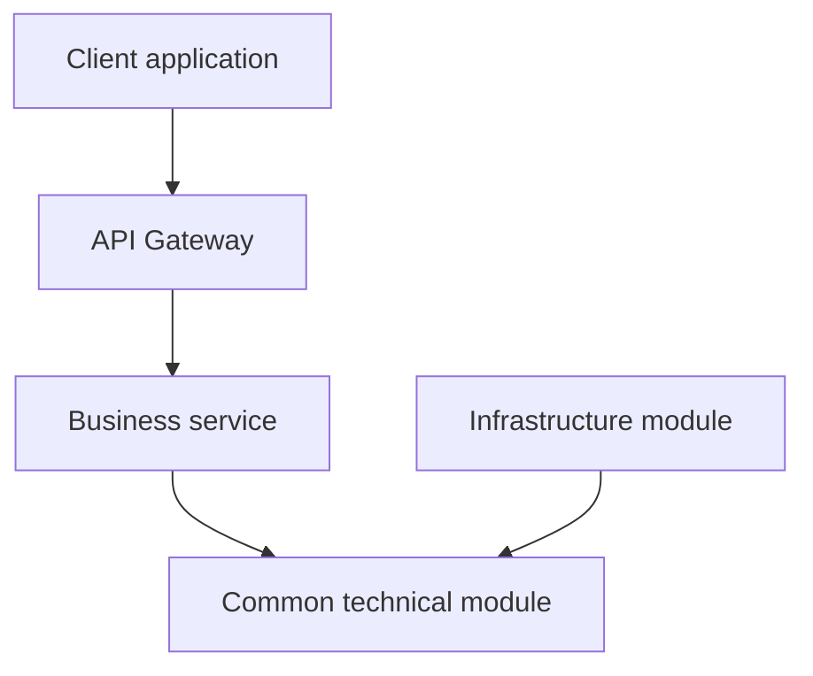
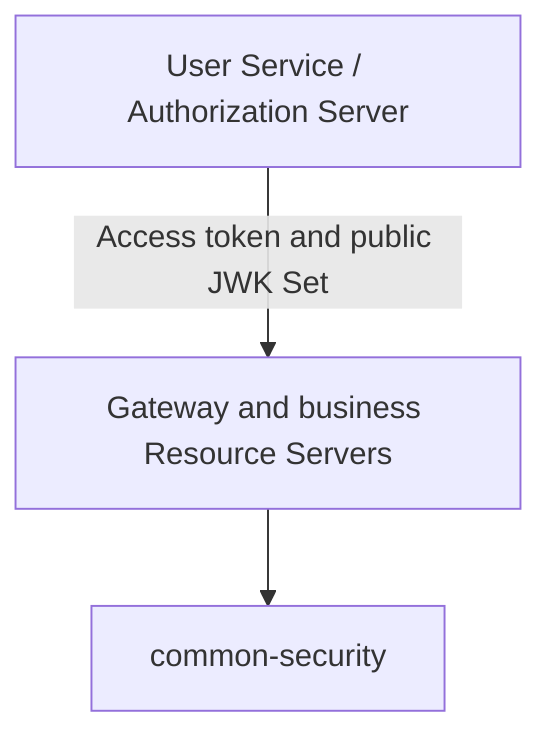
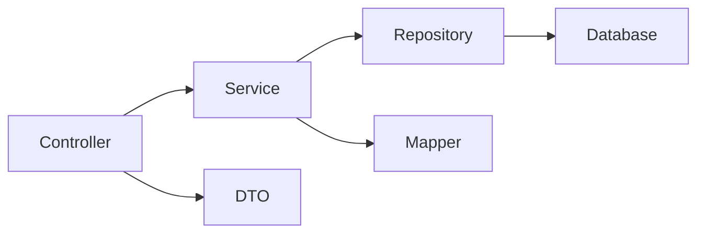

# Dependency Rules

Version: R25

---

# Purpose

This document defines the allowed compile-time, runtime, data, security, and
layer dependencies in the Cinema Booking System.

A violation is an architectural defect even when the code compiles or a local
test passes. Accepted Architecture Decision Records and explicit domain data
ownership take precedence when another document is ambiguous.

---

# Dependency Categories

The project distinguishes five kinds of dependency:

| Category             | Example                                       | Governing rule                                |
| -------------------- | --------------------------------------------- | --------------------------------------------- |
| Compile-time         | Maven dependency or Java import               | Must follow module direction                  |
| Synchronous runtime  | REST request                                  | Must use an approved service contract         |
| Asynchronous runtime | Kafka event                                   | Must use a versioned event contract           |
| Data                 | Database, table, repository, or entity access | Only the owning service may access it         |
| Security trust       | Token issuer, JWK Set, audience               | Must follow ADR-013 and `docs/08_SECURITY.md` |

An allowed runtime call does not create permission for a compile-time module
dependency or direct database access.

---

# Top-Level Dependency Direction



Rules:

- External clients enter business APIs through Gateway, except approved
  identity endpoints hosted by User Service according to the deployment
  topology.
- Business services and infrastructure modules may depend on appropriate common
  technical modules.
- Common modules must never depend on business services.
- Gateway must never become a business-service implementation.

---

# Maven Module Rules

## Allowed

```text
services/*       -> common/*
infrastructure/* -> common/*
common/*         -> lower-level common/*
```

A common-to-common dependency is allowed only when it has one clear technical
direction and does not create a cycle.

Examples:

```text
common-api       -> common-response
common-api       -> common-exception
common-api       -> common-validation
common-response  -> common-exception
common-jpa       -> common-core
common-outbox    -> common-jpa
common-outbox    -> common-kafka
common-security  -> common-exception
```

## Forbidden

```text
common/*          -> services/*
service A         -> service B
gateway-service   -> services/*
service module    -> another service's internal client implementation
```

Examples of forbidden dependencies:

```text
common-jpa        -> booking-service
booking-service   -> inventory-service
payment-service   -> booking-service
gateway-service   -> movie-service
```

A shared DTO copied into a common module does not make a business-service
dependency valid. Cross-service contracts must be explicit API or event
contracts and must not expose internal entities.

---

# Business Service Independence

Booking, Inventory, Movie, Payment, Notification, and User are independent
business-service modules.

One business service must never:

- Add another business service as a Maven dependency.
- Import another service's controller, service, repository, entity, mapper, or
  internal DTO package.
- Component-scan another service's packages.
- Instantiate another service's implementation class.
- Read another service's configuration as though it were local domain state.

Approved communication mechanisms are:

- Versioned Kafka events for asynchronous workflows.
- Approved REST APIs for synchronous queries or commands that cannot be
  completed asynchronously.
- Service discovery for internal service location where configured.
- Gateway routing for external client traffic.

Internal service calls do not have to hairpin through Gateway unless the
accepted topology requires it. They still require an explicit contract,
authentication, authorization, timeout, and failure policy.

---

# Domain Ownership

| Data or capability                                                | Owner                |
| ----------------------------------------------------------------- | -------------------- |
| Movies and genres                                                 | Movie Service        |
| Cinemas, rooms, physical seats, showtimes, and ShowSeats          | Inventory Service    |
| Seat state transitions and seat concurrency control               | Inventory Service    |
| Bookings and booking-seat references                              | Booking Service      |
| Payments and payment-provider state                               | Payment Service      |
| Notifications and delivery state                                  | Notification Service |
| Users, profiles, roles, permissions, and identity state           | User Service         |
| OAuth2 clients, grants, consent, refresh tokens, and signing keys | User Service         |

Ownership includes schema, migrations, entities, repositories, invariants,
state transitions, and authoritative APIs/events.

---

# Database Rules

Every business service uses only its own database or schema.

Allowed:

```text
Inventory Service -> Inventory database
Booking Service   -> Booking database
User Service      -> User database
```

Forbidden:

```text
Booking Service -> Inventory database
Payment Service -> Booking tables
User Service    -> Notification tables
```

The following are prohibited:

- Cross-service table reads or writes.
- Cross-database foreign keys.
- Shared JPA entities.
- Shared business repositories.
- SQL joins across service-owned schemas.
- A reporting requirement used as justification for bypassing ownership.

Cross-service references store only stable identifiers, without a database
foreign key to the remote service.

Example:

```text
inventory.showtimes.movie_id
```

This value references a Movie Service identifier. It does not grant Inventory
Service access to the Movie database.

---

# Inventory and Booking Boundary

Inventory Service is the sole owner of `show_seats` and seat-locking rules.

Booking Service may keep a ShowSeat identifier as a reference, but it must not:

- Import `ShowSeat` or `ShowSeatRepository` from Inventory Service.
- Read or update the `show_seats` table.
- Reimplement authoritative ShowSeat transitions.
- Create a cross-service foreign key to Inventory tables.

Booking requests a hold, booking, or release through an approved Inventory API
or event contract. Inventory performs the state transition and returns or
publishes the authoritative result.

---

# Event Dependency Rules

`common-kafka` may contain technical event infrastructure such as a base event,
serializer, producer abstraction, retry policy, and error handling.

Business event semantics must not be owned by a common technical module.

Rules:

- The publishing domain owns the event meaning and source schema.
- Event contracts use stable identifiers and explicit versions.
- Consumers must tolerate duplicate delivery.
- State-changing consumers must be idempotent.
- Events must not embed JPA entities.
- Event evolution follows `docs/07_EVENT_CATALOG.md`.
- Reliable database-to-Kafka publication uses Transactional Outbox.

A consumer may depend on a published contract model designed for integration;
it must not depend on the publisher's internal implementation module.

---

# Transactional Outbox Boundary

`common-outbox` provides technical infrastructure. Each business service owns:

- Its outbox table.
- Its aggregate transaction.
- Event creation rules.
- Publication and retention configuration.

The aggregate change and outbox insert must occur in the same local database
transaction. A shared outbox module must never create a shared cross-service
outbox database.

---

# Security Dependency Boundary

ADR-013 defines User Service as the authoritative OAuth2/OpenID Connect issuer
and Spring Authorization Server host.



## User Service owns

- User authentication.
- OAuth2 and OpenID Connect endpoints.
- Registered clients.
- Authorization grants and consent.
- Access- and refresh-token lifecycle.
- Token revocation.
- Signing private keys and public JWK Set publication.
- Privileged-account MFA policy.

## common-security owns

- Reusable OAuth2 Resource Server configuration.
- JWT signature, issuer, timestamp, and audience validation.
- Required `cinema-api` audience enforcement.
- Role and permission authority conversion.
- Authentication principal and security-context helpers.
- Standard servlet `401` and `403` responses.

## Forbidden security dependencies

`common-security` must not depend on User Service or import its internal Java
classes. It must not own:

- Authorization Server endpoints.
- Token issuance.
- Signing private keys.
- A shared HMAC secret.
- OAuth2 client or consent persistence.
- Refresh-token persistence or rotation.
- User, role, or permission repositories.

Resource Servers trust User Service through the documented issuer and public
JWK contract, not through a compile-time dependency or shared database.

Gateway validation does not replace business-service validation. Every
protected service validates access tokens and applies its own endpoint- and
domain-level authorization.

---

# Exception Dependency Rules

`common-exception` defines the shared exception foundation. Business services
define service-specific error codes and use the appropriate shared exception
type.

Allowed:

```text
InventoryErrorCode + ConflictException
MovieErrorCode     + NotFoundException
SecurityErrorCode  + UnauthorizedException
```

Forbidden as an API or domain error contract:

- `IllegalArgumentException`
- Generic `RuntimeException`
- Framework exceptions intentionally leaked to clients
- Ad hoc response bodies that bypass `common-api`

Low-level libraries may throw technical exceptions internally, but service
boundaries must translate expected failures into the accepted error contract.

---

# Layer Dependency Rules

The standard servlet business-service direction is:



Rules:

- Controllers call services, not repositories.
- Controllers must not implement transactions or domain state transitions.
- Services own use-case orchestration and transaction boundaries.
- Repositories own persistence queries, not business workflows.
- Mappers translate between internal models and API DTOs.
- Entities are never returned directly by public controllers.
- DTOs must not contain JPA lazy proxies or repositories.

An entity may be mapped to a DTO; that does not mean the entity layer depends
on the DTO layer.

---

# Transaction Rules

Transaction boundaries belong to service or application-use-case methods.

Rules:

- Do not place `@Transactional` on controllers.
- Repository methods participate in a service-owned transaction unless a
  repository-specific read setting is explicitly justified.
- Do not hold a database transaction open across slow external network calls.
- Do not attempt one ACID transaction across service databases.
- Use Saga choreography and compensating actions for distributed workflows.
- Use `PESSIMISTIC_WRITE`, optimistic locking, or unique constraints only where
  the owning domain's concurrency rule requires them.

---

# Mapper and Generated-Code Rules

MapStruct mapper interfaces belong to the service that owns the source and
target models.

Rules:

- Shared mapper configuration may live in `common-mapper`.
- Generated `*MapperImpl` classes must be produced by Maven annotation
  processing.
- Tests must not depend on stale generated files from a previous build.
- Do not commit generated mapper sources as a workaround for build
  configuration.
- Do not replace compile-time mapping with reflection-based `BeanUtils`.

Both focused builds and the root reactor must generate the required beans.

---

# Configuration and Secret Rules

Config Server may centralize configuration, but it does not own business data.

Rules:

- Commit secret references, not real secrets.
- Keep signing private keys under User Service operational ownership.
- Do not distribute a shared JWT HMAC secret.
- Separate environment-specific issuer and JWK configuration.
- Do not use committed default passwords for production-capable profiles.
- A service must not read another service's private configuration namespace to
  bypass an API contract.

---

# Logging and Observability Dependencies

All modules use SLF4J-compatible logging. `System.out.println` is prohibited in
application code.

Shared logging and tracing modules provide technical context propagation only.
They must not depend on business services or contain business decisions.

Logs must never include bearer tokens, refresh tokens, passwords, client
secrets, signing private keys, or complete sensitive payment data.

---

# Test Dependency Rules

`common-test` provides reusable test infrastructure. Production code must never
depend on `common-test`.

Rules:

- Test dependencies use test scope.
- Integration tests may use Testcontainers to reproduce production database,
  Kafka, or Redis semantics.
- A service test must not require another service's internal classes.
- Cross-service behavior is tested through contracts or controlled test
  doubles, not shared repositories.
- Root `mvn clean verify` is the final dependency and wiring check.

---

# Adding or Changing a Module

Any new module or material dependency-direction change requires:

1. An architecture review.
2. An ADR when the decision is durable or changes an accepted boundary.
3. Root `pom.xml` registration and dependency management.
4. Updates to `docs/02_ARCHITECTURE.md` and `docs/04_MODULES.md`.
5. A roadmap and changelog update.
6. Tests proving wiring and boundary behavior.
7. A successful root `mvn clean verify`.

---

# Verification Checklist

- [ ] No common module depends on `services/*`
- [ ] No business service depends on another business-service module
- [ ] Gateway imports no business-service implementation
- [ ] No service accesses another service's datasource
- [ ] No cross-service JPA entity or repository is shared
- [ ] No cross-database foreign key exists
- [ ] Booking Service does not read or update `show_seats`
- [ ] Business events are not owned by common technical modules
- [ ] State-changing event consumers are idempotent
- [ ] User Service is the sole token issuer and signing-key owner
- [ ] `common-security` contains Resource Server mechanics only
- [ ] Protected services validate tokens independently of Gateway
- [ ] Domain failures use `common-exception`
- [ ] Controllers do not call repositories directly
- [ ] Public APIs do not expose entities
- [ ] MapStruct implementations are generated from a clean build
- [ ] Secrets and tokens are not committed or logged
- [ ] Root `mvn clean verify` passes

Useful repository checks:

```bash
git grep -n -E "ShowSeatRepository|ShowSeatEntity|show_seats" \
    -- services/booking-service
```

```bash
git grep -n -E "IllegalArgumentException|new RuntimeException" \
    -- common services infrastructure
```

```bash
git grep -n -i -E \
    "password:[[:space:]]+(root|admin|password|123456)"
```

```bash
mvn clean verify
```

---

# Related Documentation

```text
docs/02_ARCHITECTURE.md
docs/04_MODULES.md
docs/07_EVENT_CATALOG.md
docs/08_SECURITY.md
docs/09_OUTBOX.md
docs/10_ROADMAP.md
docs/decisions/ADR-013-spring-authorization-server.md
```
