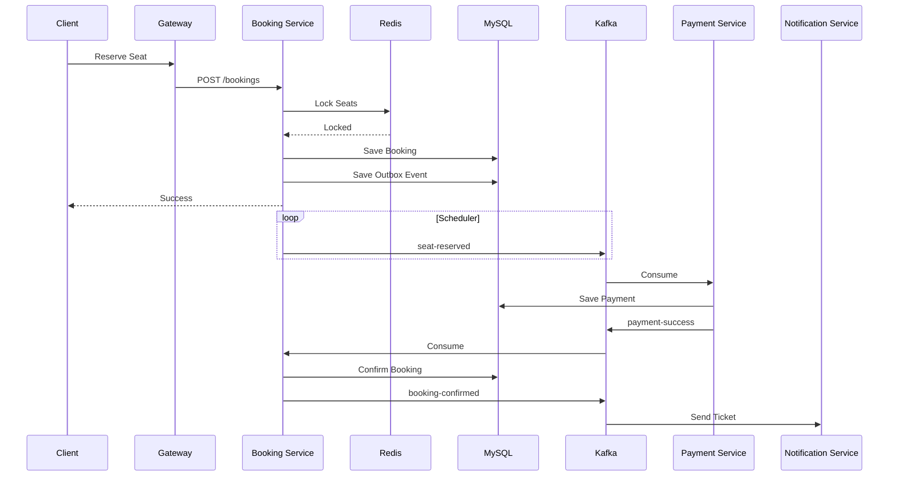
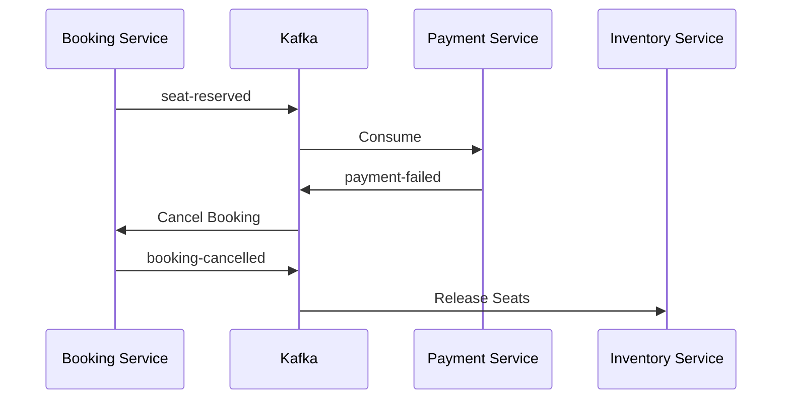
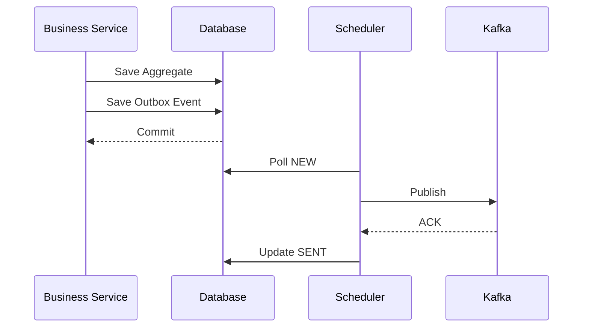
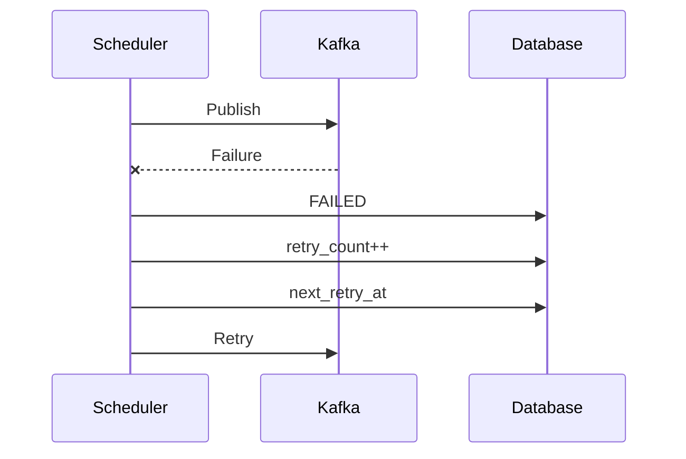
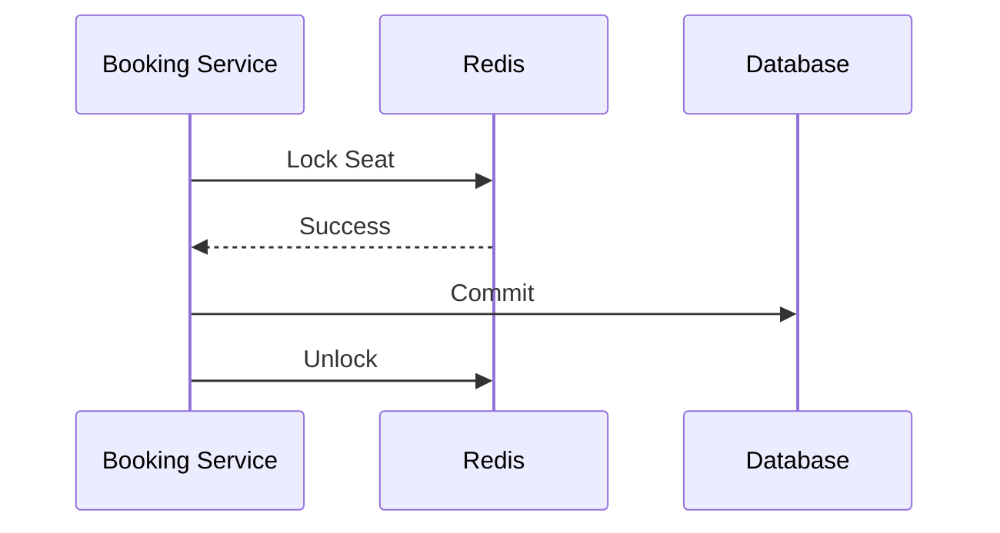

# Sequence Diagrams

Version: R14

---

# Booking Flow

```mermaid
sequenceDiagram

Client->>Gateway: Reserve Seat

Gateway->>Booking Service: POST /bookings

Booking Service->>Redis: Lock Seats

Redis-->>Booking Service: Locked

Booking Service->>MySQL: Save Booking

Booking Service->>MySQL: Save Outbox Event

Booking Service-->>Client: Success

loop Scheduler

Booking Service->>Kafka: seat-reserved

end

Kafka->>Payment Service: Consume

Payment Service->>MySQL: Save Payment

Payment Service->>Kafka: payment-success

Kafka->>Booking Service: Consume

Booking Service->>MySQL: Confirm Booking

Booking Service->>Kafka: booking-confirmed

Kafka->>Notification Service: Send Ticket
```

---

# Payment Failure

```mermaid
sequenceDiagram

Booking Service->>Kafka: seat-reserved

Kafka->>Payment Service: Consume

Payment Service->>Kafka: payment-failed

Kafka->>Booking Service: Cancel Booking

Booking Service->>Kafka: booking-cancelled

Kafka->>Inventory Service: Release Seats
```

---

# Transactional Outbox

```mermaid
sequenceDiagram

Business Service->>Database: Save Aggregate

Business Service->>Database: Save Outbox Event

Database-->>Business Service: Commit

Scheduler->>Database: Poll NEW

Scheduler->>Kafka: Publish

Kafka-->>Scheduler: ACK

Scheduler->>Database: Update SENT
```

---

# Retry Flow

```mermaid
sequenceDiagram

Scheduler->>Kafka: Publish

Kafka--xScheduler: Failure

Scheduler->>Database: FAILED

Scheduler->>Database: retry_count++

Scheduler->>Database: next_retry_at

Scheduler->>Kafka: Retry
```

---

# Distributed Lock

```mermaid
sequenceDiagram

Booking Service->>Redis: Lock Seat

Redis-->>Booking Service: Success

Booking Service->>Database: Commit

Booking Service->>Redis: Unlock
```
