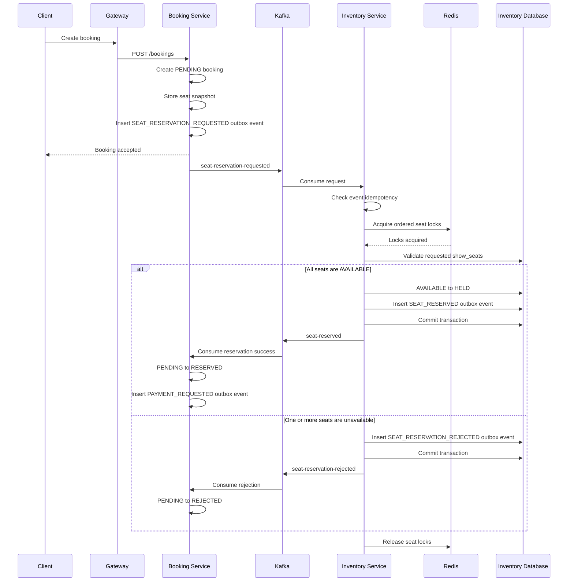
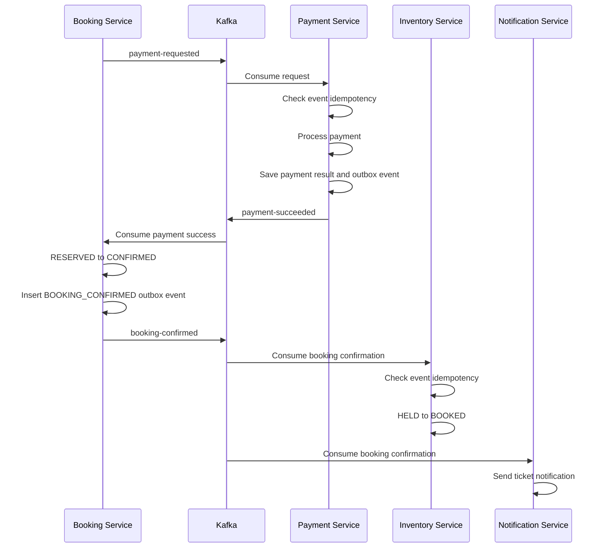
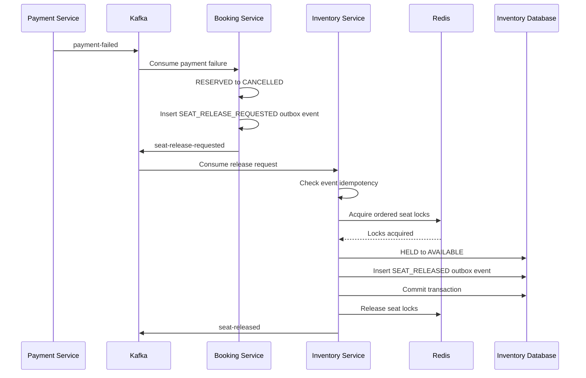
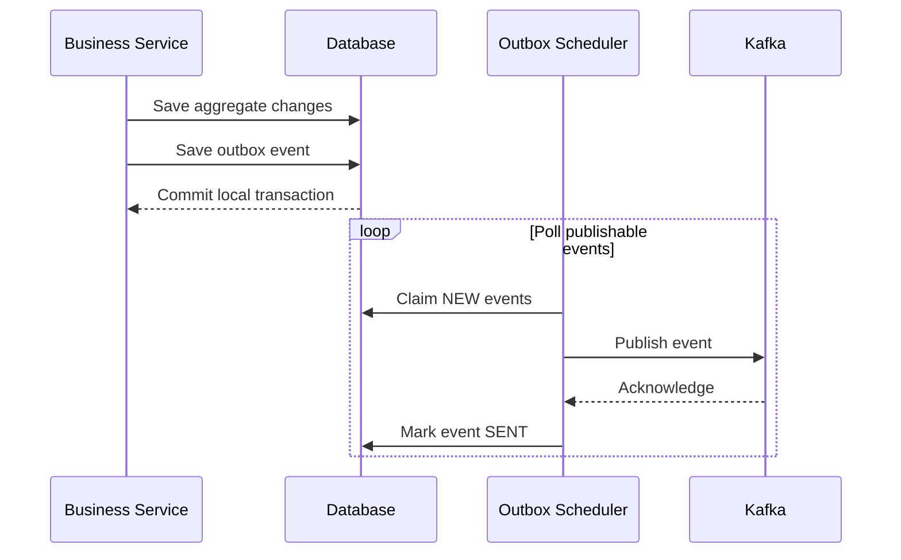
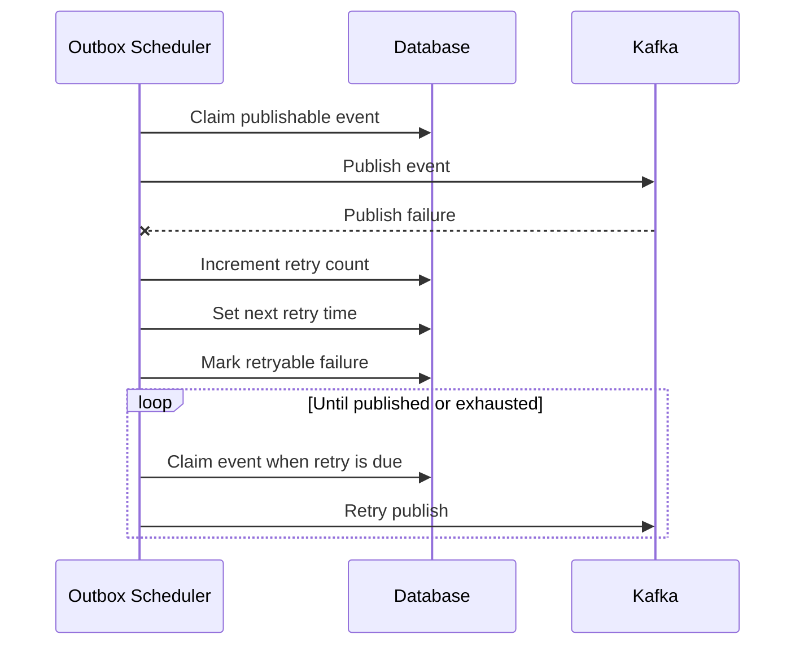
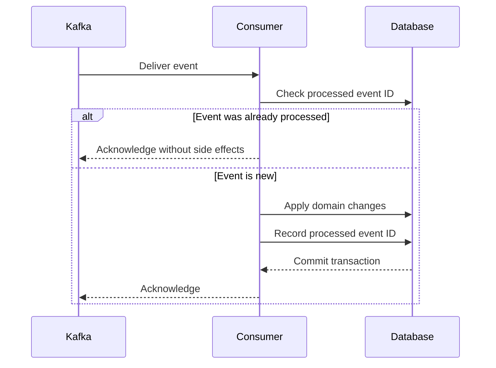
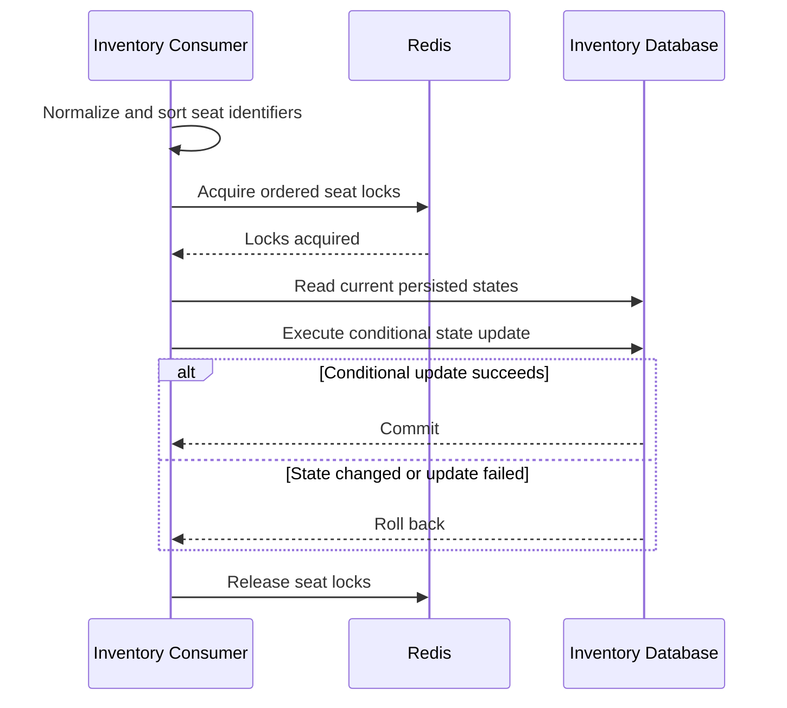
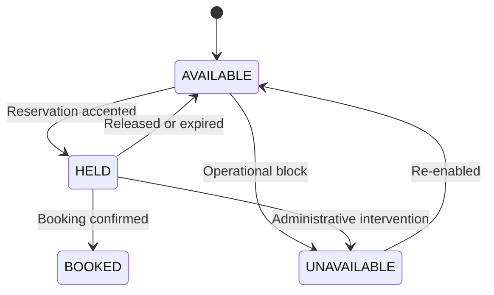

# Sequence Diagrams

Version: R24

---

# Booking and Seat Reservation Flow



Booking Service owns booking state. Inventory Service exclusively owns
`show_seats`, Redis seat locks and seat-state transitions.

Booking status `RESERVED` and Inventory status `HELD` are separate concepts.

---

# Payment Success Flow



---

# Payment Failure and Seat Release Flow



Booking expiration or cancellation follows the same
`seat-release-requested` flow.

Only Inventory Service may perform `HELD → AVAILABLE`.

---

# Transactional Outbox Flow



Aggregate changes and their outbox event must be committed in the same local
database transaction.

---

# Outbox Retry Flow



Retries must be bounded and use the retry policy defined by `common-outbox`.

---

# Idempotent Consumer Flow



The domain changes and processed-event record must belong to the same local
transaction.

---

# Inventory Distributed Lock Flow



Redis provides coordination only. Database conditional updates or database
locking provide the final consistency guarantee against double booking.

Booking Service must never acquire Inventory seat locks.

---

# ShowSeat State Transitions



The normal booking path is:

```text
AVAILABLE → HELD → BOOKED
```

The normal release path is:

```text
HELD → AVAILABLE
```

Unsupported transitions, including `BOOKED → HELD`, must be rejected.
