# Sequence Diagrams

Version: R25

---

# Purpose and Status

This document visualizes implemented interactions and approved target flows.

| Flow                                                    | Status                                             |
| ------------------------------------------------------- | -------------------------------------------------- |
| Inventory ShowSeat transitions and database concurrency | Implemented in R24                                 |
| Shared servlet Resource Server responses                | Implemented for Inventory in R25.1                 |
| Booking, Payment, and Notification Saga                 | Target for R26-R28                                 |
| User account lifecycle and email verification           | Implemented through R25.7                          |
| User Service Authorization Server/OIDC foundation       | Implemented in R25.8                               |
| OAuth2 registered clients and approved grant flows      | Partially implemented in R25.9; protocol flow target |
| Gateway reactive Resource Server                        | Target for R25.13                                  |
| Hardened multi-instance Outbox retry/claim              | Target; not implemented by current `common-outbox` |

A target diagram is an approved interaction contract, not proof that every
participant currently exists.

---

# Implemented Email Verification Flow

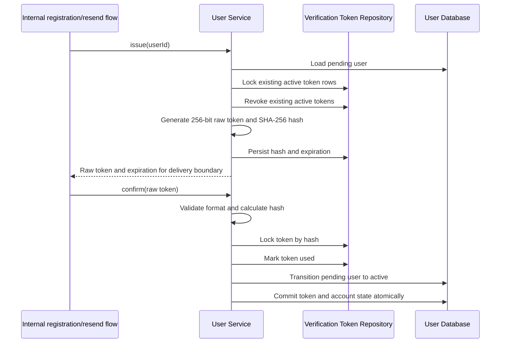
```mermaid
sequenceDiagram
    participant Internal as Internal registration/resend flow
    participant User as User Service
    participant Token as Verification Token Repository
    participant DB as User Database

    Internal->>User: issue(userId)
    User->>DB: Load pending user
    User->>Token: Lock existing active token rows
    User->>Token: Revoke existing active tokens
    User->>User: Generate 256-bit raw token and SHA-256 hash
    User->>Token: Persist hash and expiration
    User-->>Internal: Raw token and expiration for delivery boundary

    Internal->>User: confirm(raw token)
    User->>User: Validate format and calculate hash
    User->>Token: Lock token by hash
    User->>Token: Mark token used
    User->>DB: Transition pending user to active
    User->>DB: Commit token and account state atomically
```

Only the token hash is stored. Invalid, expired, used, revoked and unknown tokens
produce the same generic public failure. Notification delivery and public HTTP
endpoints are not part of the implemented R25.7 boundary.

---

# Implemented Inventory Hold Flow

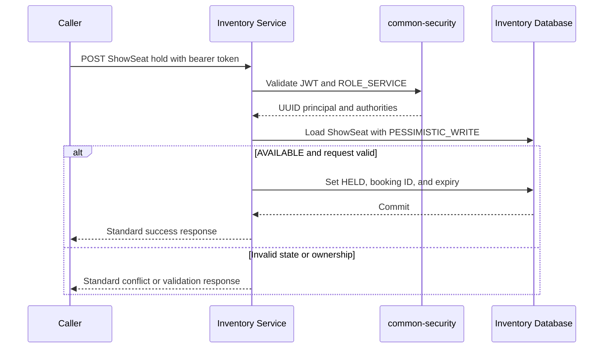
```mermaid
sequenceDiagram
    participant Caller
    participant Inventory as Inventory Service
    participant Security as common-security
    participant DB as Inventory Database

    Caller->>Inventory: POST ShowSeat hold with bearer token
    Inventory->>Security: Validate JWT and ROLE_SERVICE
    Security-->>Inventory: UUID principal and authorities
    Inventory->>DB: Load ShowSeat with PESSIMISTIC_WRITE

    alt AVAILABLE and request valid
        Inventory->>DB: Set HELD, booking ID, and expiry
        DB-->>Inventory: Commit
        Inventory-->>Caller: Standard success response
    else Invalid state or ownership
        Inventory-->>Caller: Standard conflict or validation response
    end
```

Inventory Service is the only owner of the ShowSeat transaction. The caller's
booking ID is an external UUID reference and has no cross-database foreign key.

---

# Implemented Inventory Book and Release Flow

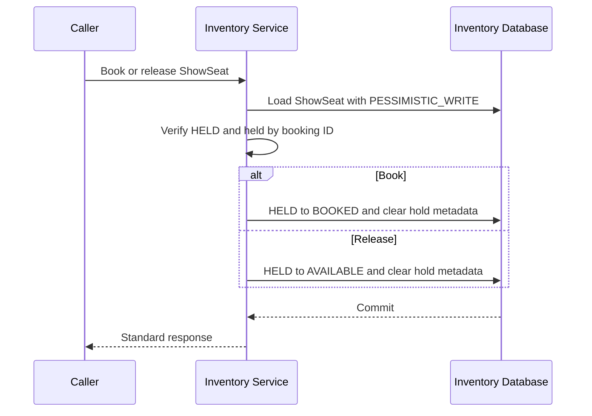
```mermaid
sequenceDiagram
    participant Caller
    participant Inventory as Inventory Service
    participant DB as Inventory Database

    Caller->>Inventory: Book or release ShowSeat
    Inventory->>DB: Load ShowSeat with PESSIMISTIC_WRITE
    Inventory->>Inventory: Verify HELD and held by booking ID

    alt Book
        Inventory->>DB: HELD to BOOKED and clear hold metadata
    else Release
        Inventory->>DB: HELD to AVAILABLE and clear hold metadata
    end

    DB-->>Inventory: Commit
    Inventory-->>Caller: Standard response
```

`AVAILABLE → BOOKED`, `BOOKED → AVAILABLE`, and operations by a different
booking ID are rejected.

---

# Implemented Concurrent Hold Flow

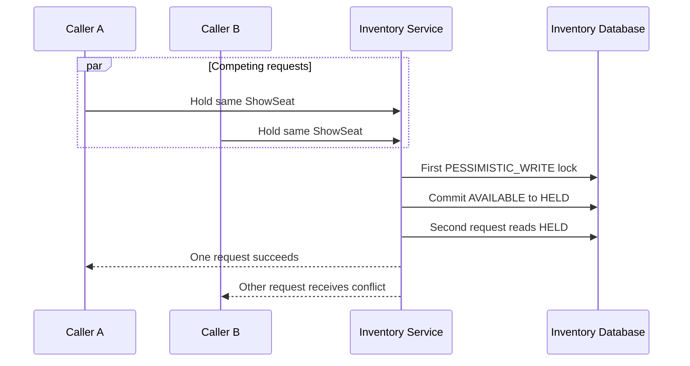
```mermaid
sequenceDiagram
    participant CallerA as Caller A
    participant CallerB as Caller B
    participant Inventory as Inventory Service
    participant DB as Inventory Database

    par Competing requests
        CallerA->>Inventory: Hold same ShowSeat
        CallerB->>Inventory: Hold same ShowSeat
    end

    Inventory->>DB: First PESSIMISTIC_WRITE lock
    Inventory->>DB: Commit AVAILABLE to HELD
    Inventory->>DB: Second request reads HELD
    Inventory-->>CallerA: One request succeeds
    Inventory-->>CallerB: Other request receives conflict
```

The order of caller success is nondeterministic. The invariant is that at most
one competing hold succeeds.

---

# Target Booking and Seat Reservation Flow

The event name uses Booking-domain language. A successful
`seat-reservation-requested` operation places Inventory ShowSeats in `HELD`
state; Inventory does not have a `RESERVED` state.

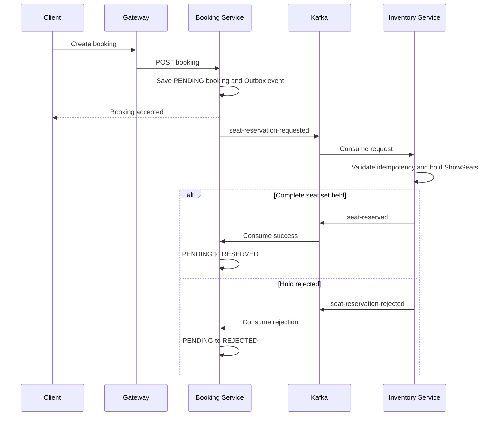
```mermaid
sequenceDiagram
    participant Client
    participant Gateway
    participant Booking as Booking Service
    participant Kafka
    participant Inventory as Inventory Service

    Client->>Gateway: Create booking
    Gateway->>Booking: POST booking
    Booking->>Booking: Save PENDING booking and Outbox event
    Booking-->>Client: Booking accepted
    Booking->>Kafka: seat-reservation-requested
    Kafka->>Inventory: Consume request
    Inventory->>Inventory: Validate idempotency and hold ShowSeats

    alt Complete seat set held
        Inventory->>Kafka: seat-reserved
        Kafka->>Booking: Consume success
        Booking->>Booking: PENDING to RESERVED
    else Hold rejected
        Inventory->>Kafka: seat-reservation-rejected
        Kafka->>Booking: Consume rejection
        Booking->>Booking: PENDING to REJECTED
    end
```

The future multi-seat workflow may use ordered Redis locks if its accepted
design requires distributed coordination. Database transactions and constraints
remain the final state guarantee.

Booking Service must never query or update `show_seats`.

---

# Target Payment Success Flow

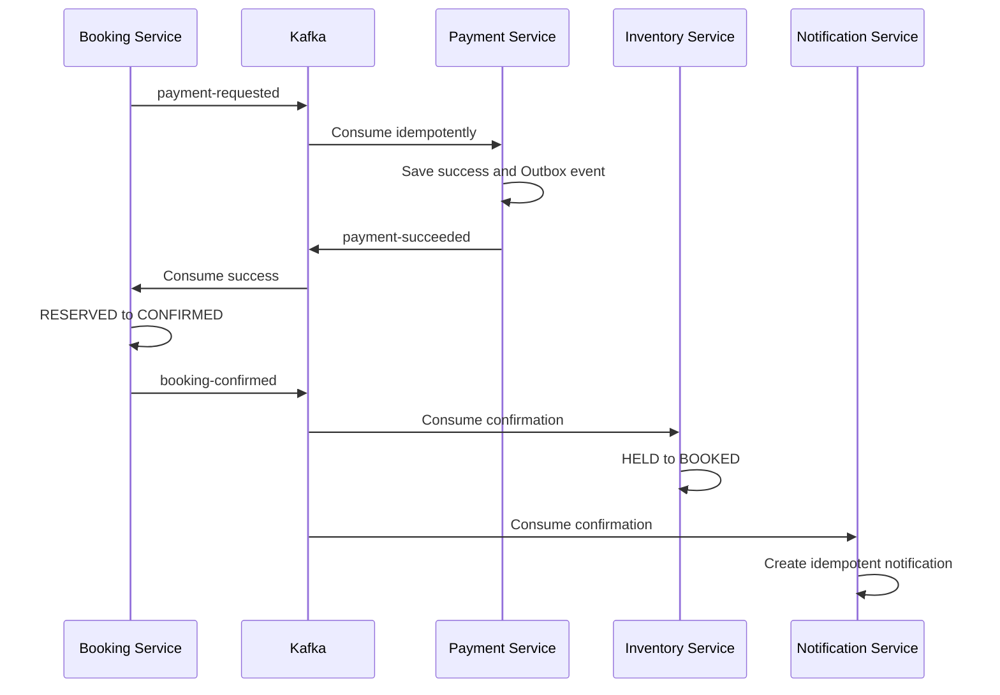
```mermaid
sequenceDiagram
    participant Booking as Booking Service
    participant Kafka
    participant Payment as Payment Service
    participant Inventory as Inventory Service
    participant Notification as Notification Service

    Booking->>Kafka: payment-requested
    Kafka->>Payment: Consume idempotently
    Payment->>Payment: Save success and Outbox event
    Payment->>Kafka: payment-succeeded
    Kafka->>Booking: Consume success
    Booking->>Booking: RESERVED to CONFIRMED
    Booking->>Kafka: booking-confirmed
    Kafka->>Inventory: Consume confirmation
    Inventory->>Inventory: HELD to BOOKED
    Kafka->>Notification: Consume confirmation
    Notification->>Notification: Create idempotent notification
```

Booking `RESERVED` and Inventory `HELD` are separate service-owned states.

---

# Target Payment Failure and Seat Release Flow

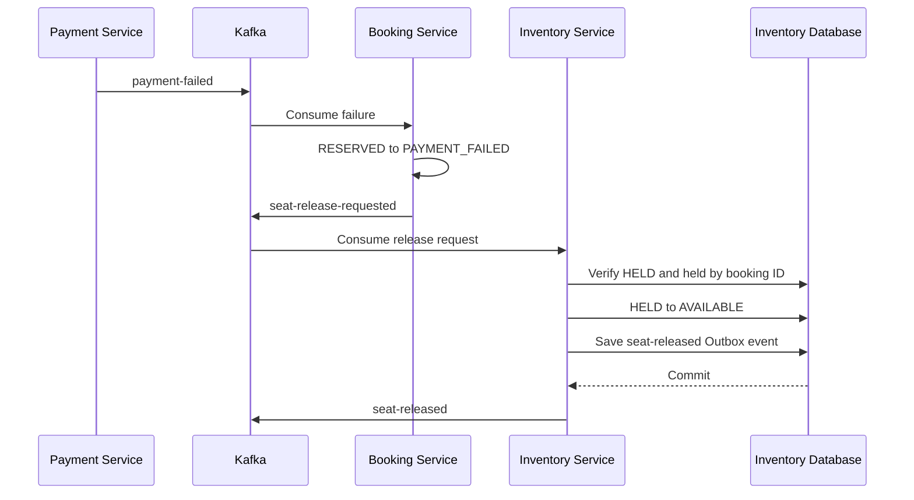
```mermaid
sequenceDiagram
    participant Payment as Payment Service
    participant Kafka
    participant Booking as Booking Service
    participant Inventory as Inventory Service
    participant DB as Inventory Database

    Payment->>Kafka: payment-failed
    Kafka->>Booking: Consume failure
    Booking->>Booking: RESERVED to PAYMENT_FAILED
    Booking->>Kafka: seat-release-requested
    Kafka->>Inventory: Consume release request
    Inventory->>DB: Verify HELD and held by booking ID
    Inventory->>DB: HELD to AVAILABLE
    Inventory->>DB: Save seat-released Outbox event
    DB-->>Inventory: Commit
    Inventory->>Kafka: seat-released
```

Booking cancellation or expiration uses the same conditional release rule.
Inventory never releases a `BOOKED` ShowSeat through this compensation flow.

---

# Current Transactional Outbox Flow

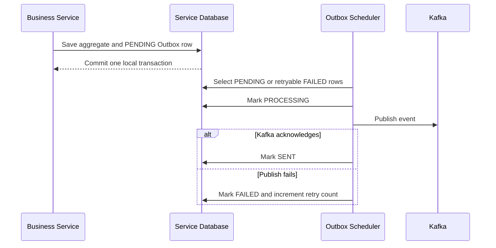
```mermaid
sequenceDiagram
    participant Service as Business Service
    participant DB as Service Database
    participant Scheduler as Outbox Scheduler
    participant Kafka

    Service->>DB: Save aggregate and PENDING Outbox row
    DB-->>Service: Commit one local transaction
    Scheduler->>DB: Select PENDING or retryable FAILED rows
    Scheduler->>DB: Mark PROCESSING
    Scheduler->>Kafka: Publish event

    alt Kafka acknowledges
        Scheduler->>DB: Mark SENT
    else Publish fails
        Scheduler->>DB: Mark FAILED and increment retry count
    end
```

The current enum is `PENDING`, `PROCESSING`, `SENT`, and `FAILED`. `NEW` is not
the current Outbox status.

The business change and Outbox insert share one local transaction. Kafka
publication occurs afterward and may be repeated.

---

# Target Hardened Outbox Claim and Retry Flow

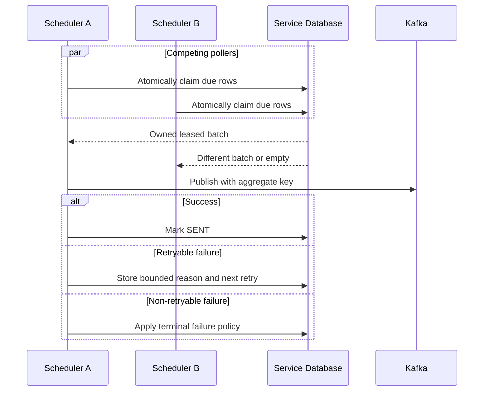
```mermaid
sequenceDiagram
    participant SchedulerA as Scheduler A
    participant SchedulerB as Scheduler B
    participant DB as Service Database
    participant Kafka

    par Competing pollers
        SchedulerA->>DB: Atomically claim due rows
        SchedulerB->>DB: Atomically claim due rows
    end
    DB-->>SchedulerA: Owned leased batch
    DB-->>SchedulerB: Different batch or empty
    SchedulerA->>Kafka: Publish with aggregate key

    alt Success
        SchedulerA->>DB: Mark SENT
    else Retryable failure
        SchedulerA->>DB: Store bounded reason and next retry
    else Non-retryable failure
        SchedulerA->>DB: Apply terminal failure policy
    end
```

This flow requires schema, entity, repository, scheduler, metrics, and test work.
The current implementation does not yet provide atomic claims, processing
leases, delayed exponential backoff, or a terminal status.

---

# Idempotent Consumer Flow

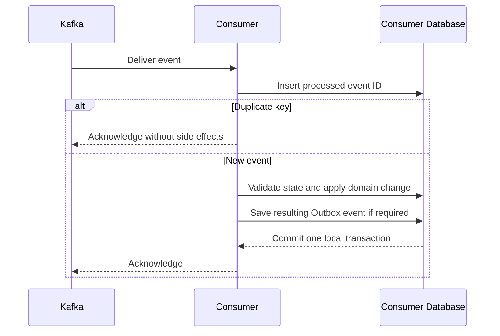
```mermaid
sequenceDiagram
    participant Kafka
    participant Consumer
    participant DB as Consumer Database

    Kafka->>Consumer: Deliver event
    Consumer->>DB: Insert processed event ID

    alt Duplicate key
        Consumer-->>Kafka: Acknowledge without side effects
    else New event
        Consumer->>DB: Validate state and apply domain change
        Consumer->>DB: Save resulting Outbox event if required
        DB-->>Consumer: Commit one local transaction
        Consumer-->>Kafka: Acknowledge
    end
```

The processed-event record, domain changes, and any resulting Outbox insert
must commit in the same service-owned transaction.

---

# Target Authorization Code with PKCE Flow

The R25.8 Authorization Server/OIDC foundation and R25.9 public-client
registration policy are implemented. The complete protocol-level flow below,
including code exchange and token issuance, is not yet verified end to end.

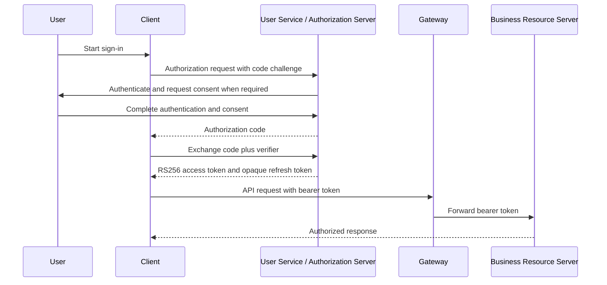
```mermaid
sequenceDiagram
    participant User
    participant Client
    participant Auth as User Service / Authorization Server
    participant Gateway
    participant API as Business Resource Server

    User->>Client: Start sign-in
    Client->>Auth: Authorization request with code challenge
    Auth->>User: Authenticate and request consent when required
    User->>Auth: Complete authentication and consent
    Auth-->>Client: Authorization code
    Client->>Auth: Exchange code plus verifier
    Auth-->>Client: RS256 access token and opaque refresh token
    Client->>Gateway: API request with bearer token
    Gateway->>API: Forward bearer token
    API-->>Client: Authorized response
```

Public clients do not receive a client secret. PKCE verification occurs in User
Service before token issuance. Resource Owner Password Credentials is
prohibited.

---

# Resource Server JWT Validation Flow

Inventory implements the servlet validation foundation. Gateway reactive
validation and remaining service integration are R25.13 work.

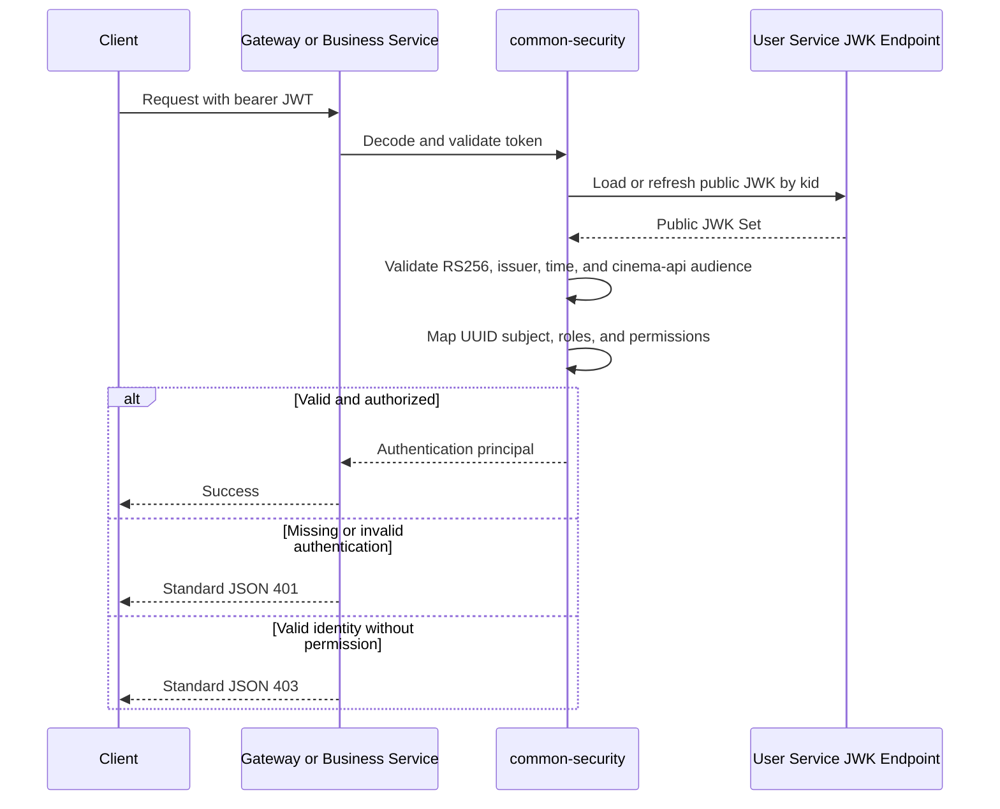
```mermaid
sequenceDiagram
    participant Client
    participant Resource as Gateway or Business Service
    participant Security as common-security
    participant Auth as User Service JWK Endpoint

    Client->>Resource: Request with bearer JWT
    Resource->>Security: Decode and validate token
    Security->>Auth: Load or refresh public JWK by kid
    Auth-->>Security: Public JWK Set
    Security->>Security: Validate RS256, issuer, time, and cinema-api audience
    Security->>Security: Map UUID subject, roles, and permissions

    alt Valid and authorized
        Security-->>Resource: Authentication principal
        Resource-->>Client: Success
    else Missing or invalid authentication
        Resource-->>Client: Standard JSON 401
    else Valid identity without permission
        Resource-->>Client: Standard JSON 403
    end
```

Resource Servers use public keys only. User Service signing private keys must
never be shared with Gateway, business services, or `common-security`.

---

# Target Refresh Token Rotation Flow

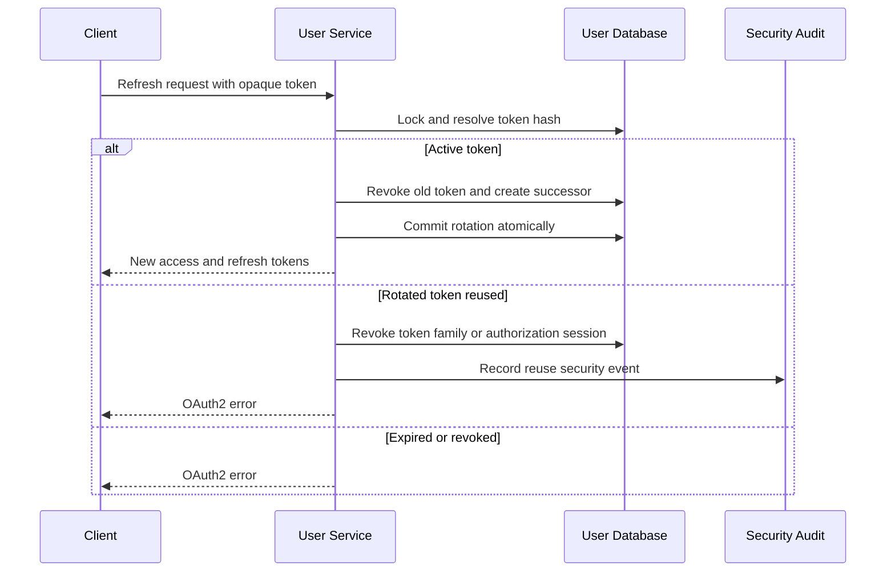
```mermaid
sequenceDiagram
    participant Client
    participant Auth as User Service
    participant DB as User Database
    participant Audit as Security Audit

    Client->>Auth: Refresh request with opaque token
    Auth->>DB: Lock and resolve token hash

    alt Active token
        Auth->>DB: Revoke old token and create successor
        Auth->>DB: Commit rotation atomically
        Auth-->>Client: New access and refresh tokens
    else Rotated token reused
        Auth->>DB: Revoke token family or authorization session
        Auth->>Audit: Record reuse security event
        Auth-->>Client: OAuth2 error
    else Expired or revoked
        Auth-->>Client: OAuth2 error
    end
```

One refresh token must not produce two valid successors under concurrent use.
Raw refresh tokens must not be stored or logged.

---

# Target Client Credentials Flow

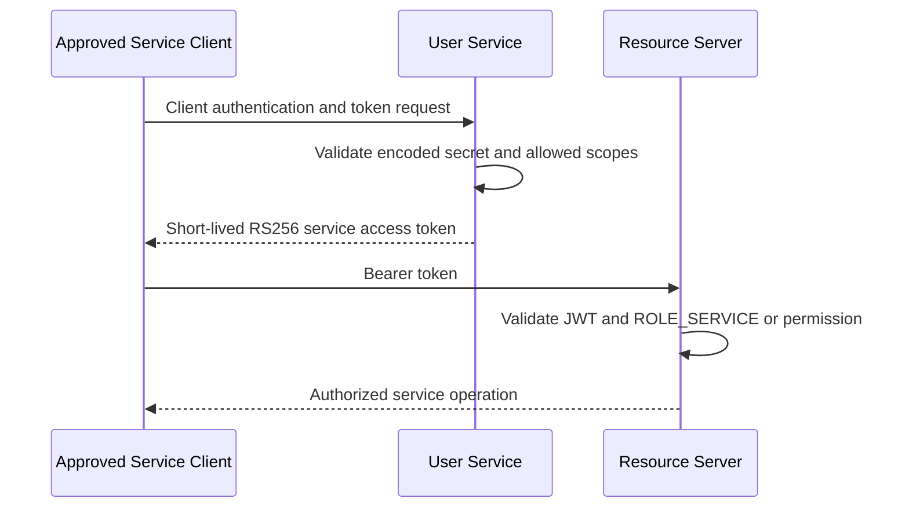
```mermaid
sequenceDiagram
    participant ServiceClient as Approved Service Client
    participant Auth as User Service
    participant API as Resource Server

    ServiceClient->>Auth: Client authentication and token request
    Auth->>Auth: Validate encoded secret and allowed scopes
    Auth-->>ServiceClient: Short-lived RS256 service access token
    ServiceClient->>API: Bearer token
    API->>API: Validate JWT and ROLE_SERVICE or permission
    API-->>ServiceClient: Authorized service operation
```

Client Credentials represents the service identity, not a human user. A service
must not impersonate an end user by inventing user claims.

---

# Target Signing-Key Rotation Flow

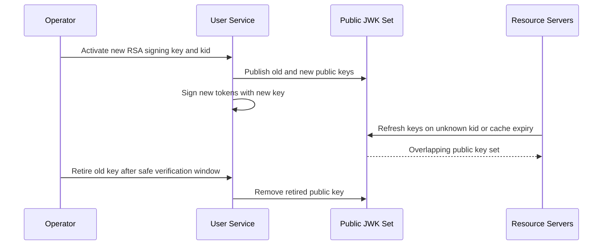
```mermaid
sequenceDiagram
    participant Operator
    participant Auth as User Service
    participant JWK as Public JWK Set
    participant Resource as Resource Servers

    Operator->>Auth: Activate new RSA signing key and kid
    Auth->>JWK: Publish old and new public keys
    Auth->>Auth: Sign new tokens with new key
    Resource->>JWK: Refresh keys on unknown kid or cache expiry
    JWK-->>Resource: Overlapping public key set
    Operator->>Auth: Retire old key after safe verification window
    Auth->>JWK: Remove retired public key
```

The old public key remains available until every access token signed by it has
expired plus the accepted clock-skew and cache-safety window.

---

# ShowSeat State Transitions

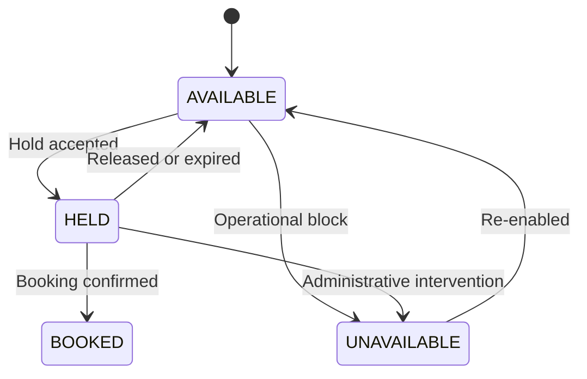
```mermaid
stateDiagram-v2
    [*] --> AVAILABLE
    AVAILABLE --> HELD: Hold accepted
    HELD --> AVAILABLE: Released or expired
    HELD --> BOOKED: Booking confirmed
    AVAILABLE --> UNAVAILABLE: Operational block
    HELD --> UNAVAILABLE: Administrative intervention
    UNAVAILABLE --> AVAILABLE: Re-enabled
```

Normal booking path:

```text
AVAILABLE → HELD → BOOKED
```

Normal release path:

```text
HELD → AVAILABLE
```

`HELD → UNAVAILABLE` clears hold ownership and expiry. Unsupported transitions,
including `AVAILABLE → BOOKED`, `BOOKED → HELD`, and `BOOKED → AVAILABLE`, are
rejected.

---

# Verification Checklist

- [ ] Implemented diagrams match current code and migrations
- [ ] Target diagrams are explicitly marked as target
- [ ] Booking `RESERVED` is not confused with Inventory `HELD`
- [ ] Inventory never uses obsolete `RESERVED` or `SOLD` ShowSeat states
- [ ] Booking Service never accesses Inventory tables or locks
- [ ] Outbox current status starts at `PENDING`, not `NEW`
- [ ] Outbox target hardening is not documented as implemented
- [ ] User Service is the sole token issuer and signing-key owner
- [ ] Authorization Code uses PKCE
- [ ] Resource Owner Password Credentials is absent
- [ ] Resource Servers validate signature, issuer, timestamps, and `cinema-api`
      audience
- [ ] Refresh rotation and reuse handling are atomic and tested when implemented
- [ ] Gateway reactive security remains planned until R25.13 passes
- [ ] No password, token, client secret, MFA material, or private key appears in
      events or logs
- [ ] `mvn clean verify` passes

---

# Related Documentation

```text
docs/02_ARCHITECTURE.md
docs/06_DATABASE_DESIGN.md
docs/07_EVENT_CATALOG.md
docs/08_SECURITY.md
docs/09_OUTBOX.md
docs/10_ROADMAP.md
docs/12_DEPENDENCY_RULES.md
docs/14_DEPLOYMENT.md
docs/decisions/ADR-013-spring-authorization-server.md
```
