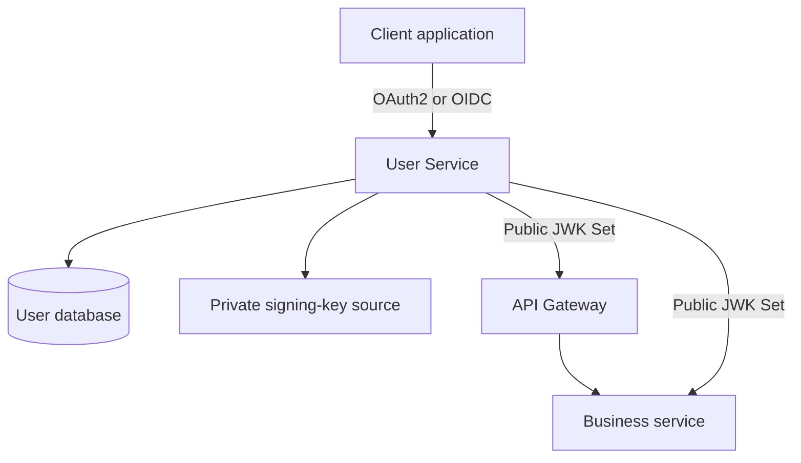

# User Service Design

**Status:** R25 User Service completed

**Runtime status:** R25.1–R25.15 implemented and verified

**Architecture decision:** `docs/decisions/ADR-013-spring-authorization-server.md`

---

## 1. Purpose

This document defines the implementation blueprint and current runtime boundary
for `services/user-service`.

User Service is both:

- the owner of users, credentials, roles, permissions and account lifecycle;
- the platform's single OAuth2 and OpenID Connect Authorization Server.

It integrates Spring Authorization Server. It does not move Authorization Server
responsibilities into `common-security`, Gateway, or another business service.

---

## 2. Accepted Decisions

| Concern                        | Decision                                                 |
| ------------------------------ | -------------------------------------------------------- |
| Issuer                         | One canonical User Service issuer per environment        |
| Authorization Server           | Spring Authorization Server inside User Service          |
| Interactive flow               | Authorization Code with PKCE                             |
| Session renewal                | Opaque, rotated and revocable refresh token              |
| Service identity               | Controlled Client Credentials                            |
| Prohibited flow                | Resource Owner Password Credentials                      |
| Access token                   | RS256 signed JWT                                         |
| RSA key size                   | At least 3072 bits                                       |
| API audience                   | `cinema-api` initially                                   |
| Access-token lifetime          | 15 minutes initially                                     |
| Refresh-token maximum lifetime | 30 days initially                                        |
| Subject                        | UUID v7 user or approved service-principal identifier    |
| Resource Server validation     | Issuer, signature, audience, lifetime and claims         |
| Shared security boundary       | `common-security` validates tokens; it never issues them |

Configuration may shorten token lifetimes by environment. Relaxing an accepted
security rule requires a new architecture decision.

---

## 3. Scope and Non-goals

### 3.1 User Service owns

- users and profiles;
- password credentials;
- account status and lock state;
- roles and permissions;
- email verification and password recovery state;
- registered OAuth2 clients;
- OAuth2 authorizations and consents;
- refresh-token sessions and revocation;
- signing-key access and public JWK publication;
- security audit events.

### 3.2 User Service does not own

- movie, cinema, inventory, booking, payment, or notification domain data;
- authorization rules for resources owned by another business service;
- another service's database;
- Gateway route configuration;
- shared Resource Server implementation;
- delivery of email or SMS messages.

User Service may request a verification or recovery notification through an
approved event. Notification Service owns delivery. Tokens and credentials must
never be included in Kafka events unless a later accepted design defines a secure
one-time delivery contract.

---

## 4. Runtime Topology



Gateway and every protected business service validate access tokens
independently. Gateway validation is not a substitute for service-level
authentication and authorization.

---

## 5. Maven and Module Boundary

`services/user-service` may depend on shared technical modules, including:

- `common-api`;
- `common-core`;
- `common-exception`;
- `common-jackson`;
- `common-jpa`;
- `common-logging`;
- `common-mapper`;
- `common-openapi`;
- `common-response`;
- `common-tracing`;
- `common-validation`;
- `common-test` in test scope.

User Service must not depend on another business service module.

`common-security` may be used only for Resource Server mechanics required by
User Service's protected management APIs. Authorization Server configuration,
authentication providers, registered-client persistence, signing keys and token
customization remain inside User Service.

The Spring Authorization Server dependency is introduced at R25.8, not during
the R25.3 bootstrap.

---

## 6. Package Structure

The initial package root is:

```text
com.cinema.user
```

Recommended structure:

```text
com.cinema.user
├── UserServiceApplication
├── config
│   ├── persistence
│   ├── security
│   └── web
├── controller
├── domain
│   ├── user
│   ├── authorization
│   └── audit
├── dto
│   ├── request
│   └── response
├── entity
├── exception
├── mapper
├── repository
├── security
│   ├── authentication
│   ├── authorizationserver
│   ├── claims
│   ├── client
│   ├── jwk
│   └── token
└── service
    └── impl
```

Package structure may evolve, but domain logic must not be placed in controllers,
JPA repositories, security filters, or mappers.

---

## 7. Security Filter Chains

User Service uses separate filter chains with explicit ordering.

### 7.1 Authorization Server chain

The highest-priority chain applies only to Spring Authorization Server protocol
endpoints.

Responsibilities:

- OAuth2 authorization endpoint;
- token endpoint;
- token revocation endpoint;
- token introspection endpoint when enabled for approved clients;
- JWK Set endpoint;
- OpenID Provider configuration;
- OIDC user-info and logout endpoints when enabled;
- OAuth2 client authentication;
- protocol-specific exception handling.

OIDC is enabled explicitly. Protocol endpoints use Spring Authorization Server
conventions rather than custom token endpoints.

### 7.2 Application chain

The second chain applies to login, registration, profile, account and
administrative APIs.

Initial policy:

| Endpoint group                          | Access                                               |
| --------------------------------------- | ---------------------------------------------------- |
| Provider metadata and JWK Set           | Public                                               |
| Login UI required by authorization flow | Public entry; authenticated session after login      |
| Registration                            | Public with abuse controls                           |
| Email verification                      | Public one-time-token operation                      |
| Password recovery request               | Public, non-enumerating response                     |
| Password reset                          | Public one-time-token operation                      |
| Current-user profile                    | Authenticated user                                   |
| Password change                         | Authenticated user with recent-authentication policy |
| User administration                     | `user:manage` plus privileged-operation policy       |
| Client administration                   | Restricted privileged administrator                  |

CSRF protection remains enabled for browser session endpoints. Disabling CSRF
globally is prohibited. CORS uses an explicit environment-specific allowlist.

---

## 8. Authentication Model

### 8.1 User authentication

User authentication loads a normalized user identifier and credential from User
Service persistence. Authentication is rejected when the account is:

- disabled;
- locked;
- deleted or otherwise unavailable;
- not permitted to use the requested flow.

Password comparison uses the approved adaptive `PasswordEncoder`. Successful
authentication may upgrade an outdated password hash transactionally.

### 8.2 Principal

The authenticated human principal contains:

- UUID v7 user identifier;
- normalized username;
- account status;
- roles;
- effective permissions.

Credential hashes, raw passwords, verification tokens, reset tokens and refresh
tokens are never part of the principal.

### 8.3 Service principal

A Client Credentials principal represents an approved service client, not a
human user. It has:

- a stable service-principal identifier;
- approved audience;
- approved scopes and permissions;
- optionally `ROLE_SERVICE`.

Service clients must not inherit human administrator roles.

---

## 9. OAuth2 and OIDC Client Policy

### 9.1 Public clients

Public browser, mobile and native clients:

- use Authorization Code with PKCE;
- require S256 code challenge;
- do not receive a client secret;
- use exact registered redirect URIs;
- cannot use Client Credentials;
- receive refresh tokens only when explicitly approved.

### 9.2 Confidential clients

Confidential clients:

- authenticate with an approved method;
- store encoded client secrets or use an approved asymmetric method;
- receive only registered grants and scopes;
- use exact registered redirect and post-logout redirect URIs;
- are disabled or revoked without deleting audit history.

Client secrets must be shown only once at creation or rotation. Stored secrets
use a `PasswordEncoder`; they are never recoverable as plaintext.

Implementation status (R25.9): controlled server-side registration and JDBC
registered-client persistence are implemented. Public clients use
`ClientAuthenticationMethod.NONE`, Authorization Code plus Refresh Token,
required PKCE and consent, a 15-minute access token and a non-reusable 30-day
refresh token. Service clients use `client_secret_basic`, Client Credentials,
encoded secrets, restricted non-human scopes and a five-minute access token.
Dynamic client registration and a public management controller are not enabled.
Authorization Server metadata advertises only Authorization Code, Refresh Token
and Client Credentials. Protocol integration coverage verifies missing-PKCE
rejection, successful S256 validation through the consent boundary, service
client isolation and client-secret rejection. Successful token issuance remains
R25.10-dependent because production RSA/JWK and JWT generation are not yet present.

### 9.3 Consent

Consent is required when the client or requested scopes require it. First-party
trusted-client consent bypass, if permitted later, must be explicit client
configuration rather than a global bypass.

---

## 10. Protocol Endpoint Contract

Spring Authorization Server standard endpoint paths are authoritative unless a
later approved decision changes them.

Expected endpoint families:

```text
/.well-known/openid-configuration
/oauth2/authorize
/oauth2/token
/oauth2/revoke
/oauth2/introspect
/oauth2/jwks
/userinfo
/connect/logout
```

Exact enabled endpoints are verified against the Spring Authorization Server
version introduced in R25.8. Introspection is restricted to approved
confidential clients and is not a public token-debugging API.

Custom business APIs remain versioned separately, for example:

```text
/api/v1/users/me
/api/v1/users
/api/v1/roles
/api/v1/oauth2-clients
```

OAuth2 protocol responses follow the OAuth2/OIDC error contract. Business APIs
use the shared `common-response` and `common-exception` contracts. Protocol
errors must not be wrapped in the business API response envelope.

---

## 11. Access Token Contract

Access tokens are RS256 JWTs and contain only necessary claims.

Required standard claims:

```text
iss sub aud iat nbf exp jti
```

Approved application claims:

```text
username roles permissions
```

Rules:

- `iss` exactly matches `CINEMA_AUTH_ISSUER`;
- `aud` includes the approved target audience;
- human `sub` is the user's UUID v7;
- service `sub` is the approved service-principal identifier;
- role values do not contain the `ROLE_` prefix;
- permissions use canonical lower-case scope-like names;
- access tokens never contain secrets or full private profiles;
- a unique `jti` is generated for every access token.

`common-security` maps roles and permissions to Spring authorities. Business
services still enforce resource ownership and domain-state rules.

---

## 12. Signing Keys and JWK Publication

User Service is the only runtime allowed to access private signing keys.

Initial rules:

- algorithm is RS256;
- RSA modulus is at least 3072 bits;
- every key has a stable, unique `kid`;
- production keys are loaded from an approved secret source;
- production keys are never generated implicitly during startup;
- private keys are never committed, logged, returned by APIs, or shared with
  Resource Servers;
- development and test fixtures are isolated from production configuration.

Key rotation publishes the new and previous public keys during the overlap
period. New tokens use the active key. The previous public key remains published
until every token signed with it must have expired, after which it may be retired.

The implementation must fail startup when production key material is missing,
invalid, too small, or inconsistent with its public key.

---

## 13. Refresh Tokens, Sessions and Revocation

Refresh tokens are opaque, high-entropy credentials.

### 13.1 Storage

Raw refresh tokens must not be stored in the database. User Service stores a
one-way SHA-256 digest of the high-entropy token and uses the same digest for
lookup. An environment-held pepper may be added as defense in depth, but it must
not replace token entropy.

Spring Authorization Server's default JDBC authorization schema or service must
not be used unchanged if it persists raw refresh-token values. User Service must
provide an adapted `OAuth2AuthorizationService` or persistence layer that
preserves Spring protocol behavior while storing only token digests and required
metadata.

Authorization codes, verification tokens and password-reset tokens follow the
same no-raw-token persistence rule where lookup semantics allow it.

### 13.2 Rotation

Every successful refresh operation:

1. locks or atomically claims the current refresh-token session;
2. verifies that it is active, unexpired and not previously used;
3. invalidates the current token;
4. issues exactly one successor refresh token;
5. records the relationship and security metadata;
6. commits before the response is returned.

Concurrent use of one refresh token must produce at most one successful
successor.

### 13.3 Reuse detection

Use of a consumed or invalidated refresh token is treated as a possible reuse
event. User Service revokes the affected authorization family or session and
records a security audit event. The client receives a standard OAuth2 error
without sensitive diagnostic details.

### 13.4 Revocation triggers

Applicable sessions are revoked after:

- logout;
- password reset;
- account disablement or lock according to policy;
- confirmed credential compromise;
- OAuth2 client disablement or secret rotation where required;
- administrator-initiated revocation;
- refresh-token reuse detection.

Short-lived JWT access tokens remain valid until expiry unless emergency key
rotation or another explicitly designed denylist mechanism is invoked.

The implemented sensitive-change baseline revokes applicable authorizations after
account lock or disablement, password change or reset, OAuth2 client deactivation or
secret rotation, and authorized administrative revocation.

Each trigger supplies an explicit non-sensitive reason code. Revocation audit records
use the username or public client identifier as the safe target reference and store the
number of authorizations actually invalidated. Audit persistence participates in the
same transaction as the triggering state change and authorization revocation.

---

## 14. Persistence Model

The User Service database is `cinema_user_db`.

### 14.1 Domain tables

| Table                   | Purpose                                |
| ----------------------- | -------------------------------------- |
| `users`                 | Account identity and status            |
| `user_profiles`         | Non-credential profile data            |
| `user_credentials`      | Password hash and credential metadata  |
| `roles`                 | Coarse-grained roles                   |
| `permissions`           | Fine-grained permissions               |
| `user_roles`            | User-role assignments                  |
| `role_permissions`      | Role-permission assignments            |
| `verification_tokens`   | Hashed, expiring verification tokens   |
| `password_reset_tokens` | Hashed, expiring reset tokens          |
| `user_mfa_methods`      | Future MFA enrollment metadata         |
| `security_audit_events` | Append-oriented security audit records |

### 14.2 Authorization Server tables

| Table                          | Purpose                                        |
| ------------------------------ | ---------------------------------------------- |
| `oauth2_registered_client`     | Registered client configuration                |
| `oauth2_authorization`         | Authorization and token metadata               |
| `oauth2_authorization_consent` | User consent                                   |
| `oauth2_refresh_token_history` | Hashed refresh-token family and rotation state |

Spring Authorization Server-compatible names may be retained, but Flyway owns
all DDL. Runtime schema initialization is disabled.

### 14.3 Persistence rules

- IDs use UUID v7 stored consistently with project UUID conventions.
- Username and email use normalized values with unique constraints.
- JPA mappings and Flyway types must agree.
- Cross-service foreign keys are prohibited.
- Credential and token entities are never returned directly from controllers.
- Optimistic locking is used where appropriate.
- Refresh rotation uses an atomic update, row lock, or equivalent concurrency
  guarantee.
- Expired token cleanup is idempotent and safe with multiple instances.

---

## 15. Account Lifecycle

Initial account states are defined during R25.4 and must distinguish at least:

- an account allowed to authenticate;
- an unverified account;
- a locked account;
- a disabled account.

State transitions are performed through domain methods and audited. Direct
controller mutation of account state is prohibited.

Rules:

- locked and disabled accounts cannot obtain new tokens;
- registration does not automatically grant privileged roles;
- password reset revokes applicable active sessions;
- role and permission changes affect new tokens immediately and existing access
  tokens after their short expiry unless emergency revocation is required;
- privileged production accounts require MFA before R25 can close.

R25.12 implementation status:

- current-user profile read and replacement APIs are implemented;
- profile ownership is derived from the authenticated principal;
- password change requires the current password and revokes applicable sessions;
- administrative lock, unlock, disable and enable operations require `user:manage`;
- HTTP authorization and method security provide independent administrative
  boundaries;
- privileged lifecycle operations write durable security audit events;
- audit failure rolls back the associated account transition;
- controller, service, security, persistence and rollback behavior is verified.

---

## 16. API and Privacy Rules

- Registration and recovery responses must not disclose whether an account
  exists unnecessarily.
- Public errors use stable codes and safe messages.
- `IllegalArgumentException` is not used as a public or domain error contract;
  User Service uses `common-exception` and User-specific error codes.
- Passwords, token values, client secrets, key material and sensitive personal
  data are never logged.
- List APIs are paginated and administratively authorized.
- Profile APIs return allowlisted fields only.
- Administrative operations require both permission checks and audit records.
- Rate limiting and abuse controls are enforced at Gateway and, for critical
  identity endpoints, at User Service or its supporting infrastructure.

---

## 17. Configuration Contract

Expected environment configuration includes:

```text
USER_SERVICE_PORT
USER_DB_URL
USER_DB_USERNAME
USER_DB_PASSWORD
CONFIG_SERVER_URL
EUREKA_URL
CINEMA_AUTH_ISSUER
CINEMA_AUTH_AUDIENCE
CINEMA_AUTH_PRIVATE_KEY_PATH
CINEMA_AUTH_PUBLIC_KEY_PATH
CINEMA_AUTH_ACTIVE_KEY_ID
CINEMA_AUTH_ACCESS_TOKEN_TTL
CINEMA_AUTH_REFRESH_TOKEN_TTL
```

Names may be refined during implementation, but secrets must remain external to
Git. Configuration binding uses validated `@ConfigurationProperties`; security-
critical configuration must fail startup when missing or invalid outside tests.

---

## 18. Transactions and Concurrency

Transactions are owned by application services.

Required atomic operations include:

- registration plus initial credential and role assignment;
- password change plus applicable session revocation;
- password reset plus token consumption and session revocation;
- role or permission assignment plus audit record;
- registered-client creation or rotation plus audit record;
- refresh-token consumption plus successor creation;
- account status transition plus applicable revocation.

Database constraints are the final defense against duplicate username, email,
client identifier, role assignment and permission assignment.

---

## 19. Audit Model

Security audit events record:

- event type;
- actor type and identifier when known;
- target type and identifier when applicable;
- outcome;
- timestamp;
- correlation or trace identifier;
- approved request metadata such as normalized IP or user-agent summary;
- non-sensitive reason code.

Audit records never contain raw passwords, password hashes, token values, client
secrets, MFA secrets, private keys, or full authorization headers.

Critical audit events include authentication failures, lock and disable actions,
password changes and resets, role changes, client changes, session revocation,
refresh-token reuse and signing-key rotation.

The implemented revocation-audit model records:

- target type `USER` or `CLIENT`;
- safe target reference;
- explicit revocation reason;
- actor user identifier when resolvable;
- actor name with a system fallback;
- number of authorizations invalidated;
- occurrence and persistence timestamps.

A failure to persist a revocation audit event fails the surrounding sensitive operation
so that account, credential, client and authorization state cannot commit without its
required audit record.

The general durable security-audit model is implemented separately in
`security_audit_events`. It does not replace `oauth2_revocation_audit_events`.

General security audit rows contain:

- event type;
- actor type `SYSTEM`, `USER` or `CLIENT`;
- bounded actor reference;
- optional paired target type and reference;
- `SUCCESS` or `FAILURE` outcome;
- optional correlation or trace identifier;
- optional bounded non-sensitive reason;
- optional approved bounded metadata;
- occurrence and persistence timestamps.

Implemented triggers are:

- authentication success and failure;
- refresh-token reuse detection;
- user-role assignment and revocation;
- role-permission assignment and revocation;
- OAuth2 client registration;
- OAuth2 client deactivation;
- OAuth2 client-secret rotation.

Role metadata contains only the role enum. Permission metadata contains only the
permission code. OAuth2 client registration metadata contains only the approved client
type. Authentication records contain neither passwords nor exception messages.

Recorder failure propagates to the caller. For transactional assignment, OAuth2 client
and refresh-token operations, this rolls back both the sensitive mutation and its
required audit record.

---

## 20. Test Strategy

### 20.1 Unit tests

- normalization and password policy;
- account-state transitions;
- role and permission calculation;
- claim customization;
- token digesting;
- revocation decisions;
- User-specific error mapping.

### 20.2 Controller and security tests

- public, authenticated and privileged endpoint policy;
- shared business API `401` and `403` responses;
- non-enumerating registration and recovery responses;
- CSRF behavior for browser endpoints;
- ownership and administrative checks.

### 20.3 Repository and migration tests

- clean MySQL migration;
- Hibernate schema validation;
- UUID column consistency;
- unique username, email and client identifier constraints;
- duplicate role-assignment rejection;
- token expiry and cleanup queries.

### 20.4 Protocol integration tests

- OIDC discovery and JWK publication;
- Authorization Code with S256 PKCE;
- rejection of public authorization without PKCE;
- approved Client Credentials flow;
- absence of Resource Owner Password Credentials;
- RS256 signature, `kid`, issuer and audience;
- locked and disabled account rejection;
- opaque refresh-token rotation;
- concurrent refresh allows one successor only;
- consumed refresh-token reuse revokes the session;
- logout and sensitive-account-change revocation.

Integration tests use MySQL Testcontainers. Test keys and clients are isolated
fixtures and must not be reusable outside tests.

---

## 21. Implementation Order

Runtime work begins only after this R25.2 design is accepted.

| Checkpoint | Scope                                                              |
| ---------- | ------------------------------------------------------------------ |
| R25.3      | Bootstrap, configuration, persistence foundation and context tests |
| R25.4      | User, profile, credential and account-status schema                |
| R25.5      | Roles and permissions                                              |
| R25.6      | Registration and password security                                 |
| R25.7      | Verification and password recovery                                 |
| R25.8      | Spring Authorization Server filter chain and OIDC foundation       |
| R25.9      | Registered clients, PKCE, Refresh and Client Credentials grants    |
| R25.10     | RSA keys, JWK publication and JWT claims                           |
| R25.11     | Refresh rotation, reuse detection and revocation                   |
| R25.12     | Profile and account lifecycle APIs                                 |
| R25.13     | Gateway and Resource Server integration                            |
| R25.14     | Security and protocol verification                                 |
| R25.15     | Stabilization, documentation and closure                           |

No checkpoint may temporarily introduce plain-text password or client-secret
storage, shared private signing keys, raw refresh-token persistence, or Resource
Owner Password Credentials.

---

## 22. R25.2 Exit Criteria

R25.2 may be marked complete when:

- ADR-013 is accepted;
- this implementation blueprint is accepted;
- issuer, audience, token lifetime and claims are defined;
- approved and prohibited grant types are explicit;
- Resource Server and Authorization Server boundaries are explicit;
- filter-chain responsibilities are explicit;
- client types, PKCE and consent rules are explicit;
- signing-key ownership and rotation are explicit;
- refresh-token hashing, rotation, concurrency and reuse handling are explicit;
- User Service schema ownership is explicit;
- endpoint, exception, privacy, configuration and audit contracts are explicit;
- implementation checkpoints and test expectations are explicit;
- affected architecture, security, database, sequence, deployment, roadmap and
  README documents agree;
- no User Service runtime implementation is claimed as complete.

---

## 23. Deferred Decisions

The following details are intentionally deferred to their implementation
checkpoint without reopening the accepted architecture:

- exact Spring Authorization Server version resolved by the Spring dependency
  management in use at R25.8;
- exact Java class names and internal package refinements;
- production secret-manager product;
- automated signing-key rotation schedule;
- supported MFA mechanism and recovery process;
- external social or enterprise identity-provider federation;
- future audience separation beyond `cinema-api`;
- optional asymmetric client authentication.

Each deferred choice must preserve ADR-013 and the security constraints in this
document.

### Concurrent Rotation

`findByTokenHashForUpdate` acquires a pessimistic write lock for the predecessor
history row. The service rechecks `isActive()` after acquiring the lock.

If another transaction rotated the row while the caller waited, the caller receives
OAuth2 `invalid_grant`. Its candidate OAuth2 authorization update and successor history
are rolled back.

The verified invariants are:

```text
concurrent ACTIVE refresh:
    exactly one success
    exactly one committed successor
    at most one ACTIVE successor
    losing request → invalid_grant

concurrent ROTATED reuse:
    both requests → invalid_grant
    predecessor → REUSED
    successor → REVOKED
    authorization family → invalidated
    reuse audit count → 1

The implementation does not expose ConflictException, lock details, token hashes or
raw token values through OAuth2 responses.
```
